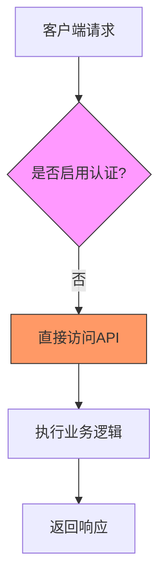
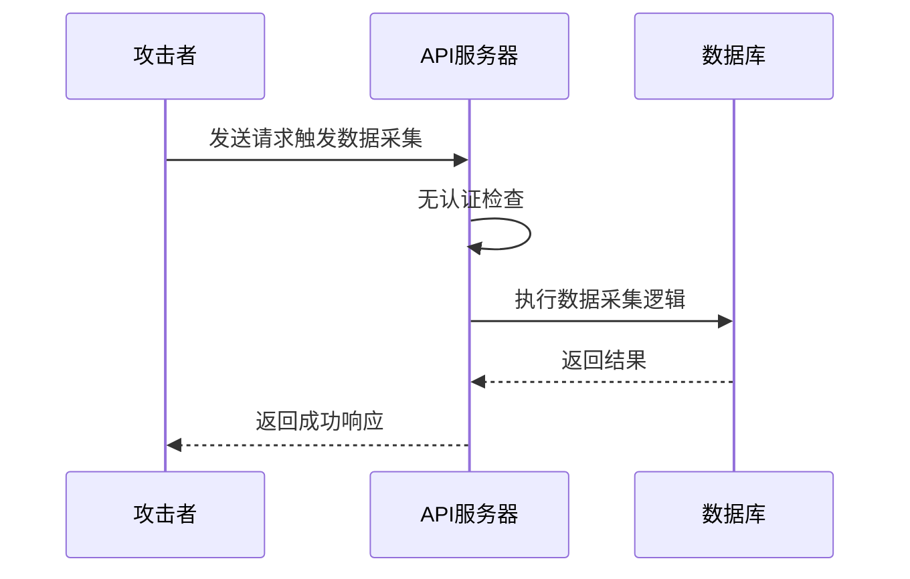
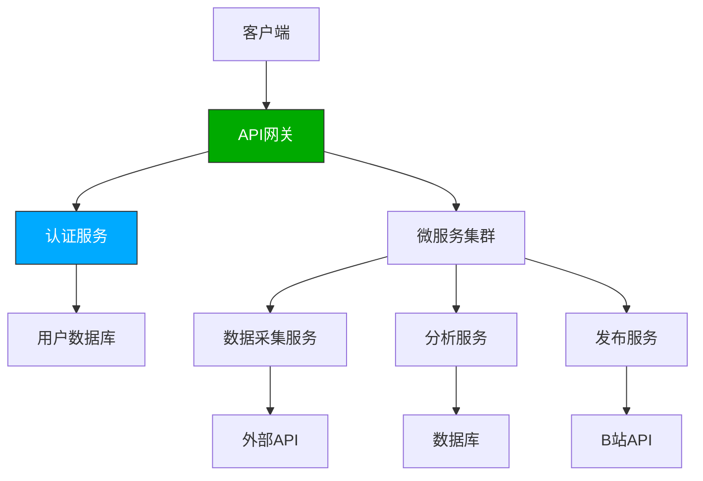

# API安全与认证

<cite>
**本文档引用的文件**  
- [Program.cs](file://src/POE2Finance.Web/Program.cs)
- [appsettings.json](file://src/POE2Finance.Web/appsettings.json)
- [AutomatedAnalysisJob.cs](file://src/POE2Finance.Services/Jobs/AutomatedAnalysisJob.cs)
- [DataCollectionJob.cs](file://src/POE2Finance.Services/Jobs/MaintenanceJobs.cs)
- [BilibiliConfiguration.cs](file://src/POE2Finance.Services/Configuration/BilibiliConfiguration.cs)
</cite>

## 目录
1. [引言](#引言)
2. [认证机制现状](#认证机制现状)
3. [中间件与安全配置](#中间件与安全配置)
4. [敏感端点保护分析](#敏感端点保护分析)
5. [B站发布安全配置](#b站发布安全配置)
6. [安全配置最佳实践建议](#安全配置最佳实践建议)
7. [未来增强方案](#未来增强方案)
8. [结论](#结论)

## 引言
本文档旨在全面分析POE2Finance系统的API安全机制，重点评估当前系统的认证方式、访问控制策略以及敏感端点的保护措施。通过分析`Program.cs`中的中间件配置和`appsettings.json`中的安全相关设置，揭示系统在API密钥、JWT等认证机制方面的实现情况，并为未来安全增强提供具体建议。

## 认证机制现状
根据对代码库的分析，当前系统**未实现API密钥或JWT等标准认证机制**。系统中不存在任何显式的身份验证（Authentication）中间件配置，如JWT Bearer认证、API密钥验证等。

尽管`Program.cs`中调用了`app.UseAuthorization()`，但缺少相应的身份验证中间件（如`UseAuthentication()`）和授权策略配置，这意味着授权管道无法正常工作。所有API端点目前处于**无认证保护状态**，任何能够访问服务的客户端都可以调用所有接口。



**图示来源**  
- [Program.cs](file://src/POE2Finance.Web/Program.cs#L138)

## 中间件与安全配置
### 中间件配置分析
`Program.cs`文件中的HTTP请求管道配置如下：
- `app.UseHttpsRedirection()`：强制HTTPS重定向，确保通信安全。
- `app.UseAuthorization()`：启用授权中间件，但缺乏身份验证支持。
- `app.MapControllers()`：映射控制器路由。

关键问题在于，`UseAuthorization`必须与某种身份验证机制配合使用，而当前配置中缺少`UseAuthentication`或类似的身份验证中间件。

### 安全相关设置
`appsettings.json`文件中包含多项与安全相关的配置，主要集中在数据采集和外部服务集成方面：

#### 数据采集安全配置
```json
"DataCollection": {
  "MinRequestIntervalSeconds": 3600,
  "RandomDelay": {
    "MinSeconds": 30,
    "MaxSeconds": 180
  },
  "UserAgents": [
    "Mozilla/5.0 (Windows NT 10.0; Win64; x64) AppleWebKit/537.36"
  ],
  "DataSources": {
    "TencentOfficial": {
      "Headers": {
        "Accept": "application/json, text/plain, */*",
        "Referer": "https://poe2.qq.com/trade"
      }
    }
  }
}
```
这些配置主要用于**反爬虫策略**，通过设置请求间隔、随机延迟和伪装User-Agent来避免被目标网站封禁，属于客户端安全策略，而非API服务端认证。

#### 日志安全配置
```json
"Serilog": {
  "WriteTo": [
    {
      "Name": "File",
      "Args": {
        "path": "logs/poe2finance-.log",
        "rollingInterval": "Day",
        "retainedFileCountLimit": 7
      }
    }
  ]
}
```
日志配置确保了操作的可追溯性，但未涉及敏感信息过滤，存在潜在的信息泄露风险。

**本节来源**  
- [Program.cs](file://src/POE2Finance.Web/Program.cs#L130-L145)
- [appsettings.json](file://src/POE2Finance.Web/appsettings.json#L0-L42)

## 敏感端点保护分析
系统中存在多个敏感操作端点，特别是**手动触发任务**类功能，如自动化分析和数据采集。这些功能在`AutomatedAnalysisJob`和`DataCollectionJob`中实现。

### 定时任务安全分析
系统使用Quartz.NET配置了多个定时任务：
- 上午/下午/晚间场自动化分析任务
- 每小时一次的数据采集任务
- 每日凌晨的清理任务

这些任务的触发完全依赖于服务器内部调度，**没有外部访问控制机制**。如果存在对应的API端点来手动触发这些任务，则当前配置下将面临严重的安全风险。



**图示来源**  
- [Program.cs](file://src/POE2Finance.Web/Program.cs#L91-L145)
- [AutomatedAnalysisJob.cs](file://src/POE2Finance.Services/Jobs/AutomatedAnalysisJob.cs#L15-L350)

## B站发布安全配置
### 认证信息存储
`BilibiliConfiguration`中包含B站发布的认证信息：
```json
"Bilibili": {
  "SessionCookie": "",
  "CsrfToken": ""
}
```
这些敏感信息以明文形式存储在配置文件中，存在严重的安全漏洞。一旦配置文件泄露，攻击者可直接获取B站账号的完全控制权。

### 敏感词过滤机制
系统实现了内容发布的敏感词检查机制：
```csharp
public class SensitiveWordConfiguration
{
    public bool Enabled { get; set; } = true;
    public List<string> Words { get; set; } = new();
    public SensitiveWordReplacement ReplacementStrategy { get; set; } = SensitiveWordReplacement.Remove;
    public string ReplacementChar { get; set; } = "*";
}
```
该机制在内容发布前进行敏感词过滤，采用移除、替换或拒绝发布的策略，有效防止违规内容的传播。

**本节来源**  
- [BilibiliConfiguration.cs](file://src/POE2Finance.Services/Configuration/BilibiliConfiguration.cs#L0-L53)
- [appsettings.json](file://src/POE2Finance.Web/appsettings.json#L90-L130)

## 安全配置最佳实践建议
### 立即实施的安全措施
1. **HTTPS强制**
   - 已通过`app.UseHttpsRedirection()`实现，建议在生产环境配置HSTS头。

2. **敏感信息保护**
   - 将`SessionCookie`和`CsrfToken`等敏感信息移出`appsettings.json`，使用环境变量或Azure Key Vault等密钥管理服务。
   - 在日志记录中过滤敏感字段，防止信息泄露。

3. **速率限制**
   - 添加`Microsoft.AspNetCore.RateLimiting`中间件，防止API滥用。
   - 为关键端点（如任务触发）设置严格的速率限制。

### 推荐的认证方案
#### JWT认证实现
```csharp
// 建议添加的认证配置
builder.Services.AddAuthentication(JwtBearerDefaults.AuthenticationScheme)
    .AddJwtBearer(options =>
    {
        options.TokenValidationParameters = new TokenValidationParameters
        {
            ValidateIssuer = true,
            ValidateAudience = true,
            ValidateLifetime = true,
            ValidateIssuerSigningKey = true,
            ValidIssuer = builder.Configuration["Jwt:Issuer"],
            ValidAudience = builder.Configuration["Jwt:Audience"],
            IssuerSigningKey = new SymmetricSecurityKey(
                Encoding.UTF8.GetBytes(builder.Configuration["Jwt:Key"]))
        };
    });
```

#### API密钥认证
对于服务间调用，可实现简单的API密钥认证：
```csharp
// 自定义API密钥中间件
app.Use(async (context, next) =>
{
    if (context.Request.Headers.TryGetValue("X-API-Key", out var apiKey))
    {
        if (IsValidApiKey(apiKey))
        {
            await next();
            return;
        }
    }
    context.Response.StatusCode = 401;
});
```

## 未来增强方案
### 认证机制实施路线图
1. **短期（1-2周）**
   - 实现API密钥认证，保护关键管理端点。
   - 迁移敏感配置到环境变量。

2. **中期（1-2个月）**
   - 实现完整的JWT认证系统。
   - 添加用户管理和角色权限控制。
   - 实现OAuth2.0支持，允许第三方应用集成。

3. **长期（3-6个月）**
   - 集成OpenID Connect实现单点登录。
   - 实现多因素认证（MFA）。
   - 建立完整的审计日志系统。

### 安全架构升级


**图示来源**  
- [Program.cs](file://src/POE2Finance.Web/Program.cs)
- [AutomatedAnalysisJob.cs](file://src/POE2Finance.Services/Jobs/AutomatedAnalysisJob.cs)

## 结论
当前POE2Finance系统在API安全方面存在明显不足，**未实现任何形式的身份认证机制**，所有端点均处于无保护状态。虽然系统实现了HTTPS重定向和一定的反爬虫策略，但这些措施无法替代API认证。

建议立即采取以下行动：
1. 为关键管理端点实施API密钥认证
2. 迁移并加密存储敏感配置信息
3. 实施速率限制防止滥用
4. 规划JWT认证系统的逐步实施

通过这些改进，可显著提升系统的安全性和可靠性，为未来的功能扩展奠定坚实的安全基础。