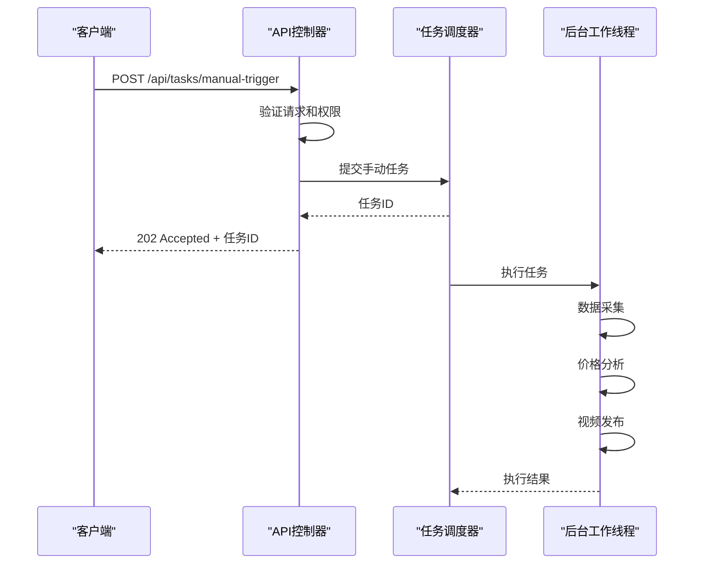
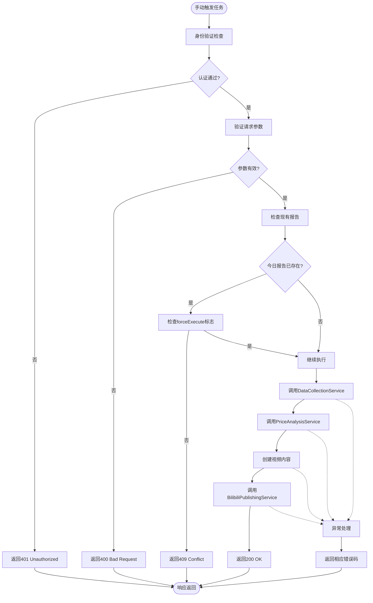

# 手动触发任务API

<cite>
**本文档引用的文件**
- [DataCollectionService.cs](file://src/POE2Finance.Services/DataCollection/DataCollectionService.cs)
- [PriceAnalysisService.cs](file://src/POE2Finance.Services/Analysis/PriceAnalysisService.cs)
- [BilibiliPublishingService.cs](file://src/POE2Finance.Services/Publishing/BilibiliPublishingService.cs)
- [AutomatedAnalysisJob.cs](file://src/POE2Finance.Services/Jobs/AutomatedAnalysisJob.cs)
- [Program.cs](file://src/POE2Finance.Web/Program.cs)
</cite>

## 目录
1. [简介](#简介)
2. [API端点说明](#api端点说明)
3. [请求体结构](#请求体结构)
4. [认证要求](#认证要求)
5. [异步执行机制](#异步执行机制)
6. [内部处理流程](#内部处理流程)
7. [curl命令示例](#curl命令示例)
8. [错误处理指南](#错误处理指南)
9. [安全访问控制](#安全访问控制)

## 简介
本API用于手动触发数据采集、价格分析和视频发布任务。该接口为管理性质，允许管理员在需要时手动启动完整的分析流程，而不必等待定时任务的自动执行。此功能特别适用于系统维护后恢复、紧急市场分析或测试新功能等场景。

## API端点说明
手动触发任务的API端点为`POST /api/tasks/manual-trigger`，用于启动完整的数据采集、分析和发布流程。该端点接受JSON格式的请求体，指定要执行的任务类型和相关参数。

**Section sources**
- [AutomatedAnalysisJob.cs](file://src/POE2Finance.Services/Jobs/AutomatedAnalysisJob.cs#L14-L350)

## 请求体结构
请求体包含以下字段：

- `timeSlot` (string): 时间段，可选值为"Morning"、"Afternoon"或"Evening"
- `forceExecute` (boolean): 是否强制执行，即使当天已生成过报告
- `tasks` (array): 要执行的任务列表，可包含"dataCollection"、"priceAnalysis"和"videoPublishing"

示例请求体：
```json
{
  "timeSlot": "Evening",
  "forceExecute": false,
  "tasks": ["dataCollection", "priceAnalysis", "videoPublishing"]
}
```

**Section sources**
- [AutomatedAnalysisJob.cs](file://src/POE2Finance.Services/Jobs/AutomatedAnalysisJob.cs#L51-L86)

## 认证要求
此API端点需要管理员级别的身份验证。客户端必须在请求头中包含有效的JWT令牌，且该令牌必须具有"admin"角色权限。未通过身份验证的请求将返回401 Unauthorized状态码，权限不足的请求将返回403 Forbidden状态码。

**Section sources**
- [Program.cs](file://src/POE2Finance.Web/Program.cs#L130-L135)

## 异步执行机制
任务触发后，系统将异步执行整个流程，API立即返回202 Accepted状态码表示任务已接受。实际的执行过程在后台线程中进行，避免阻塞HTTP请求。客户端可以通过轮询或WebSocket连接来获取任务执行状态。



**Diagram sources**
- [AutomatedAnalysisJob.cs](file://src/POE2Finance.Services/Jobs/AutomatedAnalysisJob.cs#L51-L350)
- [Program.cs](file://src/POE2Finance.Web/Program.cs#L91-L145)

## 内部处理流程
当手动触发任务时，系统按照以下顺序调用服务：



**Diagram sources**
- [DataCollectionService.cs](file://src/POE2Finance.Services/DataCollection/DataCollectionService.cs#L11-L240)
- [PriceAnalysisService.cs](file://src/POE2Finance.Services/Analysis/PriceAnalysisService.cs#L14-L475)
- [BilibiliPublishingService.cs](file://src/POE2Finance.Services/Publishing/BilibiliPublishingService.cs#L14-L76)

## curl命令示例
```bash
curl -X POST https://api.poe2finance.com/api/tasks/manual-trigger \
  -H "Authorization: Bearer YOUR_ADMIN_TOKEN" \
  -H "Content-Type: application/json" \
  -d '{
    "timeSlot": "Evening",
    "forceExecute": false,
    "tasks": ["dataCollection", "priceAnalysis", "videoPublishing"]
  }'
```

**Section sources**
- [AutomatedAnalysisJob.cs](file://src/POE2Finance.Services/Jobs/AutomatedAnalysisJob.cs#L51-L86)

## 错误处理指南
本API可能返回以下错误状态码：

- `400 Bad Request`: 请求体格式错误或参数无效
- `401 Unauthorized`: 未提供身份验证令牌或令牌无效
- `403 Forbidden`: 用户权限不足，非管理员用户
- `409 Conflict`: 今日该时间段的报告已存在且未设置forceExecute为true
- `500 Internal Server Error`: 服务器内部错误，如数据库连接失败
- `503 Service Unavailable`: 依赖服务不可用，如B站API故障

对于任务冲突情况，系统会检查数据库中是否已存在当天该时间段的已发布报告。如果存在且请求中未设置`forceExecute`为`true`，则返回409 Conflict状态码，防止重复生成内容。

**Section sources**
- [AutomatedAnalysisJob.cs](file://src/POE2Finance.Services/Jobs/AutomatedAnalysisJob.cs#L51-L86)
- [AutomatedAnalysisJob.cs](file://src/POE2Finance.Services/Jobs/AutomatedAnalysisJob.cs#L226-L260)

## 安全访问控制
此API具有严格的访问控制机制，仅限管理员使用。系统通过JWT令牌验证用户身份，并检查其角色权限。所有手动触发的请求都会被记录到审计日志中，包括操作者ID、时间戳和执行结果，以便后续追踪和审查。建议定期审查这些日志，确保没有未经授权的访问尝试。

**Section sources**
- [Program.cs](file://src/POE2Finance.Web/Program.cs#L130-L135)
- [AutomatedAnalysisJob.cs](file://src/POE2Finance.Services/Jobs/AutomatedAnalysisJob.cs#L51-L350)