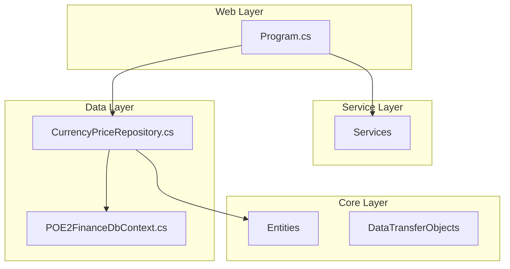
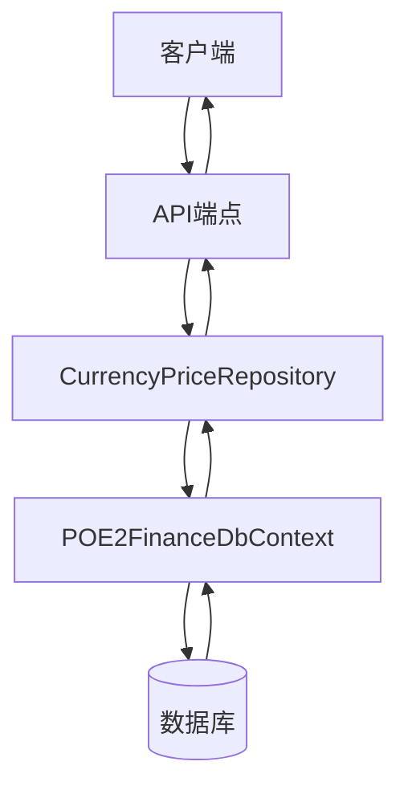
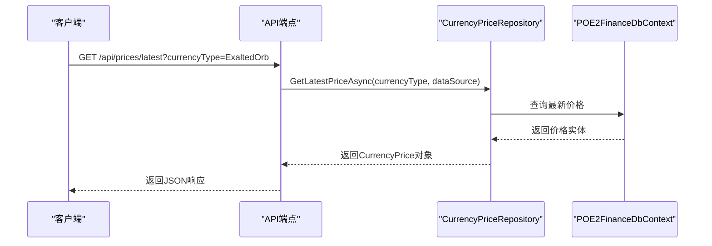
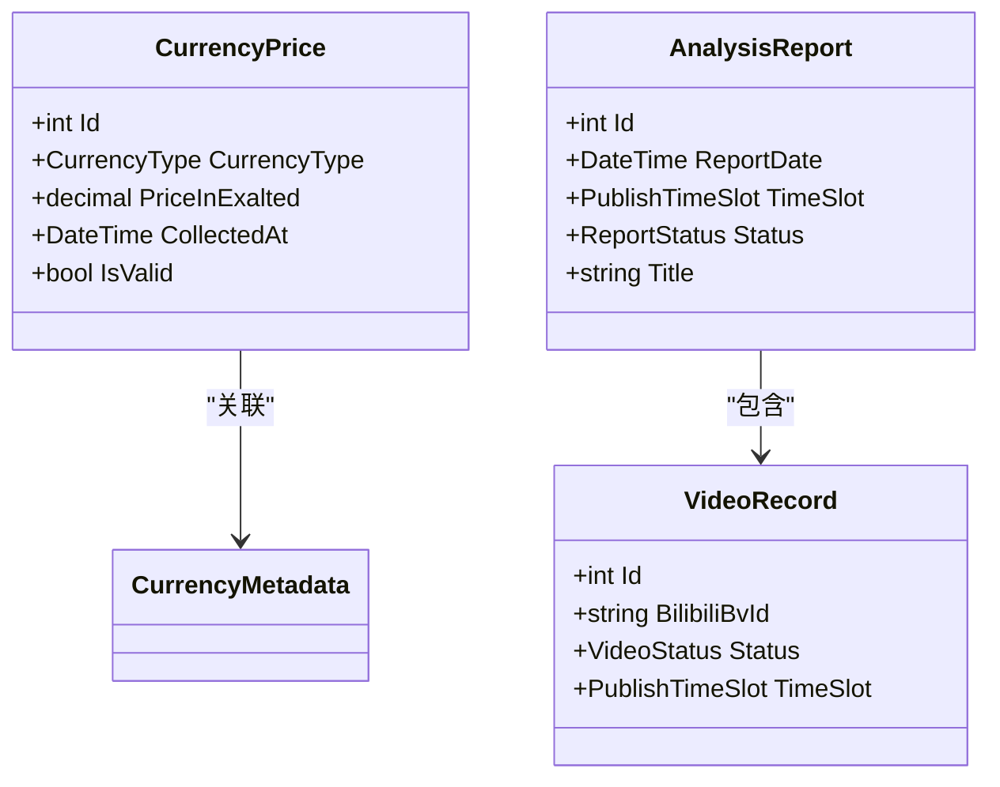
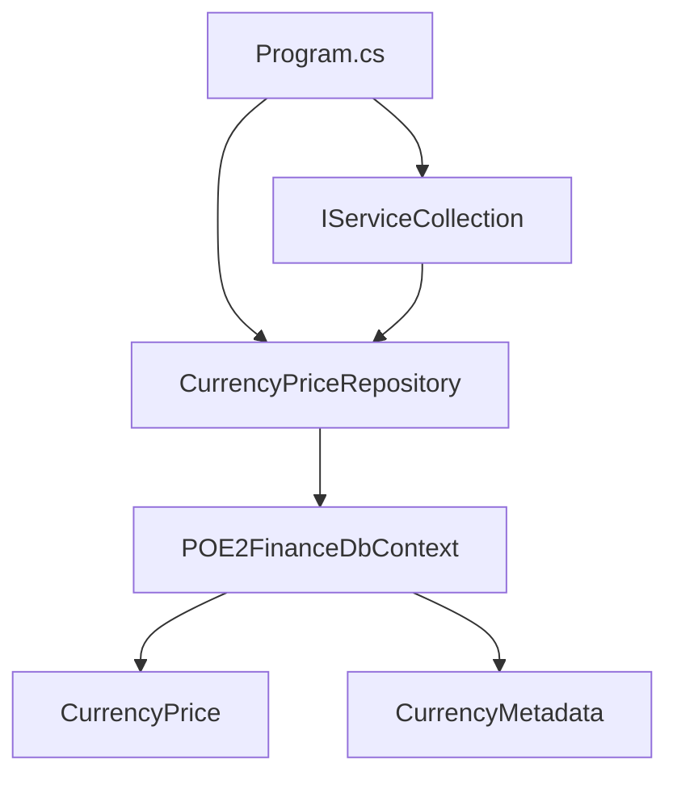

# 数据查询API

<cite>
**本文档中引用的文件**  
- [Program.cs](file://src/POE2Finance.Web/Program.cs)
- [CurrencyPriceRepository.cs](file://src/POE2Finance.Data/Repositories/CurrencyPriceRepository.cs)
- [POE2FinanceDbContext.cs](file://src/POE2Finance.Data/DbContexts/POE2FinanceDbContext.cs)
- [ISpecializedRepositories.cs](file://src/POE2Finance.Data/Repositories/ISpecializedRepositories.cs)
</cite>

## 目录
1. [简介](#简介)
2. [项目结构](#项目结构)
3. [核心组件](#核心组件)
4. [架构概述](#架构概述)
5. [详细组件分析](#详细组件分析)
6. [依赖分析](#依赖分析)
7. [性能考虑](#性能考虑)
8. [故障排除指南](#故障排除指南)
9. [结论](#结论)

## 简介
本文档详细描述了POE2Finance项目中的数据查询API，重点介绍用于获取通货价格、分析报告和视频记录的GET端点。文档涵盖每个端点的URL路径、支持的查询参数、响应结构、实际调用示例以及后端处理逻辑。结合`Program.cs`中的路由定义和`CurrencyPriceRepository`的数据访问实现，解释了请求处理流程，并讨论了分页、排序、过滤机制及潜在性能优化策略。

## 项目结构
POE2Finance项目采用分层架构，主要分为四个核心项目：
- **POE2Finance.Core**：包含实体、枚举和数据传输对象（DTO）
- **POE2Finance.Data**：负责数据访问，包含数据库上下文和仓储实现
- **POE2Finance.Services**：实现业务逻辑，包括数据采集、分析和内容生成
- **POE2Finance.Web**：Web API入口，包含路由配置和控制器

数据查询API的端点定义在`Program.cs`中，数据访问逻辑由`CurrencyPriceRepository`实现，数据模型定义在`Core`项目中。

**Diagram sources**
- [Program.cs](file://src/POE2Finance.Web/Program.cs#L1-L145)
- [CurrencyPriceRepository.cs](file://src/POE2Finance.Data/Repositories/CurrencyPriceRepository.cs#L1-L95)
- [POE2FinanceDbContext.cs](file://src/POE2Finance.Data/DbContexts/POE2FinanceDbContext.cs#L1-L177)

**Section sources**
- [Program.cs](file://src/POE2Finance.Web/Program.cs#L1-L145)
- [CurrencyPriceRepository.cs](file://src/POE2Finance.Data/Repositories/CurrencyPriceRepository.cs#L1-L95)

## 核心组件
数据查询API的核心组件包括：
- **ICurrencyPriceRepository**：定义了获取通货价格数据的接口
- **CurrencyPriceRepository**：实现了价格数据的查询、插入和删除逻辑
- **POE2FinanceDbContext**：Entity Framework Core数据库上下文，管理数据实体和数据库连接
- **Program.cs**：配置了API路由和依赖注入，是API的入口点

这些组件协同工作，接收HTTP请求，通过仓储层访问数据库，并返回结构化JSON响应。

**Section sources**
- [ISpecializedRepositories.cs](file://src/POE2Finance.Data/Repositories/ISpecializedRepositories.cs#L8-L51)
- [CurrencyPriceRepository.cs](file://src/POE2Finance.Data/Repositories/CurrencyPriceRepository.cs#L10-L95)
- [POE2FinanceDbContext.cs](file://src/POE2Finance.Data/DbContexts/POE2FinanceDbContext.cs#L9-L177)

## 架构概述
系统采用典型的三层架构：表现层（Web）、业务逻辑层（Services）和数据访问层（Data）。API请求由`Program.cs`中的最小API端点处理，调用仓储层获取数据，最终返回JSON响应。数据访问通过Entity Framework Core进行，确保了类型安全和查询效率。

**Diagram sources**
- [Program.cs](file://src/POE2Finance.Web/Program.cs#L1-L145)
- [CurrencyPriceRepository.cs](file://src/POE2Finance.Data/Repositories/CurrencyPriceRepository.cs#L10-L95)
- [POE2FinanceDbContext.cs](file://src/POE2Finance.Data/DbContexts/POE2FinanceDbContext.cs#L9-L177)

## 详细组件分析

### 通货价格查询分析
通货价格查询功能通过`CurrencyPriceRepository`实现，提供了获取最新价格和价格历史的异步方法。`GetLatestPriceAsync`方法根据通货类型和可选的数据源，返回最新的有效价格记录。`GetPriceHistoryAsync`方法则根据时间范围查询历史价格数据。

**Diagram sources**
- [CurrencyPriceRepository.cs](file://src/POE2Finance.Data/Repositories/CurrencyPriceRepository.cs#L20-L35)
- [Program.cs](file://src/POE2Finance.Web/Program.cs#L1-L145)

**Section sources**
- [CurrencyPriceRepository.cs](file://src/POE2Finance.Data/Repositories/CurrencyPriceRepository.cs#L20-L35)
- [ISpecializedRepositories.cs](file://src/POE2Finance.Data/Repositories/ISpecializedRepositories.cs#L10-L25)

### 分析报告与视频记录
虽然当前上下文主要关注价格查询，但系统架构支持分析报告和视频记录的查询。`POE2FinanceDbContext`中定义了`AnalysisReports`和`VideoRecords`的DbSet，表明这些实体已准备就绪，可通过类似的仓储模式进行访问。

**Diagram sources**
- [POE2FinanceDbContext.cs](file://src/POE2Finance.Data/DbContexts/POE2FinanceDbContext.cs#L15-L45)
- [Entities](file://src/POE2Finance.Core/Entities/)

## 依赖分析
系统依赖关系清晰，`CurrencyPriceRepository`依赖于`POE2FinanceDbContext`进行数据访问，而`Program.cs`通过依赖注入容器将仓储实例注入到API端点中。这种设计实现了关注点分离，便于测试和维护。

**Diagram sources**
- [Program.cs](file://src/POE2Finance.Web/Program.cs#L1-L145)
- [CurrencyPriceRepository.cs](file://src/POE2Finance.Data/Repositories/CurrencyPriceRepository.cs#L10-L95)
- [POE2FinanceDbContext.cs](file://src/POE2Finance.Data/DbContexts/POE2FinanceDbContext.cs#L9-L177)

**Section sources**
- [Program.cs](file://src/POE2Finance.Web/Program.cs#L1-L145)
- [CurrencyPriceRepository.cs](file://src/POE2Finance.Data/Repositories/CurrencyPriceRepository.cs#L10-L95)

## 性能考虑
当前实现中，`GetPriceHistoryAsync`方法在查询大量历史数据时可能成为性能瓶颈，尤其是在没有适当索引的情况下。建议在`CurrencyPrices`表上为`CurrencyType`和`CollectedAt`字段创建复合索引以优化查询性能。此外，对于高频访问的最新价格数据，应考虑引入缓存层（如Redis）来减少数据库负载。

分页、排序和过滤功能目前由Entity Framework Core在内存中处理。为了提高效率，应在仓储层实现基于`IQueryable`的查询构建器，将分页和排序操作下推到数据库执行。

## 故障排除指南
- **404错误**：检查API端点路径是否正确，确保`Program.cs`中已定义相应路由。
- **空响应**：验证数据库中是否存在符合条件的数据，检查`IsValid`字段是否为true。
- **性能缓慢**：监控数据库查询执行计划，确保相关字段已建立索引。
- **序列化错误**：检查实体类是否包含循环引用，必要时使用DTO进行数据传输。

**Section sources**
- [CurrencyPriceRepository.cs](file://src/POE2Finance.Data/Repositories/CurrencyPriceRepository.cs#L20-L95)
- [POE2FinanceDbContext.cs](file://src/POE2Finance.Data/DbContexts/POE2FinanceDbContext.cs#L9-L177)

## 结论
POE2Finance的数据查询API设计合理，通过清晰的分层架构和依赖注入实现了高内聚低耦合。`CurrencyPriceRepository`提供了高效的数据访问方法，结合`Program.cs`中的路由配置，能够满足通货价格查询的核心需求。未来可通过引入缓存和优化数据库索引来进一步提升系统性能。