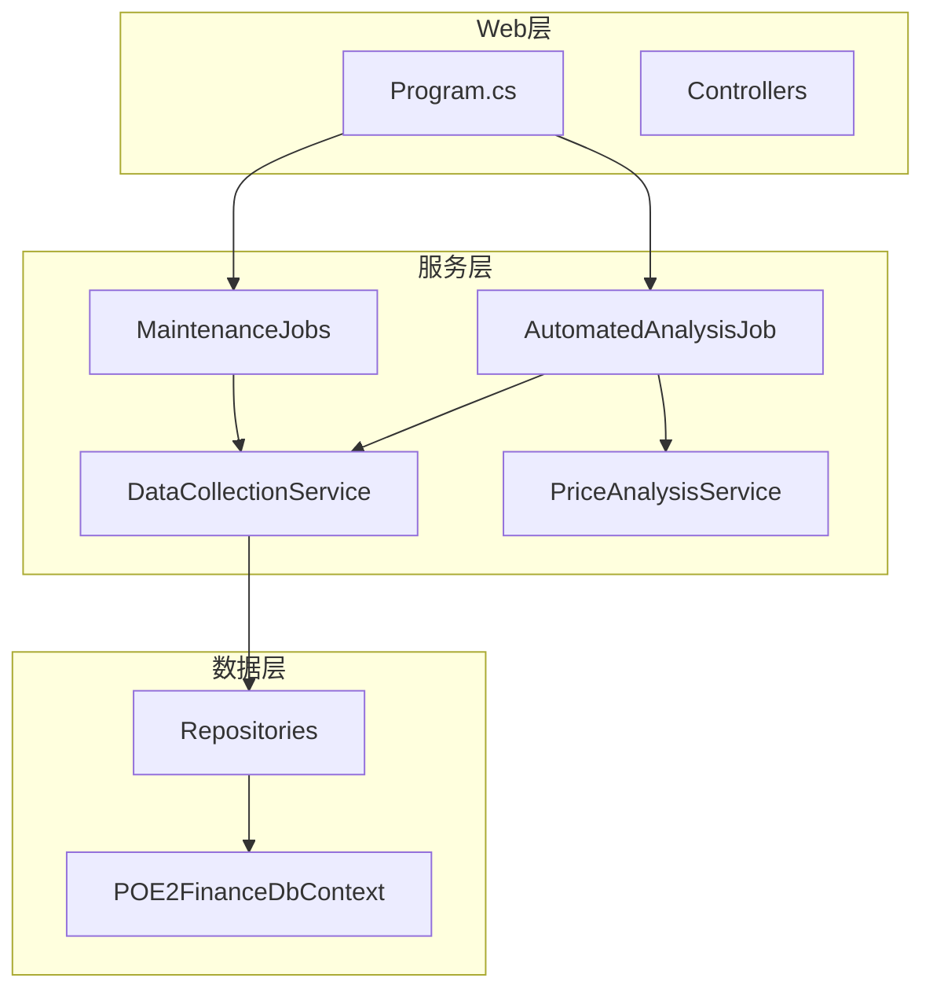
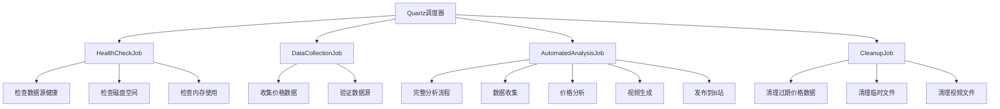
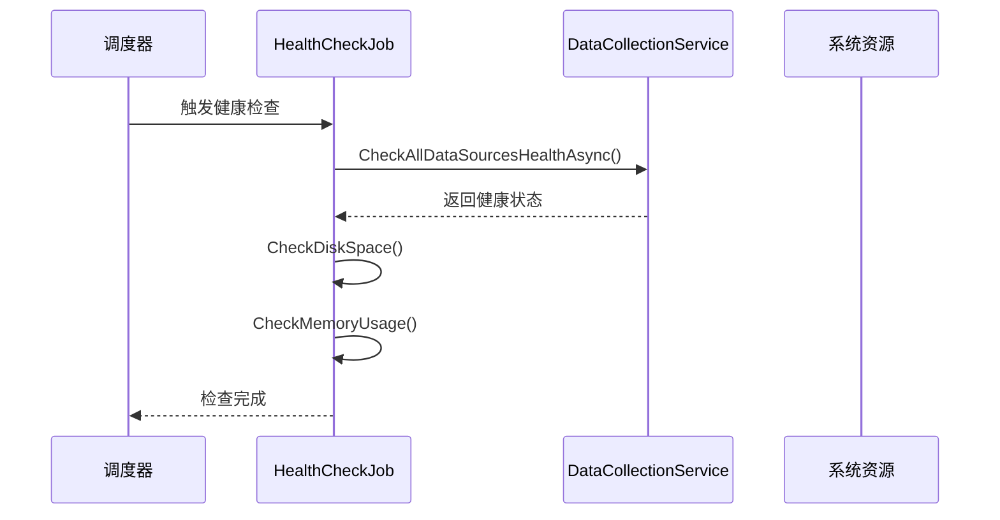
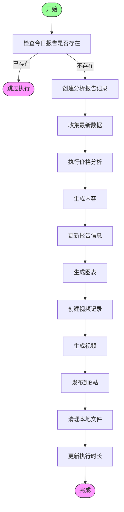
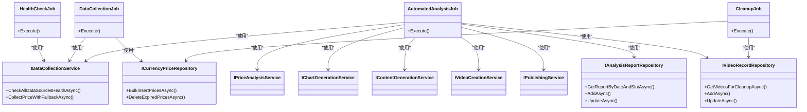

# 系统状态API

<cite>
**本文档引用的文件**  
- [AutomatedAnalysisJob.cs](file://src/POE2Finance.Services/Jobs/AutomatedAnalysisJob.cs)
- [MaintenanceJobs.cs](file://src/POE2Finance.Services/Jobs/MaintenanceJobs.cs)
- [Program.cs](file://src/POE2Finance.Web/Program.cs)
- [ServiceInterfaces.cs](file://src/POE2Finance.Core/Interfaces/ServiceInterfaces.cs)
</cite>

## 目录
1. [简介](#简介)
2. [项目结构](#项目结构)
3. [核心组件](#核心组件)
4. [架构概览](#架构概览)
5. [详细组件分析](#详细组件分析)
6. [依赖分析](#依赖分析)
7. [性能考虑](#性能考虑)
8. [故障排除指南](#故障排除指南)
9. [结论](#结论)

## 简介
本文档详细描述了 POE2Finance 系统中的健康检查与状态监控机制。重点介绍系统状态API的设计与实现，包括服务健康状况、定时任务执行状态和数据库连接情况的检测逻辑。文档还解释了HTTP响应码的语义，并提供健康检查端点的调用示例，以及如何将其集成到外部监控系统（如Prometheus）的建议。

## 项目结构
POE2Finance 项目采用分层架构设计，主要包含以下模块：
- **POE2Finance.Core**：核心实体与接口定义
- **POE2Finance.Data**：数据访问层，包含数据库上下文和仓储实现
- **POE2Finance.Services**：业务逻辑层，包含各类服务和定时任务
- **POE2Finance.Web**：Web API 层，负责HTTP请求处理和应用启动配置

定时任务和健康检查功能主要集中在 `POE2Finance.Services.Jobs` 模块中，通过 Quartz.NET 实现任务调度。

**Diagram sources**  
- [Program.cs](file://src/POE2Finance.Web/Program.cs#L1-L145)
- [AutomatedAnalysisJob.cs](file://src/POE2Finance.Services/Jobs/AutomatedAnalysisJob.cs#L15-L350)
- [MaintenanceJobs.cs](file://src/POE2Finance.Services/Jobs/MaintenanceJobs.cs#L12-L387)

**Section sources**  
- [Program.cs](file://src/POE2Finance.Web/Program.cs#L1-L145)
- [AutomatedAnalysisJob.cs](file://src/POE2Finance.Services/Jobs/AutomatedAnalysisJob.cs#L15-L350)
- [MaintenanceJobs.cs](file://src/POE2Finance.Services/Jobs/MaintenanceJobs.cs#L12-L387)

## 核心组件
系统状态监控的核心组件包括：
- **HealthCheckJob**：定期执行系统健康检查的任务
- **DataCollectionJob**：负责收集价格数据的定时任务
- **AutomatedAnalysisJob**：自动化分析主任务，包含完整的分析流程
- **CleanupJob**：清理过期数据和临时文件的任务

这些组件通过 Quartz.NET 调度器进行管理，并在 `Program.cs` 中配置了相应的触发器。

**Section sources**  
- [MaintenanceJobs.cs](file://src/POE2Finance.Services/Jobs/MaintenanceJobs.cs#L285-L387)
- [AutomatedAnalysisJob.cs](file://src/POE2Finance.Services/Jobs/AutomatedAnalysisJob.cs#L15-L350)

## 架构概览
系统采用基于Quartz.NET的定时任务架构，通过依赖注入将各个服务组件组合在一起。健康检查机制贯穿于多个层次，从数据源可用性到系统资源使用情况都有相应的检测逻辑。

**Diagram sources**  
- [Program.cs](file://src/POE2Finance.Web/Program.cs#L50-L100)
- [MaintenanceJobs.cs](file://src/POE2Finance.Services/Jobs/MaintenanceJobs.cs#L12-L387)

## 详细组件分析

### 健康检查机制分析
系统通过 `HealthCheckJob` 实现全面的健康检查，涵盖数据源、磁盘空间和内存使用等多个维度。

**Diagram sources**  
- [MaintenanceJobs.cs](file://src/POE2Finance.Services/Jobs/MaintenanceJobs.cs#L285-L387)
- [ServiceInterfaces.cs](file://src/POE2Finance.Core/Interfaces/ServiceInterfaces.cs#L9-L35)

### 自动化分析任务流程
`AutomatedAnalysisJob` 实现了完整的自动化分析流程，从数据收集到视频发布的全过程。

**Diagram sources**  
- [AutomatedAnalysisJob.cs](file://src/POE2Finance.Services/Jobs/AutomatedAnalysisJob.cs#L15-L350)
- [DataCollectionService.cs](file://src/POE2Finance.Services/DataCollection/DataCollectionService.cs)

**Section sources**  
- [AutomatedAnalysisJob.cs](file://src/POE2Finance.Services/Jobs/AutomatedAnalysisJob.cs#L15-L350)

## 依赖分析
系统各组件之间的依赖关系清晰，遵循依赖倒置原则，通过接口进行解耦。

**Diagram sources**  
- [MaintenanceJobs.cs](file://src/POE2Finance.Services/Jobs/MaintenanceJobs.cs#L12-L387)
- [AutomatedAnalysisJob.cs](file://src/POE2Finance.Services/Jobs/AutomatedAnalysisJob.cs#L15-L350)
- [ServiceInterfaces.cs](file://src/POE2Finance.Core/Interfaces/ServiceInterfaces.cs#L9-L204)

**Section sources**  
- [ServiceInterfaces.cs](file://src/POE2Finance.Core/Interfaces/ServiceInterfaces.cs#L9-L204)

## 性能考虑
系统在设计时考虑了多种性能优化策略：

1. **批量操作**：价格数据采用批量插入方式，减少数据库交互次数
2. **缓存机制**：虽然未在代码中直接体现，但可通过配置添加缓存层
3. **资源清理**：定期清理过期数据和临时文件，防止磁盘空间耗尽
4. **并发控制**：使用 `[DisallowConcurrentExecution]` 属性防止任务并发执行
5. **错误重试**：在数据收集过程中有适当的延迟和错误处理机制

响应延迟主要受网络请求和视频生成过程影响，建议监控关键路径的执行时间。

## 故障排除指南
当系统状态异常时，可按以下步骤进行排查：

1. **检查健康检查日志**：查看 `HealthCheckJob` 的执行日志，确认数据源、磁盘和内存状态
2. **验证数据源连接**：确保 `TencentOfficialCollector` 和 `DD373Collector` 能正常访问
3. **检查数据库连接**：确认 `POE2FinanceDbContext` 能正常连接数据库
4. **查看任务执行历史**：检查 Quartz 的任务执行记录，确认各定时任务是否正常触发
5. **监控资源使用**：关注磁盘空间和内存使用情况，避免资源耗尽导致服务中断

**Section sources**  
- [MaintenanceJobs.cs](file://src/POE2Finance.Services/Jobs/MaintenanceJobs.cs#L285-L387)
- [AutomatedAnalysisJob.cs](file://src/POE2Finance.Services/Jobs/AutomatedAnalysisJob.cs#L15-L350)

## 结论
POE2Finance 系统的状态监控机制设计完善，通过多个层次的健康检查和定时任务确保了系统的稳定运行。建议将健康检查端点集成到外部监控系统中，设置适当的告警阈值，以便及时发现和处理潜在问题。同时，应定期审查任务执行日志，优化性能瓶颈，确保系统长期稳定运行。