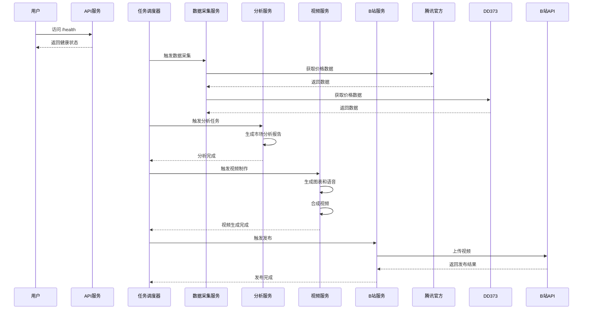

# 快速入门

<cite>
**Referenced Files in This Document**   
- [README.md](file://README.md)
- [DEPLOYMENT.md](file://DEPLOYMENT.md)
- [Dockerfile](file://Dockerfile)
- [docker-compose.yml](file://docker-compose.yml)
- [appsettings.json](file://src/POE2Finance.Web/appsettings.json)
- [Program.cs](file://src/POE2Finance.Web/Program.cs)
- [DataCollectionConfiguration.cs](file://src/POE2Finance.Services/Configuration/DataCollectionConfiguration.cs)
- [BilibiliConfiguration.cs](file://src/POE2Finance.Services/Configuration/BilibiliConfiguration.cs)
- [AutomatedAnalysisJob.cs](file://src/POE2Finance.Services/Jobs/AutomatedAnalysisJob.cs)
- [POE2FinanceDbContext.cs](file://src/POE2Finance.Data/DbContexts/POE2FinanceDbContext.cs)
</cite>

## 目录
1. [环境准备](#环境准备)
2. [项目获取与启动](#项目获取与启动)
3. [系统配置](#系统配置)
4. [API访问与功能验证](#api访问与功能验证)
5. [触发完整分析流程](#触发完整分析流程)
6. [常见问题与解决方案](#常见问题与解决方案)

## 环境准备

在开始使用POE2Finance系统之前，请确保您的开发环境已正确配置。本系统支持Docker部署和直接运行两种方式，推荐使用Docker以获得最佳兼容性和稳定性。

### 安装.NET 9.0 SDK

1. 访问 [.NET官方网站](https://dotnet.microsoft.com/download) 下载并安装.NET 9.0 SDK
2. 安装完成后，打开命令行工具，执行以下命令验证安装：
```bash
dotnet --version
```
您应该看到类似 `9.0.xxxx.x` 的版本号输出，表示.NET 9.0 SDK已成功安装。

### 安装Docker环境

1. 访问 [Docker官网](https://www.docker.com/products/docker-desktop) 下载并安装Docker Desktop
2. 启动Docker Desktop，确保Docker服务正在运行
3. 在命令行中执行以下命令验证Docker安装：
```bash
docker --version
docker-compose --version
```
这两个命令应分别返回Docker和Docker Compose的版本信息。

### 其他依赖

系统还需要以下依赖项：
- **FFmpeg**: 用于视频处理，Docker镜像中已包含
- **Python 3.8+**: 用于Edge-TTS语音合成，Docker镜像中已包含
- **Edge-TTS**: 语音合成工具，Docker镜像中已通过pip安装

**注意**：如果您选择使用Docker部署，上述FFmpeg和Python/Edge-TTS依赖已包含在Docker镜像中，无需单独安装。

**Section sources**
- [Dockerfile](file://Dockerfile#L1-L69)
- [README.md](file://README.md#L1-L344)

## 项目获取与启动

### 克隆项目仓库

打开命令行工具，执行以下命令克隆项目仓库：

```bash
git clone https://github.com/your-username/POE2Finance.git
cd POE2Finance
```

这将创建一个名为`POE2Finance`的目录，并将项目代码下载到该目录中。

### 启动项目

您可以选择以下两种方式之一来启动项目：

#### 方式一：使用Docker Compose（推荐）

Docker Compose是推荐的启动方式，因为它能确保所有依赖项的一致性。

1. 确保您位于项目根目录
2. 执行以下命令构建并启动服务：
```bash
docker-compose up -d
```
此命令将以分离模式（detached mode）启动所有服务。

3. 查看服务日志以确认系统正常运行：
```bash
docker-compose logs -f poe2finance
```
您应该能看到类似 `POE2Finance应用程序启动` 的日志信息。

4. 检查服务状态：
```bash
docker-compose ps
```
确保`poe2finance-app`服务的状态为`Up`。

#### 方式二：直接运行（适用于开发环境）

如果您希望在本地直接运行项目，可以使用.NET CLI。

1. 还原NuGet包：
```bash
dotnet restore
```

2. 运行Web应用：
```bash
dotnet run --project src/POE2Finance.Web
```

3. 应用程序将在 `http://localhost:8080` 启动。

**Section sources**
- [README.md](file://README.md#L1-L344)
- [docker-compose.yml](file://docker-compose.yml#L1-L50)
- [Dockerfile](file://Dockerfile#L1-L69)

## 系统配置

系统的主要配置文件位于 `src/POE2Finance.Web/appsettings.json`。您需要根据您的环境修改此文件。

### 数据库连接配置

默认使用SQLite数据库，您可以在`appsettings.json`中找到连接字符串配置：

```json
"ConnectionStrings": {
  "DefaultConnection": "Data Source=poe2finance.db"
}
```

此配置将创建一个名为`poe2finance.db`的SQLite数据库文件。如果您使用Docker部署，该文件将存储在`./data`目录中。

### 数据采集配置

数据采集模块的配置控制着系统如何从不同数据源获取价格信息：

```json
"DataCollection": {
  "CollectionIntervalHours": 1,
  "MinRequestIntervalSeconds": 3600,
  "RandomDelay": {
    "MinSeconds": 30,
    "MaxSeconds": 180
  },
  "RequestTimeoutSeconds": 30,
  "MaxRetries": 3,
  "RetryDelayBaseSeconds": 5,
  "UserAgents": [
    "Mozilla/5.0 (Windows NT 10.0; Win64; x64) AppleWebKit/537.36 (KHTML, like Gecko) Chrome/120.0.0.0 Safari/537.36",
    "Mozilla/5.0 (Windows NT 10.0; Win64; x64) AppleWebKit/537.36 (KHTML, like Gecko) Chrome/119.0.0.0 Safari/537.36"
  ],
  "DataSources": {
    "TencentOfficial": {
      "Enabled": true,
      "Priority": 1,
      "BaseUrl": "https://poe2.qq.com",
      "TradeApiEndpoint": "/api/trade"
    },
    "DD373": {
      "Enabled": true,
      "Priority": 2,
      "BaseUrl": "https://www.dd373.com",
      "Poe2Section": "/poe2"
    }
  }
}
```

**关键配置项说明**：
- `CollectionIntervalHours`: 数据采集间隔（小时）
- `MinRequestIntervalSeconds`: 最小请求间隔（秒），用于防Ban
- `RandomDelay`: 随机延迟范围，增加请求的随机性
- `DataSources`: 数据源配置，可启用/禁用特定数据源

**Section sources**
- [appsettings.json](file://src/POE2Finance.Web/appsettings.json#L1-L131)
- [DataCollectionConfiguration.cs](file://src/POE2Finance.Services/Configuration/DataCollectionConfiguration.cs#L5-L58)

### 外部服务凭据配置

#### B站API密钥配置

要启用B站自动发布功能，您需要配置B站的认证信息。编辑`appsettings.json`中的`Bilibili`部分：

```json
"Bilibili": {
  "Enabled": true,
  "SessionCookie": "your-session-cookie",
  "CsrfToken": "your-csrf-token",
  "CategoryId": 4
}
```

**获取B站凭据的步骤**：
1. 登录B站账号
2. 打开浏览器开发者工具（F12）
3. 访问任意B站页面，查看网络请求中的Cookie
4. 找到`SESSDATA`字段，其值即为SessionCookie
5. 找到`bili_jct`字段，其值即为CsrfToken

**注意**：请确保`Enabled`设置为`true`以启用B站发布功能。

#### 其他服务配置

系统还包含其他服务的配置，如语音合成服务：

```json
"EdgeTts": {
  "EdgeTtsCommand": "edge-tts",
  "VoiceName": "zh-CN-XiaoxiaoNeural",
  "Rate": "+10%",
  "Volume": "+0%"
}
```

这些配置通常不需要修改，除非您需要调整语音合成的音色或语速。

**Section sources**
- [appsettings.json](file://src/POE2Finance.Web/appsettings.json#L1-L131)
- [BilibiliConfiguration.cs](file://src/POE2Finance.Services/Configuration/BilibiliConfiguration.cs#L5-L71)

## API访问与功能验证

系统启动后，您可以通过Swagger UI来探索和测试API。

### 访问Swagger UI

1. 确保系统已成功启动
2. 打开浏览器，访问 `http://localhost:8080/swagger`
3. 您将看到一个交互式的API文档界面，列出了所有可用的API端点

### 主要API端点

| API端点 | HTTP方法 | 描述 |
|--------|---------|------|
| `/api/prices/latest` | GET | 获取最新价格数据 |
| `/api/analysis/{timeSlot}` | GET | 获取指定时间段的分析报告 |
| `/api/videos/status` | GET | 查看视频生成状态 |
| `/health` | GET | 健康检查，返回系统状态 |

### 验证系统功能

您可以通过以下步骤验证系统的基本功能：

1. **检查健康状态**：
   访问 `http://localhost:8080/health`，应返回`Healthy`。

2. **获取最新价格**：
   访问 `http://localhost:8080/api/prices/latest`，应返回最新的通货价格数据。

3. **查看分析报告**：
   访问 `http://localhost:8080/api/analysis/Morning`，查看早间分析报告。

**Section sources**
- [README.md](file://README.md#L1-L344)
- [Program.cs](file://src/POE2Finance.Web/Program.cs#L1-L146)

## 触发完整分析流程

系统设计为通过定时任务自动执行完整的分析流程，但您也可以手动触发以验证功能。

### 自动化流程概述

完整的分析流程包括以下步骤：
1. 从多个数据源采集价格数据
2. 执行价格分析和热点识别
3. 生成专业分析报告
4. 制作视频内容（图表+语音合成）
5. 发布视频到B站

### 手动触发分析

虽然系统主要通过Quartz.NET定时器自动触发，但您可以通过以下方式手动触发分析：

1. **通过API触发**（如果实现）：
   ```bash
   curl -X POST http://localhost:8080/api/analysis/trigger
   ```

2. **通过修改定时任务**：
   在`Program.cs`中，您可以看到定时任务的配置：
   ```csharp
   q.AddTrigger(opts => opts
       .ForJob(morningJobKey)
       .WithIdentity("MorningAnalysisTrigger")
       .WithCronSchedule("0 0 9 * * ?")
       .UsingJobData("TimeSlot", "Morning"));
   ```
   您可以临时修改Cron表达式以立即触发任务。

### 查看生成的视频记录

分析流程完成后，系统会生成视频记录。您可以通过以下方式查看：

1. **通过API查询**：
   ```bash
   curl http://localhost:8080/api/videos/status
   ```

2. **查看数据库**：
   视频记录存储在`VideoRecord`表中，您可以通过数据库工具查看。

3. **查看日志**：
   在应用日志中搜索`视频生成完成`或`视频发布成功`等关键字。



**Diagram sources**
- [AutomatedAnalysisJob.cs](file://src/POE2Finance.Services/Jobs/AutomatedAnalysisJob.cs#L15-L350)
- [Program.cs](file://src/POE2Finance.Web/Program.cs#L1-L146)

**Section sources**
- [AutomatedAnalysisJob.cs](file://src/POE2Finance.Services/Jobs/AutomatedAnalysisJob.cs#L15-L350)
- [Program.cs](file://src/POE2Finance.Web/Program.cs#L1-L146)

## 常见问题与解决方案

### 初始化问题

#### 问题1：Docker启动失败

**症状**：执行`docker-compose up -d`后，服务无法启动。

**解决方案**：
1. 检查Docker服务是否正在运行
2. 查看详细日志：
   ```bash
   docker-compose logs poe2finance
   ```
3. 常见原因是端口冲突，检查8080端口是否被占用：
   ```bash
   netstat -tulpn | grep 8080
   ```

#### 问题2：数据库连接失败

**症状**：应用日志中出现数据库连接错误。

**解决方案**：
1. 确保`appsettings.json`中的连接字符串正确
2. 如果使用Docker，确保`./data`目录有写入权限
3. 检查数据库文件是否已正确创建

#### 问题3：数据采集失败

**症状**：日志中显示无法从腾讯官方或DD373获取数据。

**解决方案**：
1. 检查网络连接
2. 验证数据源URL是否正确
3. 检查`DataCollection`配置中的`MinRequestIntervalSeconds`设置
4. 确认User-Agent配置是否被目标网站屏蔽

### 配置问题

#### 问题4：B站发布失败

**症状**：视频生成成功但无法发布到B站。

**解决方案**：
1. 检查`Bilibili`配置中的`SessionCookie`和`CsrfToken`是否正确
2. 确认B站账号是否有发布视频的权限
3. 检查网络是否能访问B站API

#### 问题5：Swagger UI无法访问

**症状**：访问`http://localhost:8080/swagger`显示404错误。

**解决方案**：
1. 确认应用是否在开发环境运行（`ASPNETCORE_ENVIRONMENT=Development`）
2. 检查`Program.cs`中是否启用了Swagger：
   ```csharp
   if (app.Environment.IsDevelopment())
   {
       app.UseSwagger();
       app.UseSwaggerUI();
   }
   ```

### 性能问题

#### 问题6：内存使用过高

**症状**：系统运行一段时间后内存占用持续增长。

**解决方案**：
1. 检查是否有内存泄漏
2. 优化数据采集频率
3. 增加服务器内存或限制Docker容器内存使用

#### 问题7：视频生成超时

**症状**：视频生成过程中出现超时错误。

**解决方案**：
1. 检查`VideoConfiguration`中的`TimeoutSeconds`设置
2. 确认服务器性能是否满足要求（推荐4核8GB）
3. 检查磁盘空间是否充足

**Section sources**
- [DEPLOYMENT.md](file://DEPLOYMENT.md#L1-L325)
- [README.md](file://README.md#L1-L344)