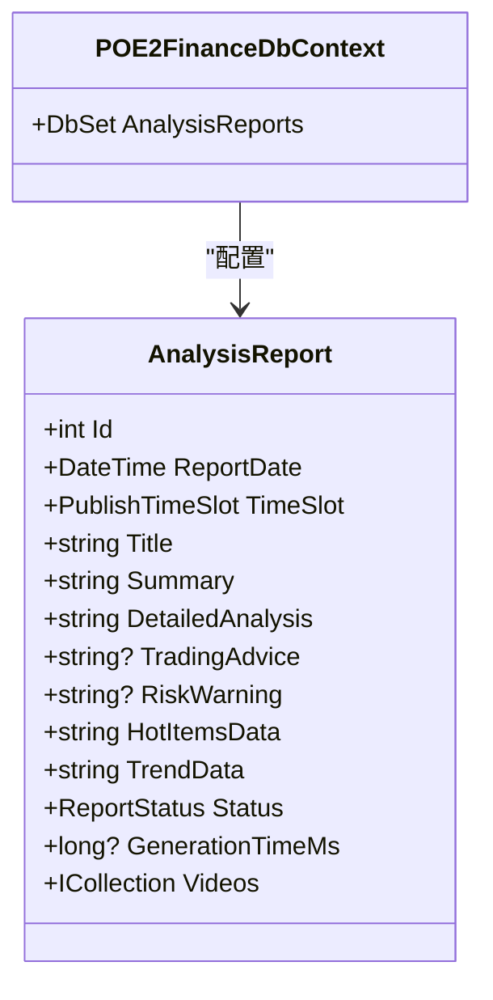
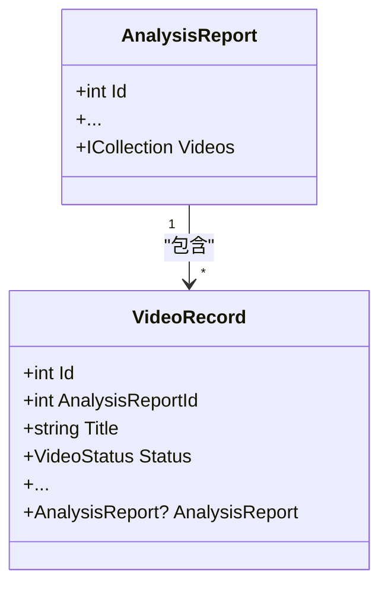
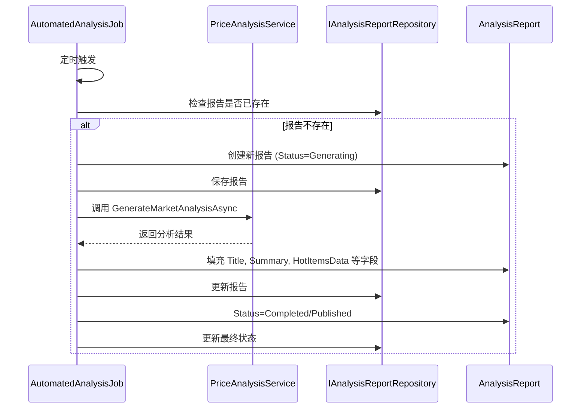

# 分析报告实体 (AnalysisReport)

<cite>
**Referenced Files in This Document**   
- [AnalysisReport.cs](file://src/POE2Finance.Core/Entities/AnalysisReport.cs)
- [POE2FinanceDbContext.cs](file://src/POE2Finance.Data/DbContexts/POE2FinanceDbContext.cs)
- [VideoRecord.cs](file://src/POE2Finance.Core/Entities/VideoRecord.cs)
- [PriceAnalysisService.cs](file://src/POE2Finance.Services/Analysis/PriceAnalysisService.cs)
- [AutomatedAnalysisJob.cs](file://src/POE2Finance.Services/Jobs/AutomatedAnalysisJob.cs)
</cite>

## 目录
1. [简介](#简介)
2. [实体结构与字段说明](#实体结构与字段说明)
3. [数据库配置与约束](#数据库配置与约束)
4. [实体关系](#实体关系)
5. [在自动化工作流中的作用](#在自动化工作流中的作用)
6. [结论](#结论)

## 简介

`AnalysisReport` 实体是 POE2Finance 系统的核心数据模型之一，它代表了一次完整的价格分析任务的输出结果。该实体不仅存储了市场分析的最终结论，还作为后续视频内容生成的数据基础，是连接数据处理与内容发布的桥梁。本文档将全面解析该实体的结构、配置、关系及其在系统自动化流程中的关键作用。

**Section sources**
- [AnalysisReport.cs](file://src/POE2Finance.Core/Entities/AnalysisReport.cs#L9-L80)

## 实体结构与字段说明

`AnalysisReport` 实体继承自 `BaseEntity`，包含了丰富的市场分析数据。其核心字段如下：

| 字段名 | 类型 | 说明 |
| :--- | :--- | :--- |
| `Id` | int | 主键，由数据库自动生成。 |
| `ReportDate` | DateTime | 报告日期，用于标识报告生成的日期。 |
| `TimeSlot` | PublishTimeSlot | 发布时间段，枚举类型，包含 `Morning`（上午）、`Afternoon`（下午）、`Evening`（晚间）三个值，用于区分一天中不同时间的市场报告。 |
| `Title` | string | 报告标题，最大长度100字符，为生成的视频提供标题。 |
| `Summary` | string | 报告摘要，最大长度500字符，是对市场动态的简要描述。 |
| `DetailedAnalysis` | string | 详细分析内容，存储为TEXT类型，包含完整的市场分析文本。 |
| `TradingAdvice` | string? | 交易建议，最大长度1000字符，为玩家提供投资策略。 |
| `RiskWarning` | string? | 风险提示，最大长度500字符，提醒用户潜在的市场风险。 |
| `HotItemsData` | string | 热点物品数据，以JSON格式存储，包含如崇高石、神圣石等关键通货的分析结果。 |
| `TrendData` | string | 趋势数据，以JSON格式存储，包含整体市场趋势和动态。 |
| `Status` | ReportStatus | 报告状态，枚举类型，包含 `Generating`（生成中）、`Completed`（已完成）、`Published`（已发布）、`Failed`（失败）四种状态，用于跟踪报告的生命周期。 |
| `GenerationTimeMs` | long? | 报告生成时长（毫秒），用于性能监控和优化。 |
| `Videos` | ICollection<VideoRecord> | 导航属性，表示一个分析报告可以关联多个视频记录，形成一对多关系。 |

**Section sources**
- [AnalysisReport.cs](file://src/POE2Finance.Core/Entities/AnalysisReport.cs#L14-L79)
- [CommonEnums.cs](file://src/POE2Finance.Core/Enums/CommonEnums.cs#L83-L156)

## 数据库配置与约束

`AnalysisReport` 实体的数据库配置在 `POE2FinanceDbContext` 类中完成。其配置确保了数据的完整性和查询效率。



**Diagram sources**
- [AnalysisReport.cs](file://src/POE2Finance.Core/Entities/AnalysisReport.cs#L9-L80)
- [POE2FinanceDbContext.cs](file://src/POE2Finance.Data/DbContexts/POE2FinanceDbContext.cs#L131-L137)

### 唯一性约束

为防止重复生成报告，系统在数据库层面配置了唯一性约束：

```csharp
modelBuilder.Entity<AnalysisReport>(entity =>
{
    entity.HasKey(e => e.Id);
    entity.Property(e => e.TimeSlot).HasConversion<int>();
    entity.Property(e => e.Status).HasConversion<int>();
    entity.HasIndex(e => new { e.ReportDate, e.TimeSlot }).IsUnique(); // 关键约束
});
```

此配置确保了 `(ReportDate, TimeSlot)` 组合必须是唯一的。这意味着系统在同一天的同一时间段内只能存在一份分析报告，有效避免了数据冗余和资源浪费。

**Section sources**
- [POE2FinanceDbContext.cs](file://src/POE2Finance.Data/DbContexts/POE2FinanceDbContext.cs#L135)

## 实体关系

`AnalysisReport` 实体与 `VideoRecord` 实体之间存在明确的一对多关系。一个分析报告可以作为基础，生成多个不同版本的视频（例如，不同平台、不同剪辑风格）。



**Diagram sources**
- [AnalysisReport.cs](file://src/POE2Finance.Core/Entities/AnalysisReport.cs#L79)
- [VideoRecord.cs](file://src/POE2Finance.Core/Entities/VideoRecord.cs#L108-L109)
- [POE2FinanceDbContext.cs](file://src/POE2Finance.Data/DbContexts/POE2FinanceDbContext.cs#L148-L154)

### 关系配置

该关系通过以下代码在 `POE2FinanceDbContext` 中配置：

```csharp
modelBuilder.Entity<VideoRecord>(entity =>
{
    // ...
    entity.HasOne(e => e.AnalysisReport) // VideoRecord 拥有一个 AnalysisReport
          .WithMany(r => r.Videos)         // AnalysisReport 拥有多个 VideoRecord
          .HasForeignKey(e => e.AnalysisReportId) // 外键
          .OnDelete(DeleteBehavior.Cascade); // 级联删除
});
```

`OnDelete(DeleteBehavior.Cascade)` 配置了级联删除行为。这意味着当一个 `AnalysisReport` 被删除时，所有关联的 `VideoRecord` 也会被自动删除，保证了数据的一致性。

**Section sources**
- [POE2FinanceDbContext.cs](file://src/POE2Finance.Data/DbContexts/POE2FinanceDbContext.cs#L151-L154)

## 在自动化工作流中的作用

`AnalysisReport` 实体是整个自动化工作流的中心枢纽。它由 `AutomatedAnalysisJob` 定时任务创建，并由 `PriceAnalysisService` 等服务填充数据。



**Diagram sources**
- [AutomatedAnalysisJob.cs](file://src/POE2Finance.Services/Jobs/AutomatedAnalysisJob.cs#L15-L277)
- [PriceAnalysisService.cs](file://src/POE2Finance.Services/Analysis/PriceAnalysisService.cs#L14-L475)

1.  **触发与创建**：`AutomatedAnalysisJob` 任务在预定时间触发，首先检查当天该时间段的报告是否已存在。如果不存在，则创建一个新的 `AnalysisReport` 实体，初始状态为 `Generating`。
2.  **数据填充**：任务调用 `PriceAnalysisService` 服务进行市场分析，获取 `MarketAnalysisResultDto`。随后，将分析结果中的数据（如标题、摘要、热点物品JSON等）填充到 `AnalysisReport` 的相应字段中。
3.  **状态更新**：随着任务的推进，`AnalysisReport` 的 `Status` 字段会从 `Generating` 更新为 `Completed` 或 `Published`，`GenerationTimeMs` 字段也会被记录。
4.  **作为数据源**：填充完成的 `AnalysisReport` 实体为后续的 `VideoCreationService` 提供了所有必要的文本和数据，用于生成视频脚本和内容。

**Section sources**
- [AutomatedAnalysisJob.cs](file://src/POE2Finance.Services/Jobs/AutomatedAnalysisJob.cs#L15-L277)
- [PriceAnalysisService.cs](file://src/POE2Finance.Services/Analysis/PriceAnalysisService.cs#L14-L475)

## 结论

`AnalysisReport` 实体是 POE2Finance 系统中承上启下的关键数据结构。它不仅通过 `(ReportDate, TimeSlot)` 唯一性约束保证了数据的准确性，还通过与 `VideoRecord` 的一对多关系支持了内容的多样化生成。其在自动化工作流中的核心地位，使其成为整个系统从数据分析到内容发布的数据基石。