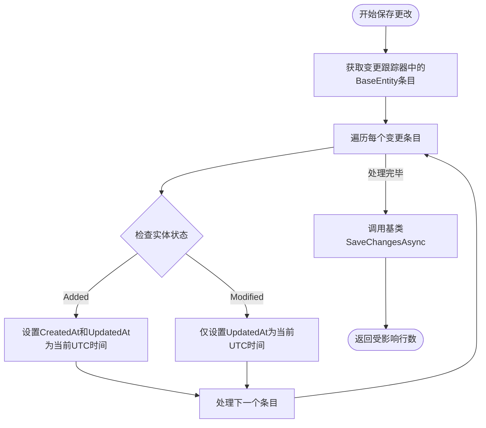

# 基类实体与时间戳管理

<cite>
**Referenced Files in This Document**  
- [BaseEntity.cs](file://src/POE2Finance.Core/Entities/BaseEntity.cs)
- [POE2FinanceDbContext.cs](file://src/POE2Finance.Data/DbContexts/POE2FinanceDbContext.cs)
- [Repository.cs](file://src/POE2Finance.Data/Repositories/Repository.cs)
- [IRepository.cs](file://src/POE2Finance.Data/Repositories/IRepository.cs)
</cite>

## 目录
1. [引言](#引言)
2. [BaseEntity基类设计](#baseentity基类设计)
3. [自动时间戳更新机制](#自动时间戳更新机制)
4. [依赖与集成分析](#依赖与集成分析)
5. [设计优势与最佳实践](#设计优势与最佳实践)
6. [结论](#结论)

## 引言
在POE2Finance项目中，`BaseEntity`作为所有数据实体的公共基类，承担着提供统一数据结构和行为规范的核心职责。该设计通过集中管理主键和时间戳字段，实现了跨实体的一致性保障。结合`POE2FinanceDbContext`中重写的`SaveChangesAsync`方法，系统能够自动维护实体的创建和更新时间，从而确保数据的时间准确性与审计可追溯性。本文档将深入剖析这一设计模式的实现细节、技术原理及其在项目架构中的关键作用。

## BaseEntity基类设计

`BaseEntity`是一个抽象基类，定义了所有持久化实体共有的三个核心字段：`Id`、`CreatedAt`和`UpdatedAt`。该类位于`POE2Finance.Core.Entities`命名空间下，是领域模型层的基础组成部分。

### 核心字段说明
- **Id**: 使用`[Key]`数据注解标记的主键属性，类型为`int`，为所有实体提供唯一标识。
- **CreatedAt**: `DateTime`类型，记录实体首次创建的UTC时间戳。
- **UpdatedAt**: `DateTime`类型，记录实体最后一次被修改的UTC时间戳。

该基类的设计遵循了领域驱动设计（DDD）中的聚合根模式，通过继承机制将通用属性和行为下放至所有具体实体，如`CurrencyMetadata`、`CurrencyPrice`等，有效避免了重复代码。

**Section sources**
- [BaseEntity.cs](file://src/POE2Finance.Core/Entities/BaseEntity.cs#L7-L24)

## 自动时间戳更新机制

时间戳的自动化管理是通过重写Entity Framework Core的`SaveChangesAsync`方法实现的。`POE2FinanceDbContext`类在保存数据变更前，会拦截所有对`BaseEntity`派生类的修改操作，并根据实体的当前状态（Added或Modified）自动设置相应的时间戳。

### 变更跟踪逻辑

此流程确保了：
1. **新增实体**：当实体状态为`EntityState.Added`时，`CreatedAt`和`UpdatedAt`均被设置为`DateTime.UtcNow`。
2. **修改实体**：当实体状态为`EntityState.Modified`时，仅更新`UpdatedAt`字段，`CreatedAt`保持不变。

这种设计保证了创建时间的不可变性，符合数据审计的基本原则。

**Diagram sources**
- [POE2FinanceDbContext.cs](file://src/POE2Finance.Data/DbContexts/POE2FinanceDbContext.cs#L157-L176)

**Section sources**
- [POE2FinanceDbContext.cs](file://src/POE2Finance.Data/DbContexts/POE2FinanceDbContext.cs#L157-L176)

## 依赖与集成分析

`BaseEntity`的设计与项目的其他核心组件紧密集成，形成了一个高内聚、低耦合的架构体系。

### 与仓储模式的集成
`Repository`和`IRepository`泛型接口均约束其类型参数`T`必须继承自`BaseEntity`。这一设计确保了所有通过仓储层操作的实体都具备统一的时间戳管理能力，同时为通用查询（如按`CreatedAt`排序）提供了类型安全的基础。

### 与数据库上下文的集成
`POE2FinanceDbContext`不仅负责时间戳的自动更新，还在`OnModelCreating`方法中为所有实体配置了相应的数据库索引（如`CurrencyMetadata`的`CreatedAt`索引），优化了基于时间的查询性能。

### 种子数据的一致性
在`SeedData`方法中，所有预置的`CurrencyMetadata`实体在初始化时也显式设置了`CreatedAt`和`UpdatedAt`为`DateTime.UtcNow`，与运行时的自动更新机制保持一致，确保了数据来源的统一性。

**Section sources**
- [Repository.cs](file://src/POE2Finance.Data/Repositories/Repository.cs#L10-L11)
- [IRepository.cs](file://src/POE2Finance.Data/Repositories/IRepository.cs#L10-L11)
- [POE2FinanceDbContext.cs](file://src/POE2Finance.Data/DbContexts/POE2FinanceDbContext.cs#L120-L147)

## 设计优势与最佳实践

### 减少重复代码
通过将共性字段和逻辑集中到基类，避免了在每个实体中重复定义`Id`、`CreatedAt`和`UpdatedAt`，显著提升了代码的可维护性。

### 确保数据一致性
自动更新机制消除了手动设置时间戳的潜在错误（如忘记更新`UpdatedAt`），保证了所有实体的时间数据都遵循相同的规则。

### 支持数据审计与调试
统一的`CreatedAt`和`UpdatedAt`字段为数据审计、变更追踪和问题排查提供了关键的时间维度信息。例如，可以通过`CreatedAt`快速定位数据导入或初始化的时间点。

### UTC时区的重要性
使用`DateTime.UtcNow`而非`DateTime.Now`是关键的最佳实践。它确保了所有时间戳都基于协调世界时（UTC），避免了因服务器所在时区不同或夏令时调整导致的时间混乱，对于分布式系统和全球化应用尤为重要。

## 结论
`BaseEntity`基类与`POE2FinanceDbContext`中的自动时间戳更新机制共同构成了POE2Finance项目数据持久化层的基石。这一设计不仅体现了面向对象的复用原则，更通过框架级别的拦截实现了业务逻辑的无侵入式增强。它有效保障了数据的时间一致性，为系统的可维护性、可审计性和可靠性提供了坚实支撑，是项目架构中一个简洁而高效的典范。