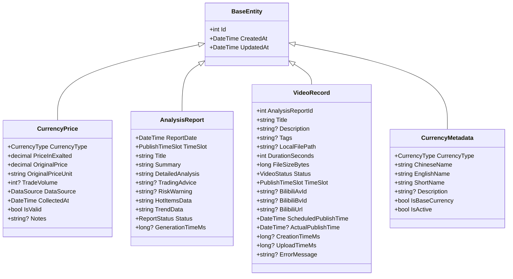
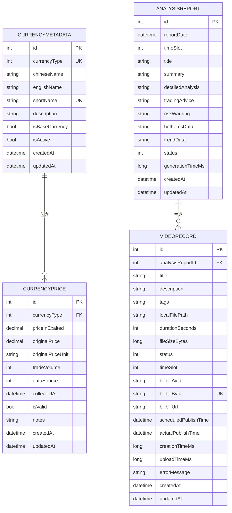

# 数据模型与ORM映射

<cite>
**Referenced Files in This Document**   
- [CurrencyPrice.cs](file://src/POE2Finance.Core/Entities/CurrencyPrice.cs)
- [AnalysisReport.cs](file://src/POE2Finance.Core/Entities/AnalysisReport.cs)
- [VideoRecord.cs](file://src/POE2Finance.Core/Entities/VideoRecord.cs)
- [CurrencyMetadata.cs](file://src/POE2Finance.Core/Entities/CurrencyMetadata.cs)
- [BaseEntity.cs](file://src/POE2Finance.Core/Entities/BaseEntity.cs)
- [POE2FinanceDbContext.cs](file://src/POE2Finance.Data/DbContexts/POE2FinanceDbContext.cs)
- [CommonEnums.cs](file://src/POE2Finance.Core/Enums/CommonEnums.cs)
</cite>

## 目录
1. [引言](#引言)
2. [核心数据实体](#核心数据实体)
3. [基础实体与共性字段](#基础实体与共性字段)
4. [数据库上下文与ORM映射](#数据库上下文与orm映射)
5. [实体关系与ER图](#实体关系与er图)
6. [数据验证与约束](#数据验证与约束)
7. [索引策略与查询优化](#索引策略与查询优化)
8. [数据生命周期管理](#数据生命周期管理)

## 引言

本文档全面记录了POE2Finance项目的核心数据模型。该系统旨在为《流放之路2》国服玩家提供自动化的价格分析与市场报告服务。其数据模型围绕通货价格监控、分析报告生成和视频内容发布三大核心功能构建。文档详细描述了`CurrencyPrice`、`AnalysisReport`、`VideoRecord`和`CurrencyMetadata`四个核心实体的结构、关系及业务含义，并基于`POE2FinanceDbContext`类说明了实体框架（Entity Framework）的配置与映射机制。

## 核心数据实体

### CurrencyPrice (通货价格)

`CurrencyPrice`实体用于存储从不同数据源采集的通货历史价格数据，是系统进行市场分析的基础。

**字段定义与业务含义**:
- `CurrencyType` (`CurrencyType`): 通货类型，使用枚举定义，如崇高石、神圣石等。
- `PriceInExalted` (`decimal`): 以崇高石为计价单位的标准化价格，便于跨通货比较。
- `OriginalPrice` (`decimal`): 从数据源获取的原始价格数值。
- `OriginalPriceUnit` (`string`): 原始价格的计价单位，如“神圣石”、“混沌石”等。
- `TradeVolume` (`int?`): 交易量，反映市场活跃度，可为空。
- `DataSource` (`DataSource`): 数据来源，标识价格数据来自腾讯官方、DD373等哪个平台。
- `CollectedAt` (`DateTime`): 数据采集时间，精确到秒。
- `IsValid` (`bool`): 数据有效性标记，用于标记异常或无效的数据点。
- `Notes` (`string?`): 备注信息，用于记录数据采集时的特殊情况。

**Section sources**
- [CurrencyPrice.cs](file://src/POE2Finance.Core/Entities/CurrencyPrice.cs#L9-L64)

### AnalysisReport (分析报告)

`AnalysisReport`实体存储每次自动生成的市场分析报告的核心信息，是系统输出价值的直接体现。

**字段定义与业务含义**:
- `ReportDate` (`DateTime`): 报告日期，通常为生成当天的日期。
- `TimeSlot` (`PublishTimeSlot`): 发布时间段，分为上午、下午、晚间三个场次。
- `Title` (`string`): 报告标题，用于视频和文章的展示，有最大长度限制。
- `Summary` (`string`): 报告摘要，简要概括市场情况。
- `DetailedAnalysis` (`string`): 详细的分析内容，存储完整的Markdown或HTML格式文本。
- `TradingAdvice` (`string?`): 针对当前市场的交易建议。
- `RiskWarning` (`string?`): 风险提示，提醒用户市场潜在风险。
- `HotItemsData` (`string`): 热点物品数据，以JSON格式存储，包含热度、趋势等信息。
- `TrendData` (`string`): 趋势数据，同样以JSON格式存储，便于前端图表渲染。
- `Status` (`ReportStatus`): 报告状态，如生成中、已发布、失败等。
- `GenerationTimeMs` (`long?`): 报告生成所耗时间（毫秒），用于性能监控。

**Section sources**
- [AnalysisReport.cs](file://src/POE2Finance.Core/Entities/AnalysisReport.cs#L9-L80)

### VideoRecord (视频记录)

`VideoRecord`实体跟踪与分析报告关联的视频内容的制作、上传和发布状态。

**字段定义与业务含义**:
- `AnalysisReportId` (`int`): 关联的分析报告ID，建立与`AnalysisReport`的外键关系。
- `Title` (`string`): 视频标题，通常与报告标题一致。
- `Description` (`string?`): 视频描述，包含标签和详细信息。
- `Tags` (`string?`): 视频标签，以逗号分隔的字符串。
- `LocalFilePath` (`string?`): 本地生成的视频文件路径。
- `DurationSeconds` (`int`): 视频时长，单位为秒。
- `FileSizeBytes` (`long`): 视频文件大小，单位为字节。
- `Status` (`VideoStatus`): 视频状态，如制作中、已发布、失败等。
- `TimeSlot` (`PublishTimeSlot`): 对应的发布时间段。
- `BilibiliAvId` / `BilibiliBvId` (`string?`): B站视频的AV号和BV号。
- `BilibiliUrl` (`string?`): B站视频的发布链接。
- `ScheduledPublishTime` (`DateTime`): 预计发布时间。
- `ActualPublishTime` (`DateTime?`): 实际发布时间。
- `CreationTimeMs` / `UploadTimeMs` (`long?`): 视频制作和上传的耗时。
- `ErrorMessage` (`string?`): 如果状态为失败，此处记录错误信息。

**Section sources**
- [VideoRecord.cs](file://src/POE2Finance.Core/Entities/VideoRecord.cs#L9-L110)

### CurrencyMetadata (通货元数据)

`CurrencyMetadata`实体存储通货的基础信息，为价格数据提供上下文和描述。

**字段定义与业务含义**:
- `CurrencyType` (`CurrencyType`): 通货类型，与`CurrencyPrice`中的类型对应。
- `ChineseName` (`string`): 通货的中文名称，如“崇高石”。
- `EnglishName` (`string`): 通货的英文名称，如“Exalted Orb”。
- `ShortName` (`string`): 通货简称，如“E”、“D”。
- `Description` (`string?`): 通货的详细描述。
- `IsBaseCurrency` (`bool`): 是否为基准计价单位，系统中崇高石为此单位。
- `IsActive` (`bool`): 是否启用价格监控，用于控制数据采集范围。

**Section sources**
- [CurrencyMetadata.cs](file://src/POE2Finance.Core/Entities/CurrencyMetadata.cs#L8-L56)

## 基础实体与共性字段

所有核心实体均继承自`BaseEntity`抽象类，实现了数据模型的标准化和代码复用。

**共性字段说明**:
- `Id` (`int`): 主键，使用整数自增，作为所有实体的唯一标识。
- `CreatedAt` (`DateTime`): 创建时间，实体首次被添加到数据库时自动设置为UTC时间。
- `UpdatedAt` (`DateTime`): 最后更新时间，实体被修改时自动更新为UTC时间。

这些共性字段通过重写`SaveChangesAsync`方法在`POE2FinanceDbContext`中实现自动管理，确保了数据的时间戳一致性。

**Diagram sources**
- [BaseEntity.cs](file://src/POE2Finance.Core/Entities/BaseEntity.cs#L7-L24)
- [CurrencyPrice.cs](file://src/POE2Finance.Core/Entities/CurrencyPrice.cs#L9-L64)
- [AnalysisReport.cs](file://src/POE2Finance.Core/Entities/AnalysisReport.cs#L9-L80)
- [VideoRecord.cs](file://src/POE2Finance.Core/Entities/VideoRecord.cs#L9-L110)
- [CurrencyMetadata.cs](file://src/POE2Finance.Core/Entities/CurrencyMetadata.cs#L8-L56)

**Section sources**
- [BaseEntity.cs](file://src/POE2Finance.Core/Entities/BaseEntity.cs#L7-L24)

## 数据库上下文与ORM映射

`POE2FinanceDbContext`是Entity Framework Core的数据库上下文类，负责管理所有实体的生命周期、配置数据库映射和执行数据操作。

**核心功能**:
1.  **实体集定义**: 通过`DbSet<T>`属性公开了`CurrencyMetadata`、`CurrencyPrices`、`AnalysisReports`和`VideoRecords`四个实体集，作为数据访问的入口。
2.  **模型配置 (`OnModelCreating`)**: 在此方法中，使用Fluent API对每个实体进行精细配置。
3.  **种子数据 (`SeedData`)**: 在模型创建时，预加载了崇高石、神圣石和混沌石的基础元数据，确保系统启动时有必要的数据。
4.  **自动时间戳管理**: 重写了`SaveChangesAsync`方法，通过检查`ChangeTracker`中的`BaseEntity`条目，自动设置`CreatedAt`和`UpdatedAt`字段。

**Section sources**
- [POE2FinanceDbContext.cs](file://src/POE2Finance.Data/DbContexts/POE2FinanceDbContext.cs#L9-L177)

## 实体关系与ER图

系统中的四个核心实体通过外键和导航属性建立了明确的关系。

**关系说明**:
- **CurrencyMetadata 与 CurrencyPrice**: 一对多关系。一个`CurrencyMetadata`（如“崇高石”）对应多个`CurrencyPrice`（历史价格记录）。在`CurrencyPrice`中，`CurrencyType`既是外键也是主键的一部分，通过`HasPrincipalKey`指定与`CurrencyMetadata`的`CurrencyType`匹配。
- **AnalysisReport 与 VideoRecord**: 一对多关系。一个`AnalysisReport`可以生成一个或多个`VideoRecord`（虽然当前设计为一对一，但预留了扩展性）。`VideoRecord`通过`AnalysisReportId`外键关联到`AnalysisReport`，并配置了`DeleteBehavior.Cascade`，即删除报告时会级联删除其关联的视频记录。

**Diagram sources**
- [CurrencyMetadata.cs](file://src/POE2Finance.Core/Entities/CurrencyMetadata.cs#L8-L56)
- [CurrencyPrice.cs](file://src/POE2Finance.Core/Entities/CurrencyPrice.cs#L9-L64)
- [AnalysisReport.cs](file://src/POE2Finance.Core/Entities/AnalysisReport.cs#L9-L80)
- [VideoRecord.cs](file://src/POE2Finance.Core/Entities/VideoRecord.cs#L9-L110)
- [POE2FinanceDbContext.cs](file://src/POE2Finance.Data/DbContexts/POE2FinanceDbContext.cs#L9-L177)

## 数据验证与约束

数据模型通过多种机制确保数据的完整性和有效性。

**主要约束**:
1.  **主键约束**: 所有实体均以`Id`为主键。
2.  **唯一性约束**:
    - `CurrencyMetadata`的`CurrencyType`和`ShortName`字段是唯一的。
    - `AnalysisReport`的`ReportDate`和`TimeSlot`组合是唯一的，防止同一天同一时段生成多份报告。
    - `VideoRecord`的`BilibiliBvId`是唯一的，确保每个B站视频只被记录一次。
3.  **外键约束**: `VideoRecord.AnalysisReportId`引用`AnalysisReport.Id`，`CurrencyPrice.CurrencyType`引用`CurrencyMetadata.CurrencyType`。
4.  **数据类型约束**: 使用`[Column(TypeName = "decimal(18,8)")]`精确控制`PriceInExalted`和`OriginalPrice`的精度和小数位数。
5.  **长度约束**: 使用`[MaxLength]`属性限制字符串字段的最大长度，如`Title`为100字符，`Notes`为200字符。
6.  **必填约束**: 使用`[Required]`属性标记`AnalysisReport`的`Title`、`Summary`等关键字段不能为空。
7.  **枚举转换**: 在`OnModelCreating`中，将`CurrencyType`、`DataSource`等枚举类型映射为数据库中的整数，提高存储效率和查询性能。

**Section sources**
- [CurrencyPrice.cs](file://src/POE2Finance.Core/Entities/CurrencyPrice.cs#L9-L64)
- [AnalysisReport.cs](file://src/POE2Finance.Core/Entities/AnalysisReport.cs#L9-L80)
- [VideoRecord.cs](file://src/POE2Finance.Core/Entities/VideoRecord.cs#L9-L110)
- [CurrencyMetadata.cs](file://src/POE2Finance.Core/Entities/CurrencyMetadata.cs#L8-L56)
- [POE2FinanceDbContext.cs](file://src/POE2Finance.Data/DbContexts/POE2FinanceDbContext.cs#L9-L177)

## 索引策略与查询优化

为了支持高效的查询，数据模型在关键字段上建立了数据库索引。

**索引配置**:
- **CurrencyPrice**:
  - `(CurrencyType, CollectedAt)`: 支持按通货类型和时间范围查询历史价格，是分析服务中最常见的查询模式。
  - `(DataSource, CollectedAt)`: 支持按数据源和时间查询，用于数据源质量分析。
- **AnalysisReport**:
  - `(ReportDate, TimeSlot)`: 唯一索引，用于快速查找特定日期和时段的报告。
- **VideoRecord**:
  - `AnalysisReportId`: 支持根据报告ID快速查找关联的视频记录。
  - `BilibiliBvId`: 唯一索引，用于通过BV号快速定位视频。

这些索引显著提升了系统在生成报告、查询历史数据和管理视频发布状态时的性能。

**Section sources**
- [POE2FinanceDbContext.cs](file://src/POE2Finance.Data/DbContexts/POE2FinanceDbContext.cs#L9-L177)

## 数据生命周期管理

系统的数据生命周期管理策略主要体现在以下几个方面：

1.  **历史价格数据保留**: `CurrencyPrice`表存储了所有采集的历史价格数据。系统通过`IsValid`字段来标记和过滤无效数据，而不是物理删除，以保留完整的数据历史用于回溯分析。
2.  **报告与视频的关联生命周期**: `VideoRecord`与`AnalysisReport`之间建立了级联删除关系。当一个分析报告被删除时，其关联的视频记录也会被自动删除，确保了数据的一致性。
3.  **自动时间戳**: 所有实体的`CreatedAt`和`UpdatedAt`字段由数据库上下文自动维护，无需业务代码干预，保证了时间信息的准确性和不可篡改性。
4.  **种子数据**: `CurrencyMetadata`表的种子数据在数据库迁移时自动创建，确保了核心元数据的稳定性和一致性。

该策略平衡了数据完整性、查询性能和存储成本，支持了系统的自动化分析和内容发布流程。