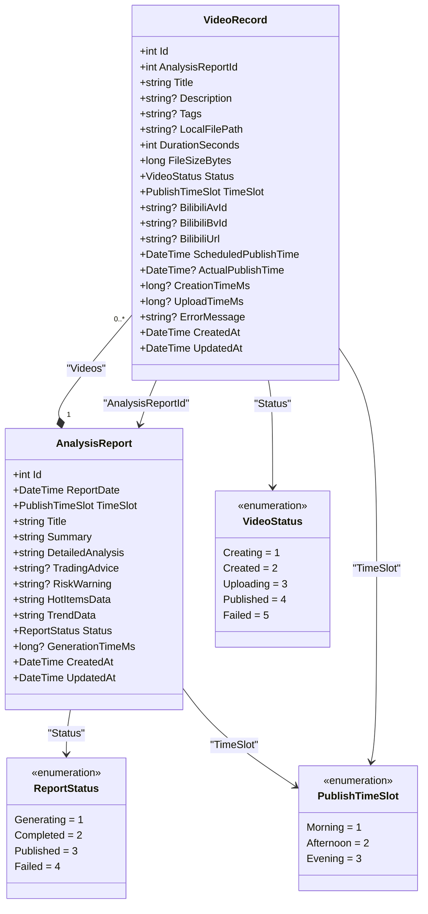

# 视频记录实体 (VideoRecord)

<cite>
**Referenced Files in This Document**  
- [VideoRecord.cs](file://src/POE2Finance.Core/Entities/VideoRecord.cs)
- [POE2FinanceDbContext.cs](file://src/POE2Finance.Data/DbContexts/POE2FinanceDbContext.cs)
- [AnalysisReport.cs](file://src/POE2Finance.Core/Entities/AnalysisReport.cs)
- [CommonEnums.cs](file://src/POE2Finance.Core/Enums/CommonEnums.cs)
- [AutomatedAnalysisJob.cs](file://src/POE2Finance.Services/Jobs/AutomatedAnalysisJob.cs)
- [BilibiliPublishingService.cs](file://src/POE2Finance.Services/Publishing/BilibiliPublishingService.cs)
</cite>

## 目录
1. [简介](#简介)
2. [核心字段说明](#核心字段说明)
3. [与AnalysisReport的外键关系](#与analysisreport的外键关系)
4. [唯一索引BilibiliBvId](#唯一索引bilibilibvid)
5. [发布状态监控](#发布状态监控)
6. [发布历史追溯](#发布历史追溯)
7. [性能数据分析](#性能数据分析)
8. [实体关系图](#实体关系图)

## 简介

`VideoRecord` 实体是POE2Finance系统中用于追踪视频发布生命周期的核心数据模型。该实体详细记录了从视频创建、制作、上传到最终发布的完整过程，为自动化分析报告的视频化发布提供了全面的数据支持。作为连接分析报告与视频内容的桥梁，`VideoRecord` 实体不仅存储了视频的基本元数据，还包含了发布状态、时间戳、性能指标等关键信息，实现了对视频发布全流程的精细化管理和监控。

**Section sources**
- [VideoRecord.cs](file://src/POE2Finance.Core/Entities/VideoRecord.cs#L9-L110)

## 核心字段说明

`VideoRecord` 实体包含了一系列精心设计的字段，用于全面描述视频的各个方面：

- **Id**: 主键，继承自 `BaseEntity`，作为每条视频记录的唯一标识符。
- **AnalysisReportId**: 关联的分析报告ID，建立与 `AnalysisReport` 实体的外键关系。
- **Title**: 视频标题，必填字段，最大长度为100个字符。
- **Description**: 视频描述，最大长度为2000个字符。
- **Tags**: 视频标签，以逗号分隔，最大长度为500个字符。
- **LocalFilePath**: 本地视频文件路径，最大长度为500个字符。
- **DurationSeconds**: 视频时长（秒）。
- **FileSizeBytes**: 视频文件大小（字节）。
- **Status**: 发布状态，使用 `VideoStatus` 枚举类型，初始值为 `Creating`。
- **TimeSlot**: 发布时间段，使用 `PublishTimeSlot` 枚举类型。
- **BilibiliAvId**: B站视频AV号。
- **BilibiliBvId**: B站视频BV号，最大长度为50个字符。
- **BilibiliUrl**: B站发布URL，最大长度为500个字符。
- **ScheduledPublishTime**: 预计发布时间。
- **ActualPublishTime**: 实际发布时间，可为空。
- **CreationTimeMs**: 制作时长（毫秒），可为空。
- **UploadTimeMs**: 上传时长（毫秒），可为空。
- **ErrorMessage**: 错误信息，最大长度为1000个字符。

**Section sources**
- [VideoRecord.cs](file://src/POE2Finance.Core/Entities/VideoRecord.cs#L9-L110)

## 与AnalysisReport的外键关系

`VideoRecord` 实体通过 `AnalysisReportId` 字段与 `AnalysisReport` 实体建立了明确的外键关系。这种关系在 `POE2FinanceDbContext` 中通过以下配置实现：

```csharp
entity.HasOne(e => e.AnalysisReport)
      .WithMany(r => r.Videos)
      .HasForeignKey(e => e.AnalysisReportId)
      .OnDelete(DeleteBehavior.Cascade);
```

此配置建立了从 `VideoRecord` 到 `AnalysisReport` 的一对多关系，其中 `AnalysisReport` 是主表，`VideoRecord` 是从表。关键的 `OnDelete(DeleteBehavior.Cascade)` 配置确保了级联删除行为：当一个 `AnalysisReport` 记录被删除时，所有关联的 `VideoRecord` 记录将被自动删除。这种设计保证了数据的一致性和完整性，避免了孤立的视频记录存在。

**Diagram sources**
- [POE2FinanceDbContext.cs](file://src/POE2Finance.Data/DbContexts/POE2FinanceDbContext.cs#L104-L108)

**Section sources**
- [POE2FinanceDbContext.cs](file://src/POE2Finance.Data/DbContexts/POE2FinanceDbContext.cs#L104-L108)
- [VideoRecord.cs](file://src/POE2Finance.Core/Entities/VideoRecord.cs#L108-L109)
- [AnalysisReport.cs](file://src/POE2Finance.Core/Entities/AnalysisReport.cs#L79-L79)

## 唯一索引BilibiliBvId

在 `POE2FinanceDbContext` 中，为 `VideoRecord` 实体配置了针对 `BilibiliBvId` 字段的唯一索引：

```csharp
entity.HasIndex(e => e.BilibiliBvId).IsUnique();
```

此唯一索引确保了每个B站视频BV号在系统中只能出现一次，防止了重复发布相同视频的错误。这一约束对于维护数据的准确性和避免B站平台的重复内容检测至关重要。当尝试插入具有已存在BV号的 `VideoRecord` 时，数据库将抛出唯一性约束异常，从而阻止了数据的重复。

**Diagram sources**
- [POE2FinanceDbContext.cs](file://src/POE2Finance.Data/DbContexts/POE2FinanceDbContext.cs#L106-L106)

**Section sources**
- [POE2FinanceDbContext.cs](file://src/POE2Finance.Data/DbContexts/POE2FinanceDbContext.cs#L106-L106)

## 发布状态监控

`VideoRecord` 实体通过 `Status` 字段和 `VideoStatus` 枚举实现了对视频发布全生命周期的精确监控。`VideoStatus` 枚举定义了五个状态：

- **Creating (1)**: 视频制作中
- **Created (2)**: 制作完成
- **Uploading (3)**: 上传中
- **Published (4)**: 已发布
- **Failed (5)**: 失败

在 `AutomatedAnalysisJob` 和 `BilibiliPublishingService` 中，这些状态被动态更新以反映视频的实际进展。例如，在视频生成完成后，状态会从 `Creating` 更新为 `Created`；在发布过程中，状态变为 `Uploading`；成功发布后，状态最终变为 `Published`。这种状态机模式使得系统能够实时跟踪每个视频的发布进度，并在发生错误时将其标记为 `Failed`。

**Section sources**
- [CommonEnums.cs](file://src/POE2Finance.Core/Enums/CommonEnums.cs#L109-L135)
- [VideoRecord.cs](file://src/POE2Finance.Core/Entities/VideoRecord.cs#L54-L54)
- [AutomatedAnalysisJob.cs](file://src/POE2Finance.Services/Jobs/AutomatedAnalysisJob.cs#L159-L191)
- [BilibiliPublishingService.cs](file://src/POE2Finance.Services/Publishing/BilibiliPublishingService.cs#L66-L104)

## 发布历史追溯

`VideoRecord` 实体通过一系列时间戳字段支持完整的发布历史追溯：

- **ScheduledPublishTime**: 记录了视频计划的发布时间。
- **ActualPublishTime**: 记录了视频实际成功发布的时间。
- **CreatedAt** 和 **UpdatedAt**: 继承自 `BaseEntity`，记录了记录的创建和最后更新时间。

这些时间戳使得系统能够精确计算计划发布时间与实际发布时间之间的差异，分析发布延迟的原因。此外，通过查询 `ActualPublishTime`，可以生成按时间排序的发布历史记录，便于进行趋势分析和绩效评估。

**Section sources**
- [VideoRecord.cs](file://src/POE2Finance.Core/Entities/VideoRecord.cs#L95-L97)
- [BaseEntity.cs](file://src/POE2Finance.Core/Entities/BaseEntity.cs)

## 性能数据分析

`VideoRecord` 实体为性能数据分析提供了关键指标：

- **CreationTimeMs**: 记录了视频制作所花费的时间（毫秒），可用于评估视频生成服务的性能和效率。
- **UploadTimeMs**: 记录了视频上传到B站所花费的时间（毫秒），可用于分析网络性能和上传服务的稳定性。
- **FileSizeBytes**: 记录了视频文件的大小，可用于分析存储使用情况和带宽消耗。
- **DurationSeconds**: 记录了视频的播放时长，是内容分析的基础数据。

虽然原始查询中未找到 `ViewCount` 字段，但系统可能通过其他方式（如外部API调用）获取播放量数据，并与 `VideoRecord` 关联进行综合分析。这些性能指标共同构成了一个全面的视频发布性能监控体系。

**Section sources**
- [VideoRecord.cs](file://src/POE2Finance.Core/Entities/VideoRecord.cs#L85-L93)

## 实体关系图



**Diagram sources**
- [VideoRecord.cs](file://src/POE2Finance.Core/Entities/VideoRecord.cs#L9-L110)
- [AnalysisReport.cs](file://src/POE2Finance.Core/Entities/AnalysisReport.cs#L9-L80)
- [CommonEnums.cs](file://src/POE2Finance.Core/Enums/CommonEnums.cs#L109-L156)