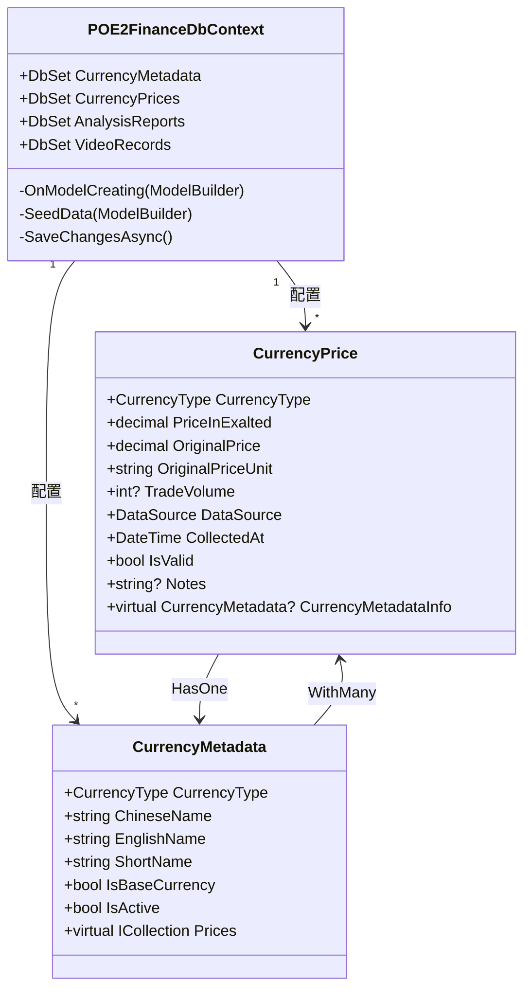

# 通货价格实体 (CurrencyPrice)

<cite>
**Referenced Files in This Document**   
- [CurrencyPrice.cs](file://src/POE2Finance.Core/Entities/CurrencyPrice.cs)
- [CurrencyMetadata.cs](file://src/POE2Finance.Core/Entities/CurrencyMetadata.cs)
- [BaseEntity.cs](file://src/POE2Finance.Core/Entities/BaseEntity.cs)
- [POE2FinanceDbContext.cs](file://src/POE2Finance.Data/DbContexts/POE2FinanceDbContext.cs)
- [CommonEnums.cs](file://src/POE2Finance.Core/Enums/CommonEnums.cs)
</cite>

## 目录
1. [简介](#简介)
2. [核心字段定义](#核心字段定义)
3. [实体关系](#实体关系)
4. [数据库配置与索引策略](#数据库配置与索引策略)
5. [数据验证与业务约束](#数据验证与业务约束)
6. [在价格分析中的核心作用](#在价格分析中的核心作用)

## 简介

`CurrencyPrice` 实体是 POE2Finance 系统的核心数据模型，负责存储和管理《流放之路2》(POE2) 游戏内通货的历史价格数据。该实体不仅记录了价格本身，还包含了交易量、数据来源、采集时间等关键元信息，为后续的价格趋势分析、市场监控和内容生成提供了坚实的数据基础。它通过继承 `BaseEntity` 获得通用的主键和时间戳，并与 `CurrencyMetadata` 实体建立关联，实现了通货基础信息与动态价格数据的分离与整合。

**Section sources**
- [CurrencyPrice.cs](file://src/POE2Finance.Core/Entities/CurrencyPrice.cs#L9-L64)
- [BaseEntity.cs](file://src/POE2Finance.Core/Entities/BaseEntity.cs#L7-L24)

## 核心字段定义

`CurrencyPrice` 实体包含以下核心字段，每个字段都经过精心设计以满足业务需求：

- **`Id` (主键)**: 继承自 `BaseEntity` 的整型主键，作为数据库表的唯一标识。
- **`CurrencyType` (通货类型)**: 枚举类型 `CurrencyType`，通过 EF Core 的 `HasConversion<int>()` 配置，以整型存储在数据库中，确保了数据的高效性和一致性。
- **`PriceInExalted` (单价)**: `decimal(18,8)` 类型的精确数值，表示该通货相对于“崇高石”的价格，是系统进行价格比较和计算的核心字段。
- **`TradeVolume` (交易量)**: 可空的整型字段，记录该价格点对应的交易数量，用于分析市场活跃度。
- **`CollectedAt` (采集时间戳)**: `DateTime` 类型，精确记录数据从外部来源采集的时间点。
- **`CreatedAt` / `UpdatedAt` (创建/更新时间戳)**: 继承自 `BaseEntity` 的时间戳字段，由 `POE2FinanceDbContext` 在 `SaveChangesAsync` 时自动维护，记录实体在数据库中的生命周期。

**Section sources**
- [CurrencyPrice.cs](file://src/POE2Finance.Core/Entities/CurrencyPrice.cs#L9-L64)
- [POE2FinanceDbContext.cs](file://src/POE2Finance.Data/DbContexts/POE2FinanceDbContext.cs#L155-L177)
- [CommonEnums.cs](file://src/POE2Finance.Core/Enums/CommonEnums.cs#L4-L20)

## 实体关系

`CurrencyPrice` 实体与 `CurrencyMetadata` 实体之间存在明确的外键关系，实现了动态价格数据与静态元数据的关联。

```mermaid
erDiagram
CURRENCYMETADATA ||--o{ CURRENCYPRICE : "包含"
CURRENCYMETADATA {
int Id PK
int CurrencyType
string ChineseName
string EnglishName
string ShortName
bool IsBaseCurrency
bool IsActive
datetime CreatedAt
datetime UpdatedAt
}
CURRENCYPRICE {
int Id PK
int CurrencyType FK
decimal PriceInExalted
decimal OriginalPrice
string OriginalPriceUnit
int? TradeVolume
int DataSource
datetime CollectedAt
bool IsValid
string? Notes
datetime CreatedAt
datetime UpdatedAt
}
```

**Diagram sources**
- [CurrencyPrice.cs](file://src/POE2Finance.Core/Entities/CurrencyPrice.cs#L63-L64)
- [CurrencyMetadata.cs](file://src/POE2Finance.Core/Entities/CurrencyMetadata.cs#L55-L56)

如上图所示，`CurrencyPrice` 通过 `CurrencyType` 字段与 `CurrencyMetadata` 建立了一对多的关系。`CurrencyMetadata` 作为主表，存储了通货的中文名、英文名、简称等基础信息；而 `CurrencyPrice` 作为从表，存储了该通货在不同时间点的价格记录。这种设计避免了数据冗余，当需要查询某个价格点的通货名称时，可以通过导航属性 `CurrencyMetadataInfo` 进行高效关联查询。

## 数据库配置与索引策略

在 `POE2FinanceDbContext` 的 `OnModelCreating` 方法中，对 `CurrencyPrice` 实体进行了详细的配置，特别是索引策略的设计，旨在优化核心查询性能。



**Diagram sources**
- [POE2FinanceDbContext.cs](file://src/POE2Finance.Data/DbContexts/POE2FinanceDbContext.cs#L55-L88)

关键的索引配置如下：
- **`(CurrencyType, CollectedAt)` 复合索引**: 此索引是查询特定通货历史价格序列的基石。例如，当分析“神圣石”在过去24小时内的价格走势时，数据库可以利用此索引快速定位到所有“神圣石”的价格记录，并按时间排序，极大地提升了查询效率。
- **`(DataSource, CollectedAt)` 复合索引**: 此索引用于按数据源分析数据采集情况。系统可以快速查询某个时间段内（如过去一小时）从“腾讯官方”或“DD373”采集了多少条价格数据，这对于监控数据采集服务的健康状况至关重要。

**Section sources**
- [POE2FinanceDbContext.cs](file://src/POE2Finance.Data/DbContexts/POE2FinanceDbContext.cs#L69-L75)

## 数据验证与业务约束

虽然 `CurrencyPrice` 实体本身未直接使用 `[Range]` 等数据注解进行验证，但其业务约束主要通过应用层逻辑和数据库设计来保证：

- **单价约束**: `PriceInExalted` 和 `OriginalPrice` 字段被定义为 `decimal` 类型，且在业务逻辑中（如 `DataCollectionService` 和 `MaintenanceJobs`）会确保其值大于0。一个价格为0或负数的记录在经济上是无意义的。
- **交易量约束**: `TradeVolume` 字段被定义为可空的整型，其值必须为非负数。`null` 值表示该数据源未提供交易量信息，而任何负数在业务逻辑中都会被拒绝或视为无效。
- **数据有效性**: `IsValid` 布尔字段提供了软删除机制。当发现某条价格数据因异常情况（如网络波动导致的错误数据）而不可靠时，可以将其 `IsValid` 标记为 `false`，而非直接从数据库中删除，这有助于数据审计和问题追溯。

**Section sources**
- [CurrencyPrice.cs](file://src/POE2Finance.Core/Entities/CurrencyPrice.cs#L42-L47)
- [MaintenanceJobs.cs](file://src/POE2Finance.Services/Jobs/MaintenanceJobs.cs#L70-L80)

## 在价格分析中的核心作用

`CurrencyPrice` 实体是整个系统价格分析功能的基石。`PriceAnalysisService` 服务通过 `CurrencyPriceRepository` 查询此实体的数据，执行以下关键任务：

1.  **趋势计算**: 通过查询特定 `CurrencyType` 在一段时间内的 `PriceInExalted` 序列，计算价格的涨跌幅、波动率，并识别出 `StrongUptrend`、`Sideways` 等趋势类型。
2.  **市场活跃度分析**: 结合 `TradeVolume` 数据，分析不同通货或不同数据源的市场交易活跃程度。
3.  **报告生成**: 将分析结果与 `CurrencyMetadata` 的信息结合，生成包含通货名称、价格变化、趋势判断等内容的 `AnalysisReport`。
4.  **内容创作**: 最终，这些分析报告被 `ContentGenerationService` 用于生成视频脚本，实现从原始数据到可视化内容的自动化流程。

因此，`CurrencyPrice` 实体的质量和完整性直接决定了整个系统分析结果的准确性和可靠性。

**Section sources**
- [CurrencyPrice.cs](file://src/POE2Finance.Core/Entities/CurrencyPrice.cs#L20-L21)
- [PriceAnalysisService.cs](file://src/POE2Finance.Services/Analysis/PriceAnalysisService.cs#L98-L108)
- [CurrencyMetadata.cs](file://src/POE2Finance.Core/Entities/CurrencyMetadata.cs#L10-L18)