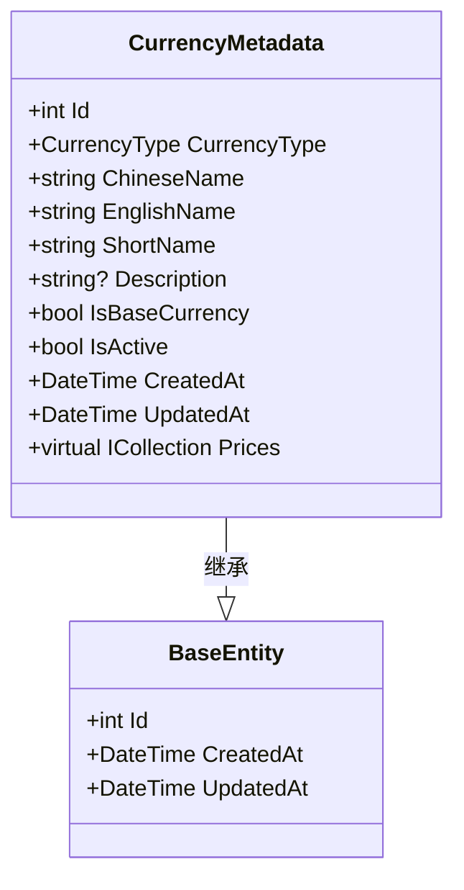

# 通货元数据实体 (CurrencyMetadata)

<cite>
**Referenced Files in This Document**  
- [CurrencyMetadata.cs](file://src/POE2Finance.Core/Entities/CurrencyMetadata.cs)
- [POE2FinanceDbContext.cs](file://src/POE2Finance.Data/DbContexts/POE2FinanceDbContext.cs)
- [CommonEnums.cs](file://src/POE2Finance.Core/Enums/CommonEnums.cs)
- [CurrencyPrice.cs](file://src/POE2Finance.Core/Entities/CurrencyPrice.cs)
- [BaseEntity.cs](file://src/POE2Finance.Core/Entities/BaseEntity.cs)
</cite>

## 目录
1. [简介](#简介)
2. [实体结构与字段说明](#实体结构与字段说明)
3. [数据库配置与约束](#数据库配置与约束)
4. [关系模型](#关系模型)
5. [种子数据与初始化](#种子数据与初始化)
6. [综合架构图](#综合架构图)

## 简介

`CurrencyMetadata` 实体是 POE2Finance 系统的核心配置数据之一，作为所有通货信息的静态元数据存储中心。该实体定义了每种通货的基础属性，为系统的价格分析、数据采集和报告生成提供统一的参照标准。通过将通货的静态信息（如名称、简称、描述）与动态价格数据分离，系统实现了数据结构的清晰分层和高效管理。

**Section sources**
- [CurrencyMetadata.cs](file://src/POE2Finance.Core/Entities/CurrencyMetadata.cs#L8-L56)

## 实体结构与字段说明

`CurrencyMetadata` 类继承自 `BaseEntity`，包含以下关键字段，用于完整描述一种通货的静态信息：

| 字段名 | 类型 | 是否必填 | 描述 |
| :--- | :--- | :--- | :--- |
| `Id` | `int` | 是 | 主键标识，由数据库自动生成。 |
| `CurrencyType` | `CurrencyType` | 是 | 通货类型枚举，系统通过此字段唯一标识每种通货。 |
| `ChineseName` | `string` | 是 | 通货的中文名称，最大长度为50个字符。 |
| `EnglishName` | `string` | 是 | 通货的英文名称，最大长度为100个字符。 |
| `ShortName` | `string` | 是 | 通货的简称（如E、D、C），用于快速标识和显示，最大长度为10个字符。 |
| `Description` | `string?` | 否 | 通货的详细描述，最大长度为500个字符。 |
| `IsBaseCurrency` | `bool` | 是 | 标记是否为基准计价单位（例如崇高石），系统以此作为价格换算的基准。 |
| `IsActive` | `bool` | 是 | 标记该通货是否处于活跃状态，用于控制是否对其进行价格监控和分析。 |
| `CreatedAt` | `DateTime` | 是 | 记录创建时间，由系统自动填充。 |
| `UpdatedAt` | `DateTime` | 是 | 记录最后更新时间，由系统自动维护。 |

**Section sources**
- [CurrencyMetadata.cs](file://src/POE2Finance.Core/Entities/CurrencyMetadata.cs#L8-L56)
- [BaseEntity.cs](file://src/POE2Finance.Core/Entities/BaseEntity.cs#L7-L24)
- [CommonEnums.cs](file://src/POE2Finance.Core/Enums/CommonEnums.cs#L5-L22)

## 数据库配置与约束

在 `POE2FinanceDbContext` 中，`CurrencyMetadata` 实体的数据库模型通过 `OnModelCreating` 方法进行了精确配置，确保了数据的完整性和查询效率。

### 主键与属性配置
- **主键**：`Id` 字段被配置为实体的主键。
- **枚举转换**：`CurrencyType` 枚举类型被转换为整数（`int`）存储，以提高数据库的兼容性和查询性能。

### 唯一性索引
为保证数据的唯一性和支持高效查询，系统配置了两个关键的唯一性索引：
1. **`CurrencyType` 唯一索引**：确保每种通货类型在数据库中仅存在一条记录，防止数据重复。
2. **`ShortName` 唯一索引**：确保每种通货的简称是唯一的，便于在用户界面和API中进行快速查找和引用。



**Diagram sources**
- [CurrencyMetadata.cs](file://src/POE2Finance.Core/Entities/CurrencyMetadata.cs#L8-L56)
- [BaseEntity.cs](file://src/POE2Finance.Core/Entities/BaseEntity.cs#L7-L24)

**Section sources**
- [POE2FinanceDbContext.cs](file://src/POE2Finance.Data/DbContexts/POE2FinanceDbContext.cs#L45-L50)

## 关系模型

`CurrencyMetadata` 实体与 `CurrencyPrice` 实体之间建立了清晰的一对多关系，这是系统数据模型的核心。

### 逆向一对多关系
- **关系定义**：一个 `CurrencyMetadata` 实体可以关联多个 `CurrencyPrice` 实体，表示一种通货拥有多个历史价格记录。
- **导航属性**：`CurrencyMetadata` 类中的 `Prices` 属性是一个 `ICollection<CurrencyPrice>` 类型的虚拟集合，允许从元数据实体直接访问其所有相关的价格记录。
- **外键约束**：`CurrencyPrice` 实体中的 `CurrencyType` 字段作为外键，引用 `CurrencyMetadata` 的 `CurrencyType` 字段。这种设计利用了通货类型的唯一性，避免了对主键 `Id` 的依赖，增强了数据模型的稳定性。

### 级联删除策略
关系配置中使用了 `DeleteBehavior.Restrict`（限制删除）策略。这意味着，只要存在与某个 `CurrencyMetadata` 相关的 `CurrencyPrice` 记录，该元数据记录就无法被删除，从而有效防止了因误操作导致的数据完整性破坏。

```mermaid
erDiagram
CURRENCY_METADATA ||--o{ CURRENCY_PRICE : "包含"
CURRENCY_METADATA {
int Id PK
int CurrencyType UK
string ChineseName
string EnglishName
string ShortName UK
string Description
bool IsBaseCurrency
bool IsActive
datetime CreatedAt
datetime UpdatedAt
}
CURRENCY_PRICE {
int Id PK
int CurrencyType FK
decimal PriceInExalted
decimal OriginalPrice
string OriginalPriceUnit
int? TradeVolume
int DataSource
datetime CollectedAt
bool IsValid
string Notes
datetime CreatedAt
datetime UpdatedAt
}
```

**Diagram sources**
- [CurrencyMetadata.cs](file://src/POE2Finance.Core/Entities/CurrencyMetadata.cs#L55-L55)
- [CurrencyPrice.cs](file://src/POE2Finance.Core/Entities/CurrencyPrice.cs#L9-L64)
- [POE2FinanceDbContext.cs](file://src/POE2Finance.Data/DbContexts/POE2FinanceDbContext.cs#L65-L75)

**Section sources**
- [CurrencyMetadata.cs](file://src/POE2Finance.Core/Entities/CurrencyMetadata.cs#L55-L55)
- [CurrencyPrice.cs](file://src/POE2Finance.Core/Entities/CurrencyPrice.cs#L9-L64)

## 种子数据与初始化

系统通过 `SeedData` 方法在数据库迁移时自动初始化核心通货的元数据，确保应用在首次部署后即可正常运行。

### 种子数据内容
初始化过程会向 `CurrencyMetadata` 表中插入三条核心通货的记录：
1. **崇高石 (Exalted Orb)**：`ShortName` 为 "E"，`IsBaseCurrency` 为 `true`，作为所有价格的基准单位。
2. **神圣石 (Divine Orb)**：`ShortName` 为 "D"，`IsBaseCurrency` 为 `false`。
3. **混沌石 (Chaos Orb)**：`ShortName` 为 "C"，`IsBaseCurrency` 为 `false`。

### 初始化时机
种子数据的插入发生在 `OnModelCreating` 方法的末尾，由 Entity Framework Core 在执行 `Add-Migration` 和 `Update-Database` 命令时自动处理。

### `IsActive` 标志的应用
`IsActive` 字段为系统提供了灵活的管理能力。通过将某个通货的 `IsActive` 设置为 `false`，可以临时禁用对该通货的所有价格采集和分析任务，而无需从数据库中物理删除其元数据。这在通货市场出现异常或需要进行维护时非常有用。

**Section sources**
- [POE2FinanceDbContext.cs](file://src/POE2Finance.Data/DbContexts/POE2FinanceDbContext.cs#L144-L175)

## 综合架构图

下图展示了 `CurrencyMetadata` 实体在整个系统中的位置及其与其他核心组件的关系。

```mermaid
graph TD
subgraph "数据层"
A[CURRENCY_METADATA]
B[CURRENCY_PRICE]
C[ANALYSIS_REPORT]
D[VIDEO_RECORD]
end
subgraph "服务层"
E[DataCollectionService]
F[PriceAnalysisService]
G[BilibiliPublishingService]
end
A --> B : 一对多
B --> F : 提供数据
E --> B : 写入数据
F --> C : 生成报告
C --> D : 关联视频
G --> D : 发布视频
F --> A : 查询元数据
E --> A : 查询元数据
style A fill:#f9f,stroke:#333
```

**Diagram sources**
- [CurrencyMetadata.cs](file://src/POE2Finance.Core/Entities/CurrencyMetadata.cs#L8-L56)
- [CurrencyPrice.cs](file://src/POE2Finance.Core/Entities/CurrencyPrice.cs#L9-L64)
- [POE2FinanceDbContext.cs](file://src/POE2Finance.Data/DbContexts/POE2FinanceDbContext.cs#L22-L22)
- [POE2FinanceDbContext.cs](file://src/POE2Finance.Data/DbContexts/POE2FinanceDbContext.cs#L33-L33)