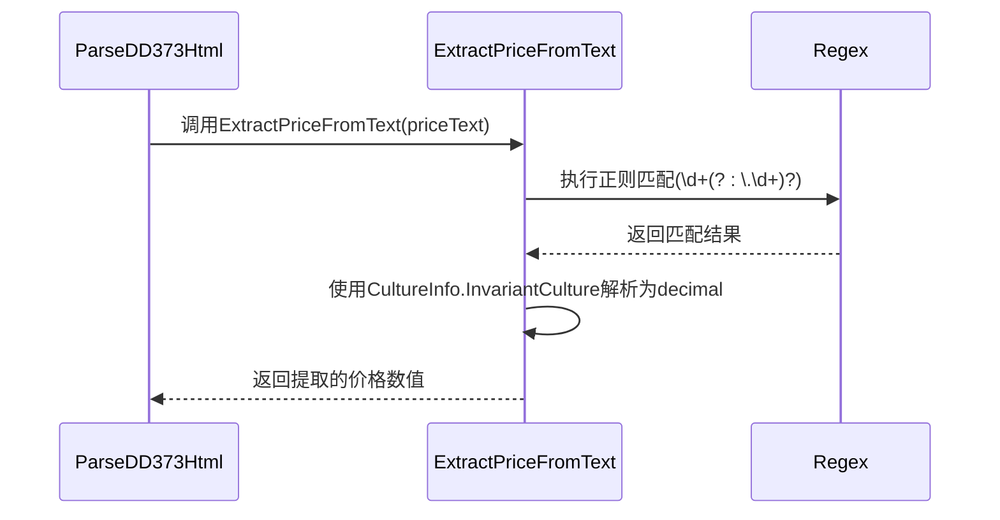
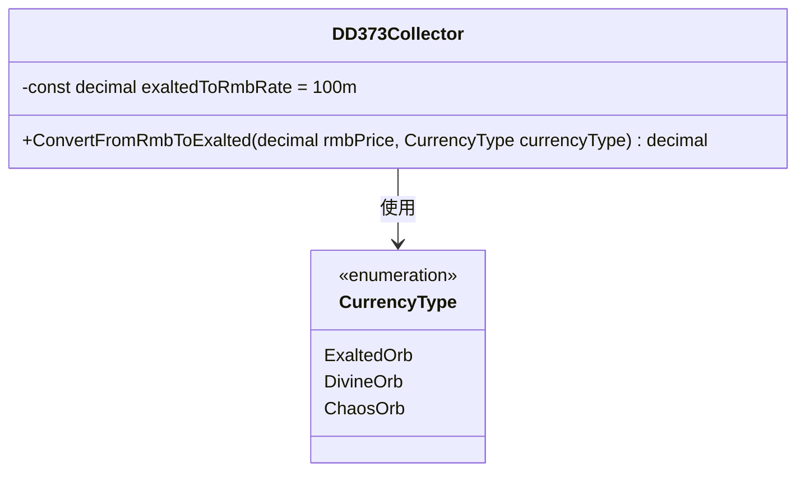
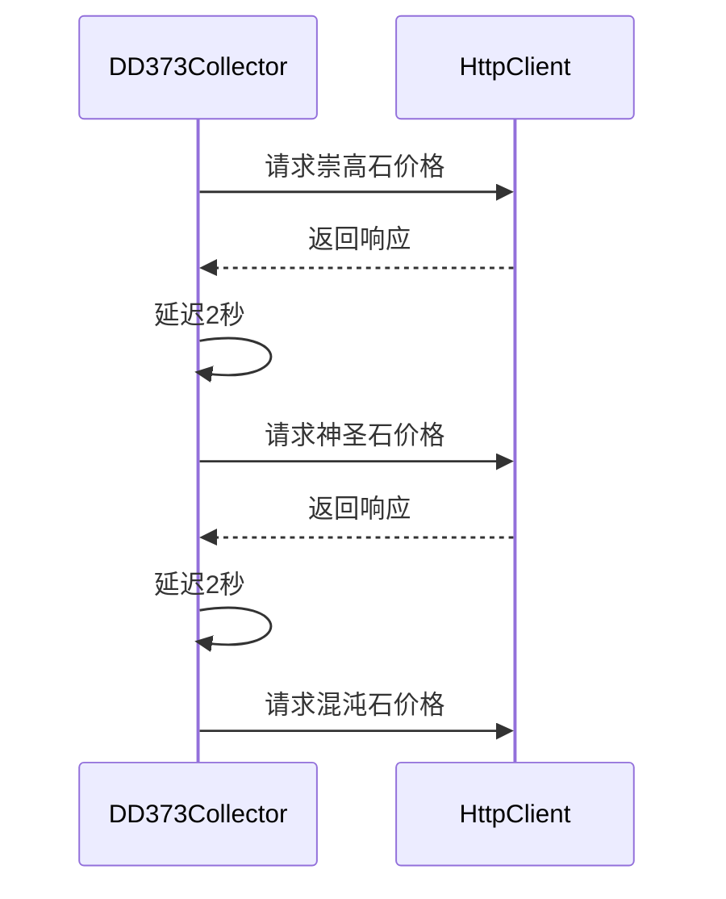
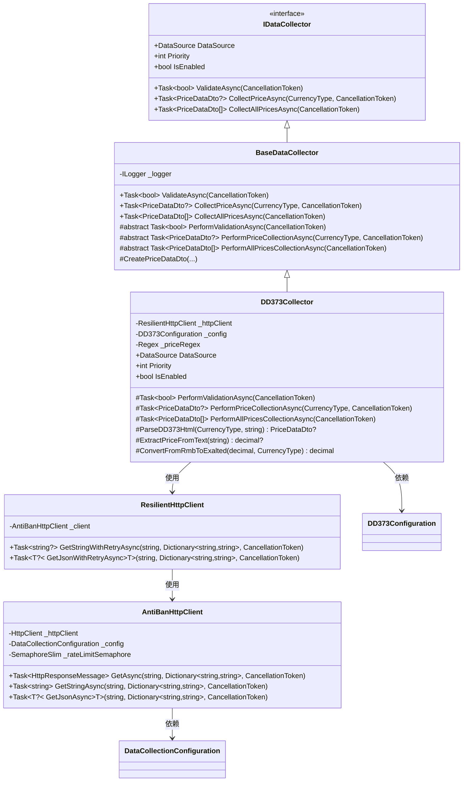

# DD373数据源采集器

<cite>
**Referenced Files in This Document**   
- [DD373Collector.cs](file://src/POE2Finance.Services/DataCollection/Collectors/DD373Collector.cs)
- [DataCollectionConfiguration.cs](file://src/POE2Finance.Services/Configuration/DataCollectionConfiguration.cs)
- [AntiBanHttpClient.cs](file://src/POE2Finance.Services/Infrastructure/AntiBanHttpClient.cs)
- [BaseDataCollector.cs](file://src/POE2Finance.Services/DataCollection/BaseDataCollector.cs)
</cite>

## 目录
1. [简介](#简介)
2. [核心实现机制](#核心实现机制)
3. [HTML解析与价格提取](#html解析与价格提取)
4. [货币单位转换](#货币单位转换)
5. [容错与反爬策略](#容错与反爬策略)
6. [配置与依赖关系](#配置与依赖关系)
7. [类图与架构](#类图与架构)

## 简介

DD373数据源采集器是POE2Finance项目中负责从第三方交易平台DD373抓取《流放之路2》游戏内通货价格信息的核心组件。该采集器通过模拟HTTP请求获取网页内容，并利用HTML解析技术提取关键数据，为后续的价格分析和可视化提供原始数据支持。采集器设计注重稳定性、容错性和反反爬虫能力，确保在目标网站结构变化或网络异常情况下仍能可靠运行。

**Section sources**
- [DD373Collector.cs](file://src/POE2Finance.Services/DataCollection/Collectors/DD373Collector.cs#L1-L20)

## 核心实现机制

DD373Collector类继承自BaseDataCollector抽象基类，实现了标准化的数据采集接口。其核心功能围绕`PerformPriceCollectionAsync`和`PerformAllPricesCollectionAsync`两个异步方法展开，分别用于采集单个通货类型和所有支持通货类型的价格数据。采集器通过ResilientHttpClient进行HTTP通信，该客户端封装了重试机制、速率限制和随机延迟等防反爬特性，确保请求的稳定性和隐蔽性。

采集流程始于`PerformValidationAsync`方法，该方法首先验证数据源的可用性，通过访问DD373的POE2专区并检查响应内容中是否包含特定关键词（如"POE2"或"流放之路"）来判断网站是否正常运行。验证通过后，系统根据配置的通货类型映射关系（如"exalted-orb"对应崇高石）构建目标URL，并发起数据抓取请求。

**Section sources**
- [DD373Collector.cs](file://src/POE2Finance.Services/DataCollection/Collectors/DD373Collector.cs#L70-L90)
- [BaseDataCollector.cs](file://src/POE2Finance.Services/DataCollection/BaseDataCollector.cs#L154-L165)

## HTML解析与价格提取

### 多重XPath选择器定位

`ParseDD373Html`方法是解析网页内容的核心，它利用HtmlAgilityPack库将HTML字符串解析为文档对象模型（DOM）。为了应对网页结构可能的变化，该方法采用了多重XPath选择器的容错策略：

```mermaid
flowchart TD
A[开始解析HTML] --> B{尝试选择器1:<br/>//span[@class='price']}
B --> |成功| C[获取价格节点]
B --> |失败| D{尝试选择器2:<br/>//div[@class='price-info']//span}
D --> |成功| C
D --> |失败| E{尝试选择器3:<br/>//td[contains(@class,'price')]}
E --> |成功| C
E --> |失败| F{尝试选择器4:<br/>//*[contains(text(),'¥') or contains(text(),'元')]}
F --> |成功| C
F --> |失败| G[记录警告并返回null]
C --> H[提取文本内容]
```

**Diagram sources**
- [DD373Collector.cs](file://src/POE2Finance.Services/DataCollection/Collectors/DD373Collector.cs#L134-L150)

这种链式选择器策略极大地增强了采集器的健壮性。即使网站改版导致某个CSS类名或DOM结构发生变化，采集器仍能通过备用选择器定位到价格信息。例如，当首选的`<span class="price">`节点不存在时，系统会退而求其次，寻找包含"¥"或"元"等货币符号的任意元素，确保不会因单一选择器失效而导致整个采集过程失败。

### 正则表达式数值提取

定位到包含价格信息的HTML节点后，`ExtractPriceFromText`方法负责从文本中提取数值。该方法使用预编译的正则表达式`(\d+(?:\.\d+)?)`来匹配数字，能够正确识别整数和小数。例如，对于文本"¥123.45元"，正则表达式会成功匹配"123.45"并将其转换为`decimal`类型的数值。



**Diagram sources**
- [DD373Collector.cs](file://src/POE2Finance.Services/DataCollection/Collectors/DD373Collector.cs#L200-L212)

该方法还包含了空值检查和文化信息（CultureInfo）的显式指定，确保在不同系统环境下都能正确解析数字格式，避免因区域性设置差异导致的解析错误。

**Section sources**
- [DD373Collector.cs](file://src/POE2Finance.Services/DataCollection/Collectors/DD373Collector.cs#L150-L160)
- [DD373Collector.cs](file://src/POE2Finance.Services/DataCollection/Collectors/DD373Collector.cs#L200-L212)

## 货币单位转换

### 人民币到崇高石的标准化

由于DD373平台以人民币（RMB）为计价单位，而项目需要以游戏内通货"崇高石"为基准进行价格比较，`ConvertFromRmbToExalted`方法实现了这一关键的单位转换。该方法基于一个预设的汇率常量`exaltedToRmbRate`（假设1崇高石=100人民币），将人民币报价转换为以崇高石为单位的标准化价格。



**Diagram sources**
- [DD373Collector.cs](file://src/POE2Finance.Services/DataCollection/Collectors/DD373Collector.cs#L220-L233)

转换逻辑根据通货类型进行区分：对于崇高石本身，直接返回1.0；对于神圣石和混沌石，则将人民币价格除以汇率常量。这种设计使得不同通货的价格可以在同一基准下进行比较和分析。

**Section sources**
- [DD373Collector.cs](file://src/POE2Finance.Services/DataCollection/Collectors/DD373Collector.cs#L220-L233)

## 容错与反爬策略

### 请求间隔控制

`PerformAllPricesCollectionAsync`方法在循环采集多种通货价格时，通过`await Task.Delay(2000, cancellationToken)`在每次请求后添加2秒的固定延迟。这一策略显著降低了被目标网站识别为爬虫并封禁IP的风险。与腾讯官方采集器使用的1秒延迟相比，DD373采集器采用了更保守的2秒延迟，反映出对DD373平台反爬机制更为谨慎的应对策略。



**Diagram sources**
- [DD373Collector.cs](file://src/POE2Finance.Services/DataCollection/Collectors/DD373Collector.cs#L92-L110)

### 全局反爬机制

除了采集器内部的延迟策略，系统还通过`AntiBanHttpClient`实现了更高级别的防护。该客户端封装了`ResilientHttpClient`，提供了以下核心功能：
- **速率限制**：通过`SemaphoreSlim`和锁机制确保请求频率不超过配置的最小间隔。
- **随机延迟**：在基础延迟之上添加随机时间（默认30-180秒），使请求模式更接近人类用户。
- **User-Agent轮换**：从预设池中随机选择User-Agent，避免使用单一标识。
- **自动重试**：利用Polly库实现指数退避重试策略，在网络波动时自动恢复。

**Section sources**
- [DD373Collector.cs](file://src/POE2Finance.Services/DataCollection/Collectors/DD373Collector.cs#L92-L110)
- [AntiBanHttpClient.cs](file://src/POE2Finance.Services/Infrastructure/AntiBanHttpClient.cs#L150-L200)

## 配置与依赖关系

DD373Collector的运行依赖于`DataCollectionConfiguration`中的`DD373Configuration`配置对象，该对象通过依赖注入提供以下关键参数：
- `BaseUrl`：DD373网站的基础URL（https://www.dd373.com）
- `Poe2Section`：POE2专区的路径（/poe2）
- `Headers`：发送请求时附带的HTTP头信息
- `Enabled`和`Priority`：控制采集器的启用状态和优先级

这些配置使得采集器的行为可以在不修改代码的情况下进行调整，提高了系统的灵活性和可维护性。

**Section sources**
- [DD373Collector.cs](file://src/POE2Finance.Services/DataCollection/Collectors/DD373Collector.cs#L25-L34)
- [DataCollectionConfiguration.cs](file://src/POE2Finance.Services/Configuration/DataCollectionConfiguration.cs#L150-L170)

## 类图与架构



**Diagram sources**
- [DD373Collector.cs](file://src/POE2Finance.Services/DataCollection/Collectors/DD373Collector.cs#L15-L234)
- [BaseDataCollector.cs](file://src/POE2Finance.Services/DataCollection/BaseDataCollector.cs#L15-L216)
- [AntiBanHttpClient.cs](file://src/POE2Finance.Services/Infrastructure/AntiBanHttpClient.cs#L15-L272)
- [DataCollectionConfiguration.cs](file://src/POE2Finance.Services/Configuration/DataCollectionConfiguration.cs#L150-L170)