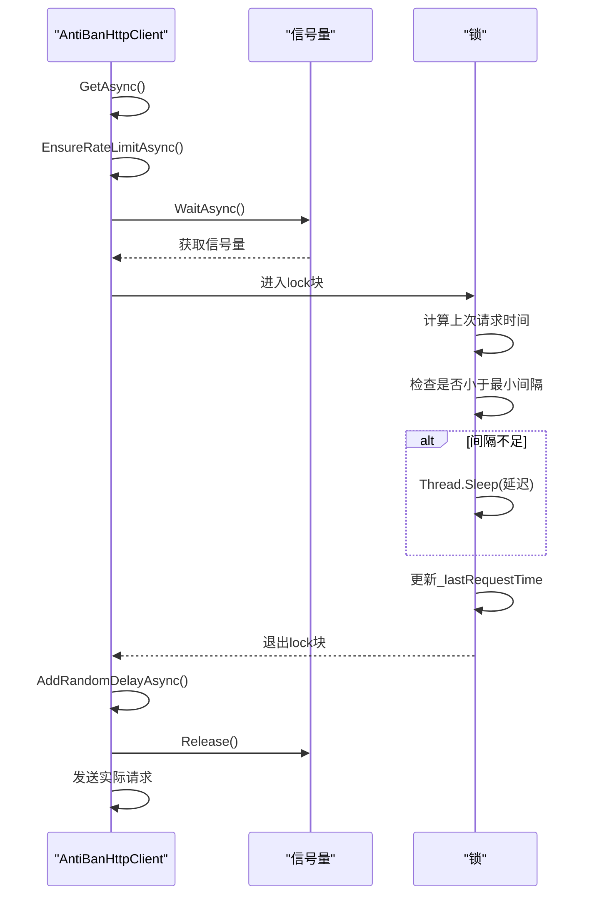
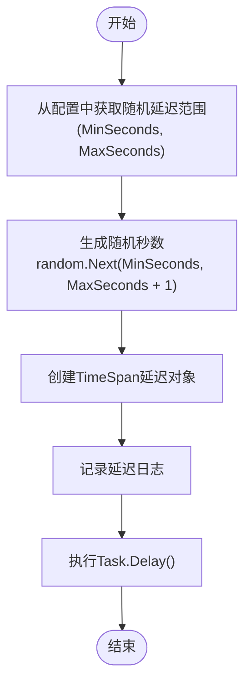
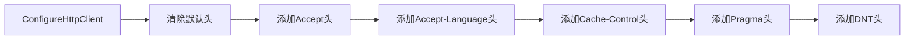
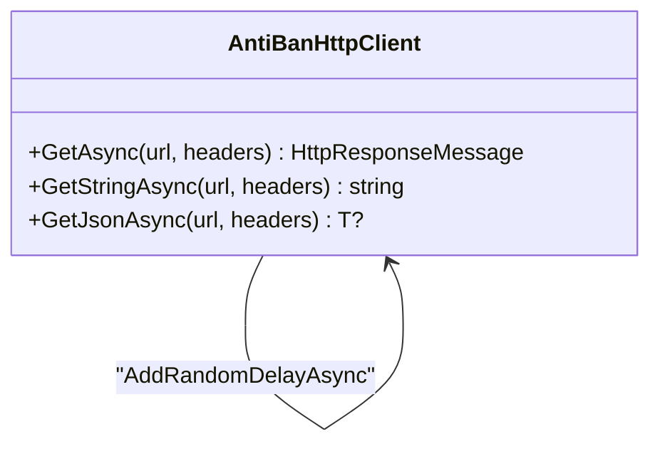
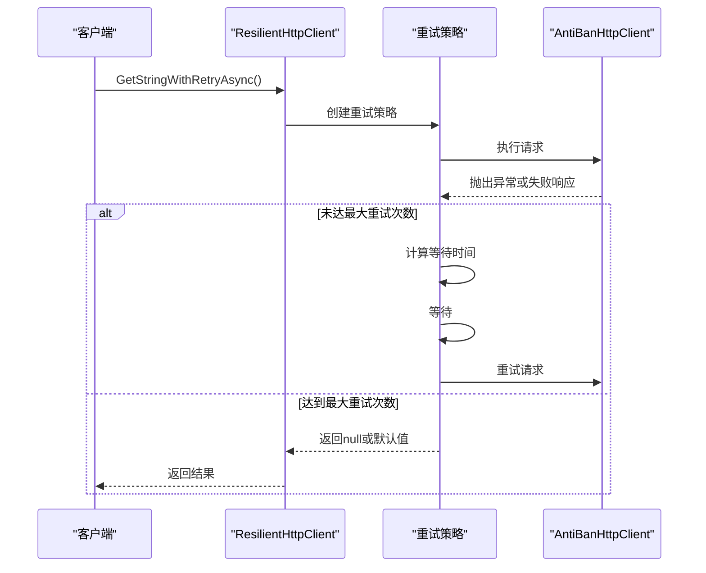

# 反封禁HTTP客户端机制

<cite>
**本文档引用的文件**  
- [AntiBanHttpClient.cs](file://src/POE2Finance.Services/Infrastructure/AntiBanHttpClient.cs)
- [DataCollectionConfiguration.cs](file://src/POE2Finance.Services/Configuration/DataCollectionConfiguration.cs)
</cite>

## 目录
1. [引言](#引言)
2. [核心反封禁策略](#核心反封禁策略)
3. [请求频率控制机制](#请求频率控制机制)
4. [随机延迟与行为模拟](#随机延迟与行为模拟)
5. [客户端标识轮换](#客户端标识轮换)
6. [默认请求头配置](#默认请求头配置)
7. [请求方法封装](#请求方法封装)
8. [日志记录与监控](#日志记录与监控)
9. [配置驱动的可定制性](#配置驱动的可定制性)
10. [弹性重试机制](#弹性重试机制)

## 引言
`AntiBanHttpClient` 是一个专为防止因频繁请求而导致IP被封禁而设计的HTTP客户端。它通过一系列精心设计的反爬虫规避策略，确保自动化数据采集过程的稳定性和隐蔽性。该客户端不仅实现了精确的请求间隔控制，还通过随机延迟、User-Agent轮换等技术模拟人类用户行为，有效规避了目标服务器的反爬虫检测机制。

**Section sources**
- [AntiBanHttpClient.cs](file://src/POE2Finance.Services/Infrastructure/AntiBanHttpClient.cs#L12-L272)

## 核心反封禁策略
`AntiBanHttpClient` 的核心目标是通过多种技术手段协同工作，最大限度地降低被目标服务器识别为自动化脚本的风险。其主要策略包括：
- **精确的速率限制**：确保请求间隔不低于配置的最小值，避免触发基于频率的封禁。
- **行为随机化**：引入随机延迟，打破请求时间的规律性，模拟真实用户操作。
- **客户端伪装**：轮换User-Agent头，规避基于客户端标识的检测。
- **请求头标准化**：自动设置合理的默认请求头，使请求看起来更像来自真实浏览器。

这些策略共同构成了一个多层次的反封禁体系，显著提高了数据采集的可靠性和成功率。

**Section sources**
- [AntiBanHttpClient.cs](file://src/POE2Finance.Services/Infrastructure/AntiBanHttpClient.cs#L12-L272)

## 请求频率控制机制
`AntiBanHttpClient` 通过 `_rateLimitSemaphore` 信号量和 `_rateLimitLock` 锁机制实现了精确的请求间隔控制。



**Diagram sources**
- [AntiBanHttpClient.cs](file://src/POE2Finance.Services/Infrastructure/AntiBanHttpClient.cs#L149-L178)

**Section sources**
- [AntiBanHttpClient.cs](file://src/POE2Finance.Services/Infrastructure/AntiBanHttpClient.cs#L149-L178)

### 机制详解
1.  **信号量控制并发**：`_rateLimitSemaphore = new SemaphoreSlim(1, 1)` 创建了一个容量为1的信号量，确保 `EnsureRateLimitAsync` 方法的临界区代码块在任何时刻都只有一个线程可以执行，防止了多线程环境下的竞争条件。
2.  **锁机制保证原子性**：在 `EnsureRateLimitAsync` 方法内部，使用 `lock (_rateLimitLock)` 确保了对 `_lastRequestTime` 的读取、比较和更新操作是原子的。
3.  **精确的时间计算**：方法通过 `DateTime.UtcNow - _lastRequestTime` 计算出距离上一次请求的真实时间间隔，并与配置的 `MinRequestIntervalSeconds` 进行比较。
4.  **同步延迟**：如果时间间隔不足，使用 `Thread.Sleep(delay)` 进行阻塞式等待，确保总间隔达到最小要求。

这种双重保护机制（信号量+锁）确保了即使在高并发场景下，请求的发送频率也能被严格控制在安全范围内。

## 随机延迟与行为模拟
为了进一步模拟人类用户的行为模式，`AntiBanHttpClient` 实现了 `AddRandomDelayAsync` 方法，为每次请求添加一个随机的延迟。



**Diagram sources**
- [AntiBanHttpClient.cs](file://src/POE2Finance.Services/Infrastructure/AntiBanHttpClient.cs#L180-L188)
- [DataCollectionConfiguration.cs](file://src/POE2Finance.Services/Configuration/DataCollectionConfiguration.cs#L42-L48)

**Section sources**
- [AntiBanHttpClient.cs](file://src/POE2Finance.Services/Infrastructure/AntiBanHttpClient.cs#L180-L188)

### 实现细节
- **随机性来源**：使用 `private readonly Random _random = new();` 作为随机数生成器。
- **延迟范围**：延迟的秒数由配置文件中的 `RandomDelay.MinSeconds` 和 `RandomDelay.MaxSeconds` 决定，例如默认配置为30到180秒。
- **异步等待**：使用 `await Task.Delay(delay, cancellationToken)` 进行非阻塞的异步等待，不会占用线程资源。
- **日志记录**：每次添加延迟时，都会通过 `_logger.LogDebug` 记录日志，便于监控和调试。

通过引入这种不可预测的随机延迟，`AntiBanHttpClient` 打破了请求时间的规律性，使其行为更接近于真实用户，从而有效规避了基于时间模式分析的反爬虫系统。

## 客户端标识轮换
`AntiBanHttpClient` 通过 `SetRandomUserAgent` 方法轮换User-Agent头，以规避基于客户端标识的检测。

```mermaid
classDiagram
class AntiBanHttpClient {
-List<string> UserAgents
-Random _random
+SetRandomUserAgent(request)
}
class HttpRequestMessage {
+Headers
}
AntiBanHttpClient --> HttpRequestMessage : "设置"
AntiBanHttpClient ..> "User-Agent池" : "引用"
class "User-Agent池" {
"Mozilla/5.0 (Windows NT 10.0; Win64; x64) AppleWebKit/537.36..."
"Mozilla/5.0 (Windows NT 10.0; Win64; x64) AppleWebKit/537.36..."
"Mozilla/5.0 (Windows NT 10.0; Win64; x64; rv : 109.0) Gecko/20100101..."
"Mozilla/5.0 (Macintosh; Intel Mac OS X 10_15_7) AppleWebKit/537.36..."
}
```

**Diagram sources**
- [AntiBanHttpClient.cs](file://src/POE2Finance.Services/Infrastructure/AntiBanHttpClient.cs#L189-L194)
- [DataCollectionConfiguration.cs](file://src/POE2Finance.Services/Configuration/DataCollectionConfiguration.cs#L54-L57)

**Section sources**
- [AntiBanHttpClient.cs](file://src/POE2Finance.Services/Infrastructure/AntiBanHttpClient.cs#L189-L194)

### 工作原理
1.  **User-Agent池**：配置文件中定义了一个 `UserAgents` 列表，包含了多个来自不同浏览器（如Chrome、Firefox）和不同操作系统的User-Agent字符串。
2.  **随机选择**：在每次发送请求前，`SetRandomUserAgent` 方法会从这个池中随机选择一个User-Agent。
3.  **头信息设置**：使用 `request.Headers.TryAddWithoutValidation("User-Agent", userAgent)` 将选中的User-Agent添加到HTTP请求头中。
4.  **日志记录**：同时记录下本次使用的User-Agent，方便追踪。

通过这种方式，`AntiBanHttpClient` 的请求看起来像是来自不同的浏览器和设备，大大增加了服务器识别其为单一自动化脚本的难度。

## 默认请求头配置
`AntiBanHttpClient` 在构造时会自动配置一系列合理的默认请求头，使请求更符合真实浏览器的行为。



**Diagram sources**
- [AntiBanHttpClient.cs](file://src/POE2Finance.Services/Infrastructure/AntiBanHttpClient.cs#L70-L80)

**Section sources**
- [AntiBanHttpClient.cs](file://src/POE2Finance.Services/Infrastructure/AntiBanHttpClient.cs#L70-L80)

### 配置内容
- **Accept**: `text/html,application/xhtml+xml,application/xml;q=0.9,image/webp,*/*;q=0.8` - 表明客户端可以接受多种类型的响应内容。
- **Accept-Language**: `zh-CN,zh;q=0.9,en;q=0.8` - 表明客户端偏好中文，但也接受英文。
- **Cache-Control** 和 **Pragma**: `no-cache` - 指示不使用缓存，模拟用户每次都是新鲜访问。
- **DNT**: `1` - 表示“请勿跟踪”，是现代浏览器的常见行为。

此外，客户端还支持传入额外的自定义头。在 `GetAsync` 等方法中，可以通过 `headers` 参数传入一个字典，这些头信息会被合并到请求中，提供了极大的灵活性。

## 请求方法封装
`AntiBanHttpClient` 对常用的HTTP操作进行了简洁的封装，简化了上层调用。



**Diagram sources**
- [AntiBanHttpClient.cs](file://src/POE2Finance.Services/Infrastructure/AntiBanHttpClient.cs#L90-L147)

**Section sources**
- [AntiBanHttpClient.cs](file://src/POE2Finance.Services/Infrastructure/AntiBanHttpClient.cs#L90-L147)

### 封装的方法
- **GetAsync**: 最基础的方法，发送GET请求并返回 `HttpResponseMessage` 对象，适用于需要处理响应状态码或头信息的场景。
- **GetStringAsync**: 在 `GetAsync` 的基础上，自动读取响应体并返回字符串内容，适用于获取HTML或纯文本。
- **GetJsonAsync<T>**: 在 `GetAsync` 的基础上，自动读取响应体、反序列化JSON，并返回指定类型的对象，适用于调用JSON API。

所有这些方法在发送请求前都会自动调用 `EnsureRateLimitAsync`、`SetRandomUserAgent` 和 `AddRandomDelayAsync`，确保了反封禁策略的统一应用。

## 日志记录与监控
`AntiBanHttpClient` 集成了日志记录功能，便于监控请求行为和排查问题。

**Section sources**
- [AntiBanHttpClient.cs](file://src/POE2Finance.Services/Infrastructure/AntiBanHttpClient.cs#L108-L112)
- [AntiBanHttpClient.cs](file://src/POE2Finance.Services/Infrastructure/AntiBanHttpClient.cs#L115-L117)
- [AntiBanHttpClient.cs](file://src/POE2Finance.Services/Infrastructure/AntiBanHttpClient.cs#L163-L165)
- [AntiBanHttpClient.cs](file://src/POE2Finance.Services/Infrastructure/AntiBanHttpClient.cs#L186-L187)

### 日志级别与内容
- **Debug级别**：记录了详细的调试信息，包括发送的URL、收到的响应状态码、等待的速率限制时间以及使用的User-Agent和随机延迟。这些信息对于分析请求模式和调试反封禁策略非常有用。
- **Warning级别**：在 `ResilientHttpClient` 的重试机制中，当发生重试时会记录警告日志，提示重试次数和等待时间。
- **Error级别**：当请求失败且达到最大重试次数时，会记录错误日志，包含异常堆栈和失败的URL。

通过这些日志，开发者可以清晰地了解客户端的运行状态，及时发现并解决问题。

## 配置驱动的可定制性
`AntiBanHttpClient` 的所有反封禁策略都是通过 `DataCollectionConfiguration` 配置文件驱动的，具有高度的可定制性。

```mermaid
erDiagram
DATA_COLLECTION_CONFIG ||--o{ RANDOM_DELAY : "包含"
DATA_COLLECTION_CONFIG ||--o{ USER_AGENT : "包含"
class DATA_COLLECTION_CONFIG {
int MinRequestIntervalSeconds
int RequestTimeoutSeconds
int MaxRetries
int RetryDelayBaseSeconds
}
class RANDOM_DELAY {
int MinSeconds
int MaxSeconds
}
class USER_AGENT {
string UserAgentString
}
```

**Diagram sources**
- [DataCollectionConfiguration.cs](file://src/POE2Finance.Services/Configuration/DataCollectionConfiguration.cs#L15-L58)

**Section sources**
- [DataCollectionConfiguration.cs](file://src/POE2Finance.Services/Configuration/DataCollectionConfiguration.cs#L15-L58)

### 可配置项
- **MinRequestIntervalSeconds**: 最小请求间隔，单位为秒，直接控制 `EnsureRateLimitAsync` 的行为。
- **RandomDelay.MinSeconds/MaxSeconds**: 随机延迟的范围，控制 `AddRandomDelayAsync` 的行为。
- **UserAgents**: User-Agent字符串列表，控制 `SetRandomUserAgent` 的轮换池。
- **RequestTimeoutSeconds**: 请求超时时间，影响 `HttpClient` 的行为。
- **MaxRetries** 和 **RetryDelayBaseSeconds**: 控制 `ResilientHttpClient` 的重试策略。

这种配置化的设计使得无需修改代码即可调整反封禁策略，极大地提高了系统的灵活性和适应性。

## 弹性重试机制
`AntiBanHttpClient` 通常与 `ResilientHttpClient` 配合使用，后者提供了强大的弹性重试机制。



**Diagram sources**
- [AntiBanHttpClient.cs](file://src/POE2Finance.Services/Infrastructure/AntiBanHttpClient.cs#L183-L272)

**Section sources**
- [AntiBanHttpClient.cs](file://src/POE2Finance.Services/Infrastructure/AntiBanHttpClient.cs#L183-L272)

### 重试策略详解
- **触发条件**：策略会处理 `HttpRequestException`、`TaskCanceledException`、`TimeoutException` 以及非成功的HTTP响应状态码（除了404）。
- **指数退避**：重试的等待时间采用指数增长模式 `TimeSpan.FromSeconds(_config.RetryDelayBaseSeconds * Math.Pow(2, retryAttempt - 1))`，例如5秒、10秒、20秒，避免在服务器故障时造成雪崩效应。
- **日志记录**：每次重试都会记录警告日志，便于监控。

这个机制确保了在网络波动或服务器临时不可用的情况下，数据采集任务仍能保持稳定，提高了整体的鲁棒性。