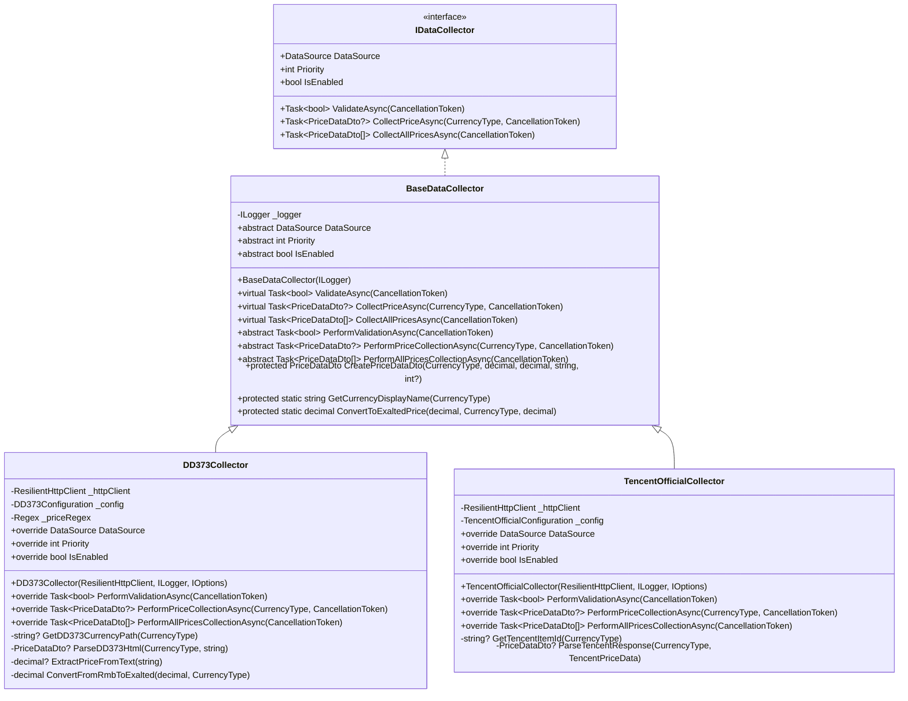
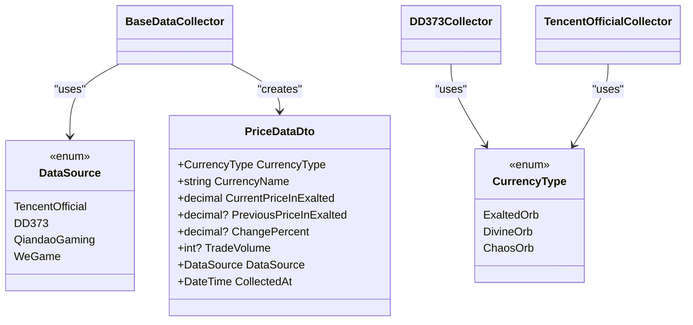
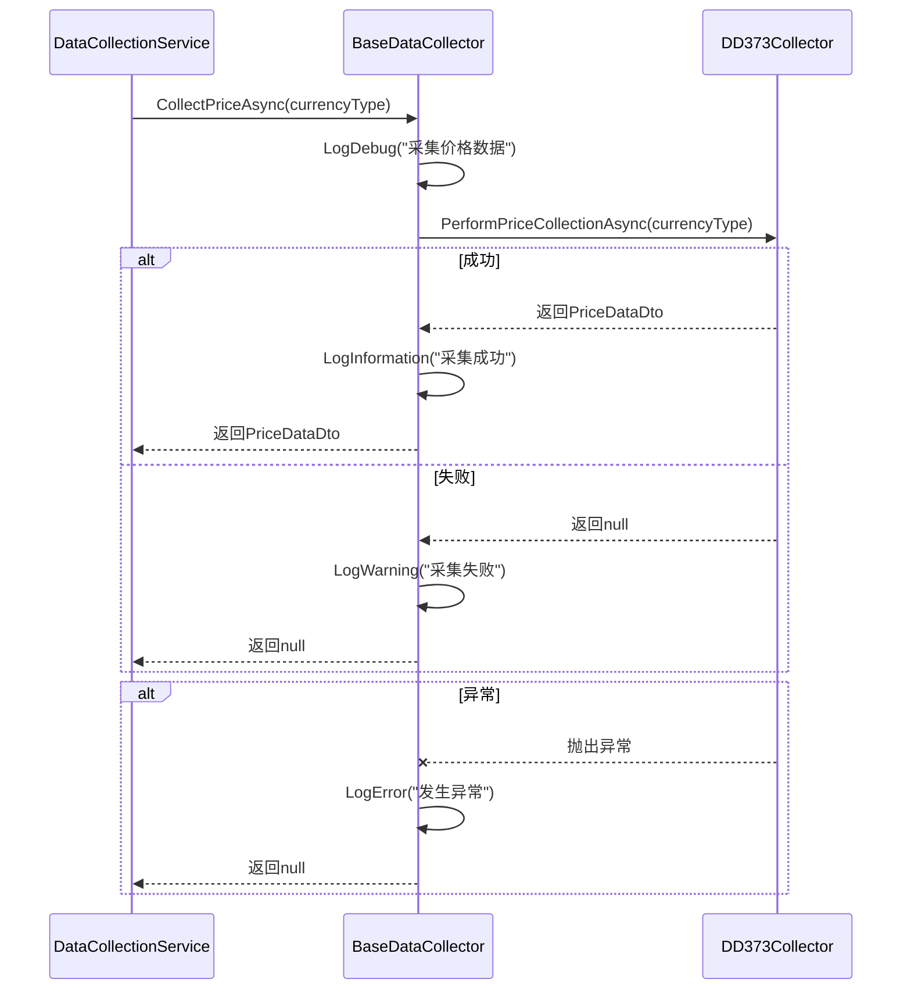
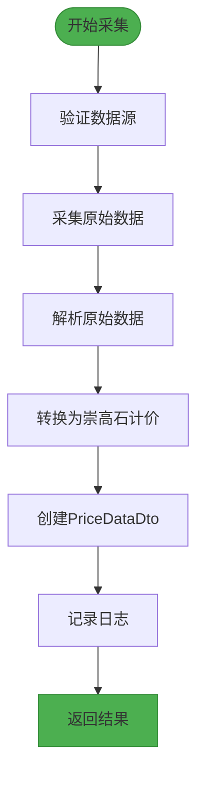
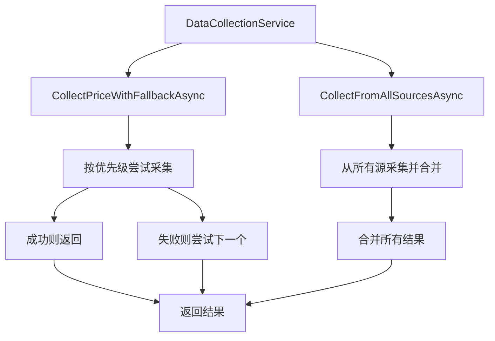

# 基础采集器设计

<cite>
**Referenced Files in This Document**  
- [BaseDataCollector.cs](file://src/POE2Finance.Services/DataCollection/BaseDataCollector.cs)
- [DataTransferObjects.cs](file://src/POE2Finance.Core/Models/DataTransferObjects.cs)
- [CommonEnums.cs](file://src/POE2Finance.Core/Enums/CommonEnums.cs)
- [DataCollectionService.cs](file://src/POE2Finance.Services/DataCollection/DataCollectionService.cs)
- [DD373Collector.cs](file://src/POE2Finance.Services/DataCollection/Collectors/DD373Collector.cs)
- [TencentOfficialCollector.cs](file://src/POE2Finance.Services/DataCollection/Collectors/TencentOfficialCollector.cs)
</cite>

## 目录
1. [引言](#引言)
2. [核心设计原则](#核心设计原则)
3. [元数据与状态管理](#元数据与状态管理)
4. [执行流程与日志记录](#执行流程与日志记录)
5. [抽象方法与具体实现](#抽象方法与具体实现)
6. [数据标准化工具方法](#数据标准化工具方法)
7. [继承实现模式](#继承实现模式)
8. [异常处理与扩展性](#异常处理与扩展性)

## 引言

`BaseDataCollector` 抽象基类是 POE2Finance 项目中数据采集模块的核心设计，为各类数据源采集器提供了统一的接口规范和基础功能实现。该基类通过定义标准化的元数据属性、执行流程和工具方法，实现了采集器的可插拔架构，使得新增数据源采集器变得简单而一致。本文档将详细阐述该基类的设计理念、实现细节以及在实际项目中的应用模式。

**Section sources**
- [BaseDataCollector.cs](file://src/POE2Finance.Services/DataCollection/BaseDataCollector.cs#L52-L216)

## 核心设计原则

`BaseDataCollector` 的设计遵循了面向对象的开闭原则和依赖倒置原则，通过 `IDataCollector` 接口定义了所有采集器必须遵守的契约。该接口明确了数据采集器的核心职责：提供元数据信息、验证数据源可用性、采集单个或全部通货价格数据。基类实现了这些接口方法的默认执行流程，同时通过抽象方法强制子类提供具体的采集逻辑，从而实现了"模板方法"设计模式。

这种设计使得上层服务（如 `DataCollectionService`）可以面向 `IDataCollector` 接口编程，而无需关心具体的数据源实现细节，极大地提高了系统的可维护性和可扩展性。

**Diagram sources**
- [BaseDataCollector.cs](file://src/POE2Finance.Services/DataCollection/BaseDataCollector.cs#L9-L47)
- [BaseDataCollector.cs](file://src/POE2Finance.Services/DataCollection/BaseDataCollector.cs#L52-L216)
- [DD373Collector.cs](file://src/POE2Finance.Services/DataCollection/Collectors/DD373Collector.cs#L15-L234)
- [TencentOfficialCollector.cs](file://src/POE2Finance.Services/DataCollection/Collectors/TencentOfficialCollector.cs#L13-L158)

**Section sources**
- [BaseDataCollector.cs](file://src/POE2Finance.Services/DataCollection/BaseDataCollector.cs#L9-L47)
- [BaseDataCollector.cs](file://src/POE2Finance.Services/DataCollection/BaseDataCollector.cs#L52-L216)

## 元数据与状态管理

`BaseDataCollector` 通过三个抽象属性统一管理采集器的元数据和状态：`DataSource`、`Priority` 和 `IsEnabled`。这些属性在运行时为系统提供了关键的决策信息。

`DataSource` 枚举类型定义了不同的数据源，如腾讯官方、DD373等，使得系统能够区分不同来源的数据。`Priority` 属性决定了当多个数据源可用时的采集优先级，数值越小优先级越高，这在实现数据源故障转移时至关重要。`IsEnabled` 属性则提供了运行时的开关控制，允许系统管理员动态启用或禁用特定的数据源，而无需修改代码或重新部署。

这些元数据属性不仅为上层服务提供了决策依据，还通过日志记录和监控系统暴露了采集器的运行状态，使得系统的可观测性大大增强。

**Diagram sources**
- [CommonEnums.cs](file://src/POE2Finance.Core/Enums/CommonEnums.cs#L20-L45)
- [DataTransferObjects.cs](file://src/POE2Finance.Core/Models/DataTransferObjects.cs#L5-L40)
- [BaseDataCollector.cs](file://src/POE2Finance.Services/DataCollection/BaseDataCollector.cs#L52-L216)

**Section sources**
- [BaseDataCollector.cs](file://src/POE2Finance.Services/DataCollection/BaseDataCollector.cs#L65-L79)
- [CommonEnums.cs](file://src/POE2Finance.Core/Enums/CommonEnums.cs#L20-L45)

## 执行流程与日志记录

`BaseDataCollector` 通过虚方法为 `ValidateAsync`、`CollectPriceAsync` 和 `CollectAllPricesAsync` 提供了统一的执行流程和日志记录机制。这些方法实现了典型的"模板方法"模式，在执行子类提供的具体逻辑前后添加了标准的预处理和后处理步骤。

每个执行方法都包含了完整的异常处理机制，确保任何子类实现中的异常都不会导致整个采集流程崩溃。同时，通过结构化日志记录，系统能够清晰地追踪每个采集步骤的执行情况，包括开始、成功、警告和错误等不同级别的日志信息。这种统一的日志格式使得日志分析和监控变得更加容易。

例如，`CollectPriceAsync` 方法首先记录调试级别的日志，然后调用子类实现的 `PerformPriceCollectionAsync` 方法，根据结果记录信息或警告级别的日志，最后在发生异常时记录错误级别的日志并返回 null。这种一致的模式确保了所有采集器的行为可预测且易于调试。

**Diagram sources**
- [BaseDataCollector.cs](file://src/POE2Finance.Services/DataCollection/BaseDataCollector.cs#L100-L140)
- [DD373Collector.cs](file://src/POE2Finance.Services/DataCollection/Collectors/DD373Collector.cs#L15-L234)

**Section sources**
- [BaseDataCollector.cs](file://src/POE2Finance.Services/DataCollection/BaseDataCollector.cs#L100-L140)

## 抽象方法与具体实现

`BaseDataCollector` 定义了三个抽象方法：`PerformValidationAsync`、`PerformPriceCollectionAsync` 和 `PerformAllPricesCollectionAsync`，这些方法强制子类实现具体的数据采集逻辑。这种设计将通用的执行框架与特定的业务逻辑分离，确保了代码的高内聚和低耦合。

`PerformValidationAsync` 方法负责验证数据源的可用性，不同的数据源可能有不同的验证策略。例如，`DD373Collector` 通过检查网页内容是否包含特定关键词来验证，而 `TencentOfficialCollector` 则通过调用健康检查API来验证。

`PerformPriceCollectionAsync` 方法负责采集单个通货的价格数据，需要处理具体的HTTP请求、HTML解析或JSON反序列化等细节。`PerformAllPricesCollectionAsync` 方法则通常通过循环调用 `PerformPriceCollectionAsync` 来实现，但也可以根据数据源的特点进行优化。

这种抽象方法的设计使得新增数据源采集器变得非常简单：开发者只需继承 `BaseDataCollector`，实现这三个抽象方法以及元数据属性，即可获得完整的采集功能。

**Section sources**
- [BaseDataCollector.cs](file://src/POE2Finance.Services/DataCollection/BaseDataCollector.cs#L150-L175)
- [DD373Collector.cs](file://src/POE2Finance.Services/DataCollection/Collectors/DD373Collector.cs#L15-L234)
- [TencentOfficialCollector.cs](file://src/POE2Finance.Services/DataCollection/Collectors/TencentOfficialCollector.cs#L13-L158)

## 数据标准化工具方法

`BaseDataCollector` 提供了多个受保护的工具方法来支持数据标准化，其中最重要的是 `CreatePriceDataDto`、`GetCurrencyDisplayName` 和 `ConvertToExaltedPrice`。这些方法确保了从不同数据源采集的数据能够以统一的格式存储和使用。

`CreatePriceDataDto` 方法负责创建标准化的 `PriceDataDto` 对象，填充通货类型、名称、价格、数据源和采集时间等必要字段。`GetCurrencyDisplayName` 方法将枚举值转换为用户友好的显示名称，如将 `CurrencyType.ExaltedOrb` 转换为"崇高石"。

`ConvertToExaltedPrice` 方法尤为重要，它将不同计价单位的价格统一转换为以崇高石为基准的计价方式。由于不同数据源可能使用不同的计价单位（如人民币、神圣石等），这个方法确保了所有价格数据在系统内部的一致性，为后续的价格分析和比较提供了基础。

**Diagram sources**
- [BaseDataCollector.cs](file://src/POE2Finance.Services/DataCollection/BaseDataCollector.cs#L177-L216)
- [DataTransferObjects.cs](file://src/POE2Finance.Core/Models/DataTransferObjects.cs#L5-L40)

**Section sources**
- [BaseDataCollector.cs](file://src/POE2Finance.Services/DataCollection/BaseDataCollector.cs#L177-L216)

## 继承实现模式

继承 `BaseDataCollector` 的标准模式包括实现元数据属性、重写抽象方法以及利用基类提供的工具方法。以 `DD373Collector` 为例，其实现模式清晰地展示了这一过程。

首先，`DD373Collector` 通过重写 `DataSource`、`Priority` 和 `IsEnabled` 属性来提供自身的元数据信息，这些信息来源于配置文件。然后，它实现了三个抽象方法，分别处理数据源验证、单个价格采集和所有价格采集的逻辑。

在实现过程中，`DD373Collector` 充分利用了基类提供的 `CreatePriceDataDto` 和 `ConvertToExaltedPrice` 方法来标准化数据输出。同时，它还实现了自己的辅助方法，如 `ParseDD373Html` 用于解析HTML内容，`ExtractPriceFromText` 用于从文本中提取价格等。

这种继承模式确保了所有采集器的一致性，同时又允许每个采集器根据数据源的特点进行定制化实现，体现了面向对象设计的强大灵活性。

**Section sources**
- [DD373Collector.cs](file://src/POE2Finance.Services/DataCollection/Collectors/DD373Collector.cs#L15-L234)
- [TencentOfficialCollector.cs](file://src/POE2Finance.Services/DataCollection/Collectors/TencentOfficialCollector.cs#L13-L158)

## 异常处理与扩展性

`BaseDataCollector` 的异常处理设计体现了防御性编程的原则。所有公共的虚方法都包含了完整的 try-catch 块，捕获并记录任何可能的异常，然后返回安全的默认值（如 false 或 null），而不是让异常向上抛出。这种设计确保了单个采集器的故障不会影响整个系统的稳定性。

在扩展性方面，`BaseDataCollector` 的设计允许轻松添加新的数据源。开发者只需创建一个新的类继承 `BaseDataCollector`，实现必要的抽象方法和属性，然后在依赖注入容器中注册该类即可。系统会自动发现并使用新的采集器，无需修改现有代码。

此外，通过 `DataCollectionService` 提供的 `CollectPriceWithFallbackAsync` 和 `CollectFromAllSourcesAsync` 方法，系统实现了高级的采集策略，如故障转移和数据聚合，进一步增强了系统的健壮性和数据质量。

**Diagram sources**
- [DataCollectionService.cs](file://src/POE2Finance.Services/DataCollection/DataCollectionService.cs#L11-L240)

**Section sources**
- [DataCollectionService.cs](file://src/POE2Finance.Services/DataCollection/DataCollectionService.cs#L11-L240)