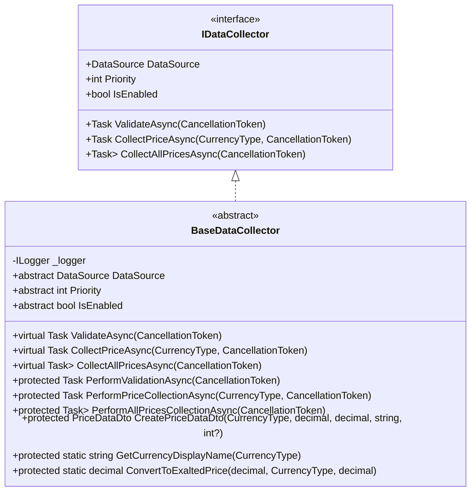
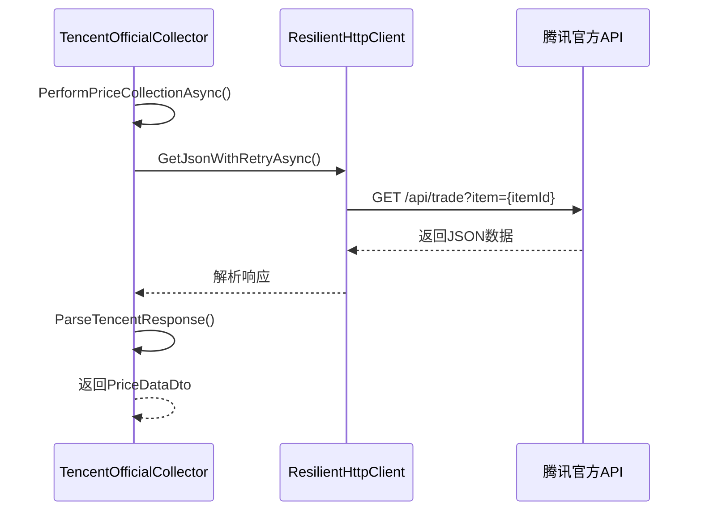
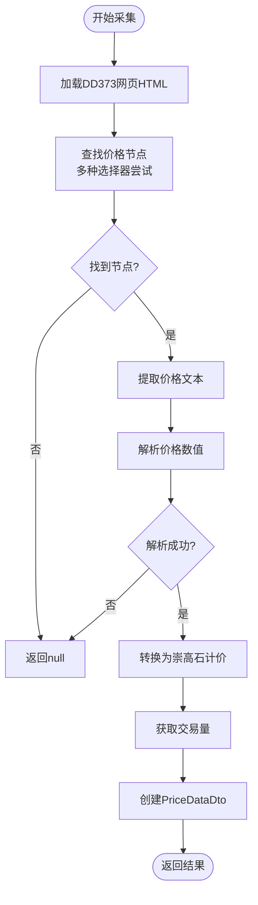
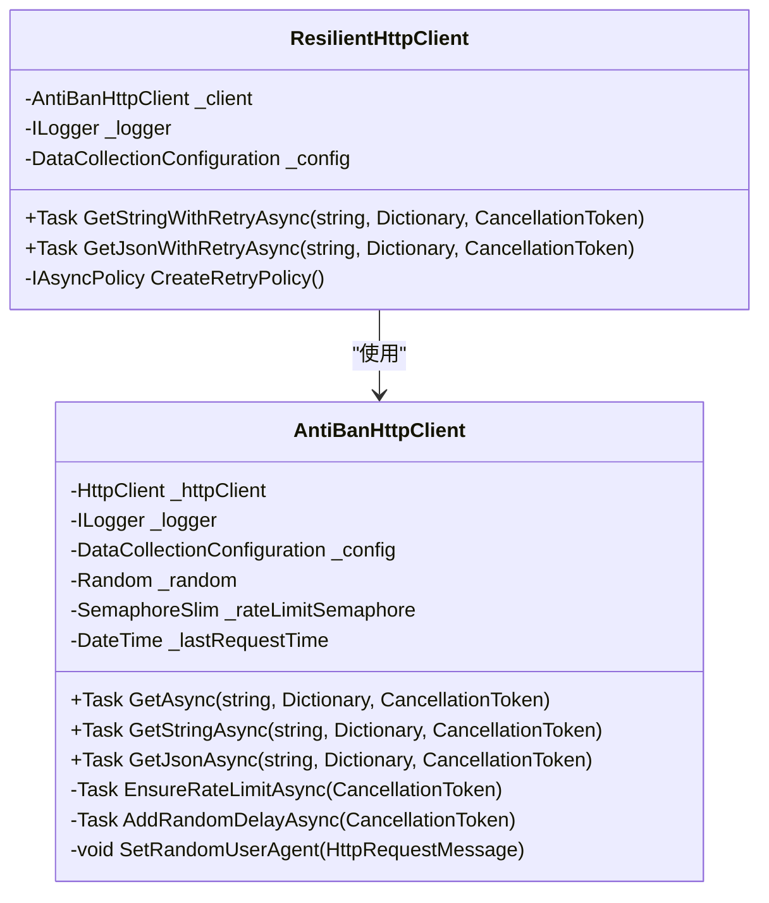
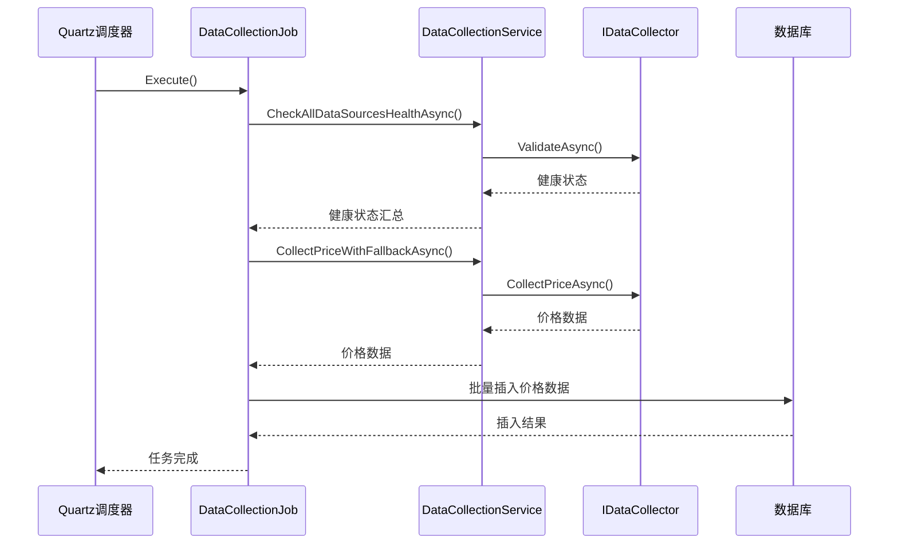
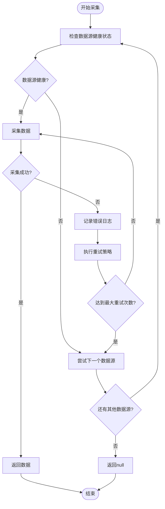
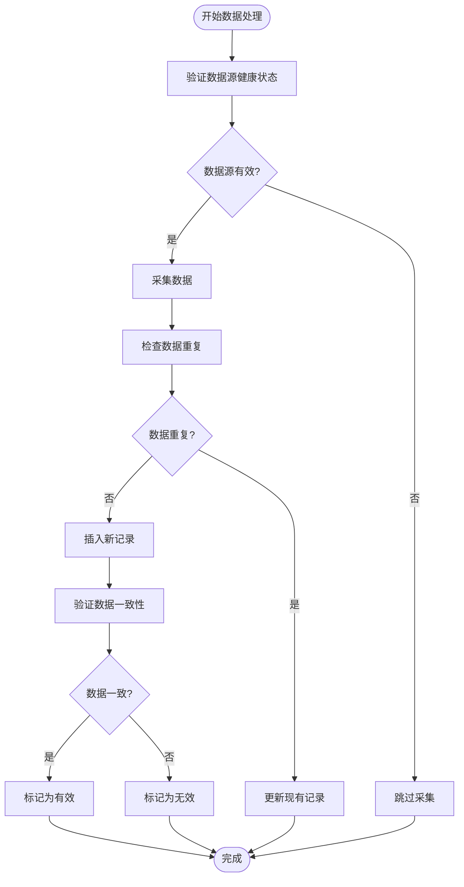

# 数据采集系统

<cite>
**本文档引用的文件**
- [BaseDataCollector.cs](file://src\POE2Finance.Services\DataCollection\BaseDataCollector.cs)
- [TencentOfficialCollector.cs](file://src\POE2Finance.Services\DataCollection\Collectors\TencentOfficialCollector.cs)
- [DD373Collector.cs](file://src\POE2Finance.Services\DataCollection\Collectors\DD373Collector.cs)
- [AntiBanHttpClient.cs](file://src\POE2Finance.Services\Infrastructure\AntiBanHttpClient.cs)
- [MaintenanceJobs.cs](file://src\POE2Finance.Services\Jobs\MaintenanceJobs.cs)
- [DataCollectionConfiguration.cs](file://src\POE2Finance.Services\Configuration\DataCollectionConfiguration.cs)
- [DataCollectionService.cs](file://src\POE2Finance.Services\DataCollection\DataCollectionService.cs)
</cite>

## 目录
1. [数据采集模块设计概述](#数据采集模块设计概述)
2. [BaseDataCollector抽象类设计](#basedatacollector抽象类设计)
3. [具体数据源采集器实现](#具体数据源采集器实现)
   - [腾讯官方采集器](#腾讯官方采集器)
   - [DD373采集器](#dd373采集器)
4. [反封禁HTTP客户端实现](#反封禁http客户端实现)
5. [数据采集调度机制](#数据采集调度机制)
6. [容错处理机制](#容错处理机制)
7. [多数据源配置与采集频率调整](#多数据源配置与采集频率调整)
8. [数据去重与一致性校验](#数据去重与一致性校验)

## 数据采集模块设计概述

数据采集模块是POE2Finance系统的核心组件，负责从多个外部数据源获取游戏货币价格信息。该模块采用分层架构设计，包含抽象基类、具体实现、反封禁机制、调度系统和配置管理等多个部分。通过这种设计，系统能够灵活地扩展新的数据源，同时确保采集过程的稳定性和可靠性。

**本节来源**
- [BaseDataCollector.cs](file://src\POE2Finance.Services\DataCollection\BaseDataCollector.cs)
- [DataCollectionService.cs](file://src\POE2Finance.Services\DataCollection\DataCollectionService.cs)

## BaseDataCollector抽象类设计

BaseDataCollector作为数据采集器的抽象基类，定义了通用的采集流程和接口规范。该类实现了IDataCollector接口，为所有具体的数据源采集器提供了统一的契约。



**图表来源**
- [BaseDataCollector.cs](file://src\POE2Finance.Services\DataCollection\BaseDataCollector.cs#L9-L47)
- [BaseDataCollector.cs](file://src\POE2Finance.Services\DataCollection\BaseDataCollector.cs#L52-L216)

**本节来源**
- [BaseDataCollector.cs](file://src\POE2Finance.Services\DataCollection\BaseDataCollector.cs)

## 具体数据源采集器实现

### 腾讯官方采集器

TencentOfficialCollector实现了对腾讯官方POE2交易平台的数据采集。该采集器继承自BaseDataCollector，通过API接口获取数据，具有较高的数据准确性和稳定性。



**图表来源**
- [TencentOfficialCollector.cs](file://src\POE2Finance.Services\DataCollection\Collectors\TencentOfficialCollector.cs#L13-L158)
- [TencentOfficialCollector.cs](file://src\POE2Finance.Services\DataCollection\Collectors\TencentOfficialCollector.cs#L59-L86)

**本节来源**
- [TencentOfficialCollector.cs](file://src\POE2Finance.Services\DataCollection\Collectors\TencentOfficialCollector.cs)

### DD373采集器

DD373Collector实现了对DD373平台的数据采集。由于该平台主要提供HTML页面，因此采集器使用HtmlAgilityPack库进行网页解析，通过选择器定位价格信息。



**图表来源**
- [DD373Collector.cs](file://src\POE2Finance.Services\DataCollection\Collectors\DD373Collector.cs#L15-L234)
- [DD373Collector.cs](file://src\POE2Finance.Services\DataCollection\Collectors\DD373Collector.cs#L62-L89)

**本节来源**
- [DD373Collector.cs](file://src\POE2Finance.Services\DataCollection\Collectors\DD373Collector.cs)

## 反封禁HTTP客户端实现

AntiBanHttpClient类实现了多种反封禁策略，确保数据采集过程不会被目标网站识别和阻止。该类通过请求节流、随机延迟和User-Agent轮换等技术实现反反爬虫功能。



**图表来源**
- [AntiBanHttpClient.cs](file://src\POE2Finance.Services\Infrastructure\AntiBanHttpClient.cs#L12-L178)
- [AntiBanHttpClient.cs](file://src\POE2Finance.Services\Infrastructure\AntiBanHttpClient.cs#L183-L272)

**本节来源**
- [AntiBanHttpClient.cs](file://src\POE2Finance.Services\Infrastructure\AntiBanHttpClient.cs)

## 数据采集调度机制

系统通过Quartz.NET框架实现数据采集的定时调度。MaintenanceJobs类中的DataCollectionJob负责定期执行数据采集任务，确保价格数据的及时更新。



**图表来源**
- [MaintenanceJobs.cs](file://src\POE2Finance.Services\Jobs\MaintenanceJobs.cs#L12-L120)
- [DataCollectionService.cs](file://src\POE2Finance.Services\DataCollection\DataCollectionService.cs#L116-L148)

**本节来源**
- [MaintenanceJobs.cs](file://src\POE2Finance.Services\Jobs\MaintenanceJobs.cs)

## 容错处理机制

系统实现了多层次的容错处理机制，包括异常捕获、重试策略和数据源故障转移。当某个数据源不可用时，系统会自动切换到备用数据源，确保数据采集的连续性。



**图表来源**
- [DataCollectionService.cs](file://src\POE2Finance.Services\DataCollection\DataCollectionService.cs#L116-L148)
- [AntiBanHttpClient.cs](file://src\POE2Finance.Services\Infrastructure\AntiBanHttpClient.cs#L209-L251)

**本节来源**
- [DataCollectionService.cs](file://src\POE2Finance.Services\DataCollection\DataCollectionService.cs)
- [AntiBanHttpClient.cs](file://src\POE2Finance.Services\Infrastructure\AntiBanHttpClient.cs)

## 多数据源配置与采集频率调整

系统通过DataCollectionConfiguration类实现多数据源的配置管理。用户可以通过配置文件调整各个数据源的优先级、启用状态和采集频率。

```mermaid
erDiagram
DATA_COLLECTION_CONFIG {
int CollectionIntervalHours
int MinRequestIntervalSeconds
int RequestTimeoutSeconds
int MaxRetries
int RetryDelayBaseSeconds
List<string> UserAgents
}
DATA_SOURCE_CONFIG {
bool Enabled
int Priority
string BaseUrl
Dictionary<string, string> Headers
}
TENCENT_CONFIG {
string TradeApiEndpoint
}
DD373_CONFIG {
string Poe2Section
}
DATA_COLLECTION_CONFIG ||--o{ DATA_SOURCE_CONFIG : "包含"
DATA_SOURCE_CONFIG }|--|| TENCENT_CONFIG : "继承"
DATA_SOURCE_CONFIG }|--|| DD373_CONFIG : "继承"
```

**图表来源**
- [DataCollectionConfiguration.cs](file://src\POE2Finance.Services\Configuration\DataCollectionConfiguration.cs#L5-L58)
- [DataCollectionConfiguration.cs](file://src\POE2Finance.Services\Configuration\DataCollectionConfiguration.cs#L105-L173)

**本节来源**
- [DataCollectionConfiguration.cs](file://src\POE2Finance.Services\Configuration\DataCollectionConfiguration.cs)

## 数据去重与一致性校验

系统通过多种机制确保数据的一致性和准确性。首先，在数据采集层面，系统会验证数据源的健康状态；其次，在数据存储层面，系统会进行数据去重和有效性检查。



**图表来源**
- [MaintenanceJobs.cs](file://src\POE2Finance.Services\Jobs\MaintenanceJobs.cs#L12-L120)
- [DataCollectionService.cs](file://src\POE2Finance.Services\DataCollection\DataCollectionService.cs)

**本节来源**
- [MaintenanceJobs.cs](file://src\POE2Finance.Services\Jobs\MaintenanceJobs.cs)
- [DataCollectionService.cs](file://src\POE2Finance.Services\DataCollection\DataCollectionService.cs)