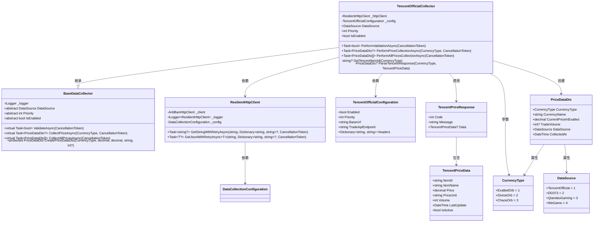
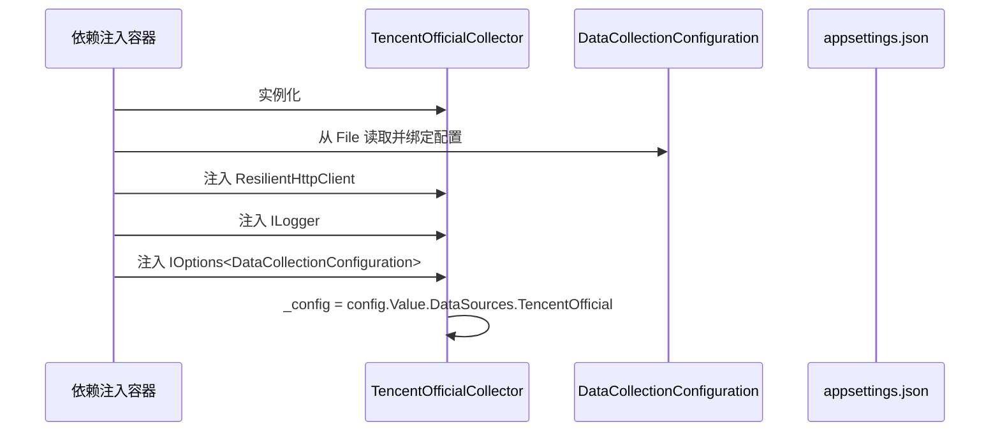

# 腾讯官方数据源采集器

<cite>
**Referenced Files in This Document**   
- [TencentOfficialCollector.cs](file://src/POE2Finance.Services/DataCollection/Collectors/TencentOfficialCollector.cs)
- [BaseDataCollector.cs](file://src/POE2Finance.Services/DataCollection/BaseDataCollector.cs)
- [DataCollectionConfiguration.cs](file://src/POE2Finance.Services/Configuration/DataCollectionConfiguration.cs)
- [CommonEnums.cs](file://src/POE2Finance.Core/Enums/CommonEnums.cs)
- [DataTransferObjects.cs](file://src/POE2Finance.Core/Models/DataTransferObjects.cs)
</cite>

## 目录
1. [简介](#简介)
2. [核心组件](#核心组件)
3. [继承与配置机制](#继承与配置机制)
4. [健康检查与可用性验证](#健康检查与可用性验证)
5. [价格数据采集流程](#价格数据采集流程)
6. [ID映射与数据转换](#id映射与数据转换)
7. [采集频率控制与错误处理](#采集频率控制与错误处理)
8. [配置联动与调用流程](#配置联动与调用流程)

## 简介
`TencentOfficialCollector` 类是 POE2Finance 项目中用于从腾讯官方 POE2 交易平台采集通货价格数据的核心组件。该类通过继承 `BaseDataCollector` 抽象基类，实现了标准化的数据采集接口，并利用 `ResilientHttpClient` 进行具备重试机制的 HTTP 通信。其功能依赖于 `TencentOfficialConfiguration` 配置类注入的参数，确保了采集行为的灵活性和可配置性。本文档将深入解析该采集器的实现细节，包括其继承结构、配置注入、健康检查、API 调用、数据解析、频率控制及错误处理等关键方面。

## 核心组件

`TencentOfficialCollector` 的实现依赖于多个核心组件，共同构成了一个健壮、可配置且易于维护的数据采集系统。这些组件包括数据采集器基类、HTTP 通信客户端、配置模型以及数据传输对象。

**Diagram sources**
- [TencentOfficialCollector.cs](file://src/POE2Finance.Services/DataCollection/Collectors/TencentOfficialCollector.cs#L13-L158)
- [BaseDataCollector.cs](file://src/POE2Finance.Services/DataCollection/BaseDataCollector.cs#L52-L216)
- [DataCollectionConfiguration.cs](file://src/POE2Finance.Services/Configuration/DataCollectionConfiguration.cs#L105-L137)
- [DataTransferObjects.cs](file://src/POE2Finance.Core/Models/DataTransferObjects.cs#L7-L48)
- [CommonEnums.cs](file://src/POE2Finance.Core/Enums/CommonEnums.cs#L5-L21)

**Section sources**
- [TencentOfficialCollector.cs](file://src/POE2Finance.Services/DataCollection/Collectors/TencentOfficialCollector.cs#L13-L158)
- [BaseDataCollector.cs](file://src/POE2Finance.Services/DataCollection/BaseDataCollector.cs#L52-L216)

## 继承与配置机制

`TencentOfficialCollector` 类通过继承 `BaseDataCollector` 抽象基类来实现 `IDataCollector` 接口，从而获得统一的数据采集框架。这种设计遵循了面向对象的开闭原则，允许在不修改基类的情况下扩展新的数据源采集器。

### 继承关系
`BaseDataCollector` 定义了所有数据采集器必须实现的抽象属性和方法，包括 `DataSource`、`Priority`、`IsEnabled` 以及三个核心的 `Perform*` 异步方法。`TencentOfficialCollector` 通过重写这些成员，提供了针对腾讯官方数据源的具体实现。

### 配置注入
`TencentOfficialCollector` 的构造函数接收三个依赖项：`ResilientHttpClient`、`ILogger<TencentOfficialCollector>` 和 `IOptions<DataCollectionConfiguration>`。其中，`IOptions<DataCollectionConfiguration>` 是 .NET Core 配置系统的关键部分，它允许将 `appsettings.json` 中的配置反序列化为强类型的 `DataCollectionConfiguration` 对象。

在构造函数中，通过 `config.Value?.DataSources?.TencentOfficial` 表达式，从配置对象中提取出专属于腾讯官方数据源的 `TencentOfficialConfiguration` 实例，并将其赋值给私有字段 `_config`。这使得采集器的运行时行为（如是否启用、优先级、基础URL、请求头等）完全由外部配置文件决定，实现了代码与配置的解耦。

**Diagram sources**
- [TencentOfficialCollector.cs](file://src/POE2Finance.Services/DataCollection/Collectors/TencentOfficialCollector.cs#L24-L31)
- [DataCollectionConfiguration.cs](file://src/POE2Finance.Services/Configuration/DataCollectionConfiguration.cs#L84-L84)

**Section sources**
- [TencentOfficialCollector.cs](file://src/POE2Finance.Services/DataCollection/Collectors/TencentOfficialCollector.cs#L13-L31)
- [DataCollectionConfiguration.cs](file://src/POE2Finance.Services/Configuration/DataCollectionConfiguration.cs#L84-L137)

## 健康检查与可用性验证

`TencentOfficialCollector` 通过 `PerformValidationAsync` 方法实现对数据源的可用性验证。该方法是 `BaseDataCollector` 中定义的抽象方法的具体实现。

### 健康检查API调用
该方法首先使用 `_config.BaseUrl` 和硬编码的 `/api/health` 路径构造健康检查API的完整URL。然后，它调用 `ResilientHttpClient` 的 `GetStringWithRetryAsync` 方法发起HTTP GET请求。此方法不仅发送请求，还会自动附加在 `TencentOfficialConfiguration.Headers` 中定义的请求头（如 `Accept`、`Referer` 等），这对于模拟真实浏览器请求、避免被服务器识别为爬虫至关重要。

### 可用性判断
`GetStringWithRetryAsync` 方法内置了重试策略。如果请求因网络问题或服务器暂时不可用而失败，它会根据 `DataCollectionConfiguration` 中定义的 `MaxRetries` 和 `RetryDelayBaseSeconds` 参数进行指数退避重试。只有当所有重试均失败或服务器返回了非200状态码时，该方法才会返回 `null` 或抛出异常。

在 `PerformValidationAsync` 中，如果 `GetStringWithRetryAsync` 成功返回一个非空字符串的响应体，则认为数据源可用，返回 `true`。如果在 `try-catch` 块中捕获到任何异常（如 `HttpRequestException`），则记录错误日志并返回 `false`，表明验证失败。

**Section sources**
- [TencentOfficialCollector.cs](file://src/POE2Finance.Services/DataCollection/Collectors/TencentOfficialCollector.cs#L36-L47)

## 价格数据采集流程

`PerformPriceCollectionAsync` 方法是 `TencentOfficialCollector` 的核心，负责采集单个通货类型的价格数据。

### 请求URL构造
该方法首先调用私有的 `GetTencentItemId` 方法，根据传入的 `CurrencyType` 参数获取对应的物品ID（如 `exalted_orb`）。如果返回的ID为空，则记录警告并返回 `null`。随后，它使用 `_config.BaseUrl`、`_config.TradeApiEndpoint` 和查询参数 `item={itemId}` 构造出完整的API请求URL。

### API调用与响应解析
构造好URL后，方法调用 `ResilientHttpClient` 的 `GetJsonWithRetryAsync<TencentPriceResponse>` 泛型方法。该方法会发起请求，并自动将JSON响应反序列化为 `TencentPriceResponse` 对象。同样，此调用也受益于内置的重试机制。

如果反序列化后的 `response.Data` 为 `null`，则记录警告并返回 `null`。否则，将 `response.Data` 传递给 `ParseTencentResponse` 方法进行数据转换。

**Section sources**
- [TencentOfficialCollector.cs](file://src/POE2Finance.Services/DataCollection/Collectors/TencentOfficialCollector.cs#L49-L77)

## ID映射与数据转换

`TencentOfficialCollector` 通过两个私有方法处理ID映射和数据转换，确保内部数据模型与外部API的兼容。

### GetTencentItemId 方法
此静态方法使用 `switch` 表达式，将项目内部的 `CurrencyType` 枚举值（如 `CurrencyType.ExaltedOrb`）映射为腾讯官方API所识别的字符串ID（如 `"exalted_orb"`）。这是一种简单的查找表机制，确保了请求的准确性。

### ParseTencentResponse 方法
此方法负责将从API获取的 `TencentPriceData` 对象转换为项目通用的 `PriceDataDto` 对象。它首先根据 `currencyType` 计算以崇高石（Exalted Orb）为计价单位的价格。对于崇高石本身，价格为1.0m；对于神圣石和混沌石，直接使用API返回的 `Price` 值，因为根据注释，腾讯官方的数据已经是以崇高石为单位的。

最后，该方法调用基类提供的 `CreatePriceDataDto` 工具方法，将转换后的价格、交易量等信息填充到 `PriceDataDto` 实例中，并返回。`CreatePriceDataDto` 方法还负责设置通货名称和采集时间等通用字段。

**Section sources**
- [TencentOfficialCollector.cs](file://src/POE2Finance.Services/DataCollection/Collectors/TencentOfficialCollector.cs#L138-L158)

## 采集频率控制与错误处理

`TencentOfficialCollector` 在设计上考虑了对采集频率的控制和全面的错误处理，以确保系统的稳定性和对目标API的友好性。

### 采集频率控制
在 `PerformAllPricesCollectionAsync` 方法中，采集器会依次采集三种通货（崇高石、神圣石、混沌石）的价格。在每次 `PerformPriceCollectionAsync` 调用之后，都会执行 `await Task.Delay(1000, cancellationToken)`。这个1秒的延迟是关键的频率控制措施，它防止了在短时间内对API发起过于密集的请求，从而降低了被服务器封禁的风险。

### 错误处理策略
整个采集流程采用了分层的错误处理策略：
1.  **HTTP通信层**：`ResilientHttpClient` 提供了基于Polly库的重试策略，能够自动处理瞬时性故障（如网络抖动、超时）。
2.  **业务逻辑层**：`PerformValidationAsync` 和 `PerformPriceCollectionAsync` 方法都包裹在 `try-catch` 块中。这确保了即使在数据解析或业务逻辑处理中发生未预期的异常，也不会导致整个采集服务崩溃。捕获到的异常会被记录到日志中，方法则返回一个安全的默认值（`false` 或 `null`）。
3.  **基类封装**：`BaseDataCollector` 的 `CollectPriceAsync` 等虚方法再次对 `Perform*` 方法的调用进行 `try-catch` 包装，提供了统一的异常处理和日志记录入口。

这种多层防御机制极大地增强了采集器的健壮性。

**Section sources**
- [TencentOfficialCollector.cs](file://src/POE2Finance.Services/DataCollection/Collectors/TencentOfficialCollector.cs#L79-L136)

## 配置联动与调用流程

`TencentOfficialCollector` 的实际运行是其与配置文件和外部调用者紧密联动的结果。

### 配置联动
`TencentOfficialConfiguration` 类中的所有属性（如 `BaseUrl`、`Headers`）都直接映射到 `appsettings.json` 文件中的 `DataCollection:DataSources:TencentOfficial` 配置节。当配置文件被修改后，应用重启或配置热重载机制会更新 `IOptions<DataCollectionConfiguration>` 实例，从而动态改变 `TencentOfficialCollector` 的行为。

### 实际调用流程
典型的调用流程始于一个高层服务（如 `DataCollectionService`），它会遍历所有注册的 `IDataCollector` 实现。对于 `TencentOfficialCollector`：
1.  首先调用 `ValidateAsync` 方法，该方法会委托给 `PerformValidationAsync` 进行健康检查。
2.  如果验证通过，则调用 `CollectPriceAsync` 方法，该方法会委托给 `PerformPriceCollectionAsync` 执行具体的采集逻辑。
3.  整个流程由依赖注入容器管理，确保了 `ResilientHttpClient` 和配置对象的正确注入。

这种设计使得 `TencentOfficialCollector` 成为一个高内聚、低耦合的模块化组件，可以轻松地被集成、测试和替换。

**Section sources**
- [TencentOfficialCollector.cs](file://src/POE2Finance.Services/DataCollection/Collectors/TencentOfficialCollector.cs#L13-L158)
- [DataCollectionConfiguration.cs](file://src/POE2Finance.Services/Configuration/DataCollectionConfiguration.cs#L105-L137)