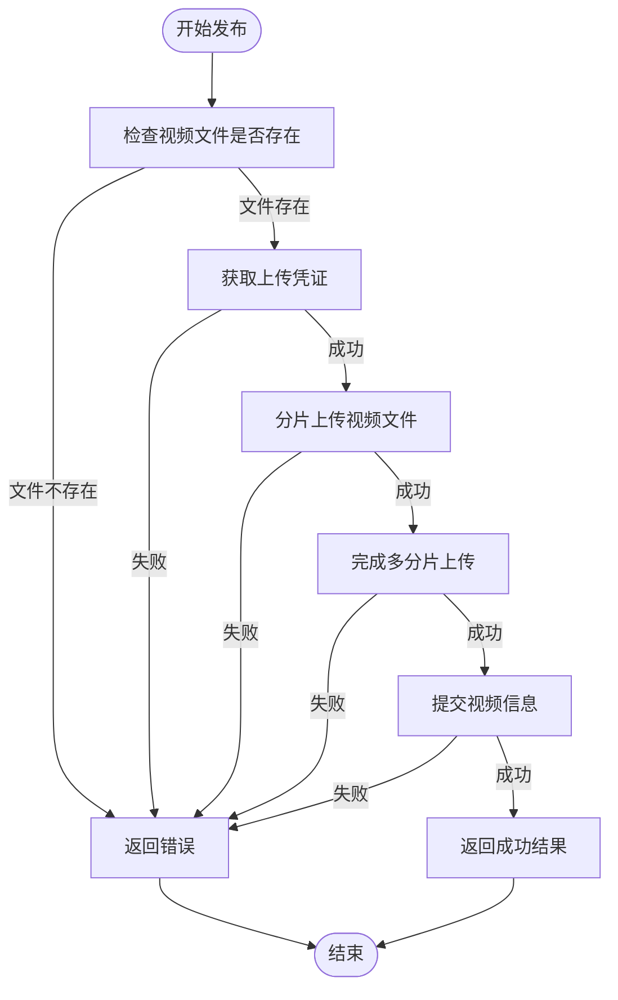
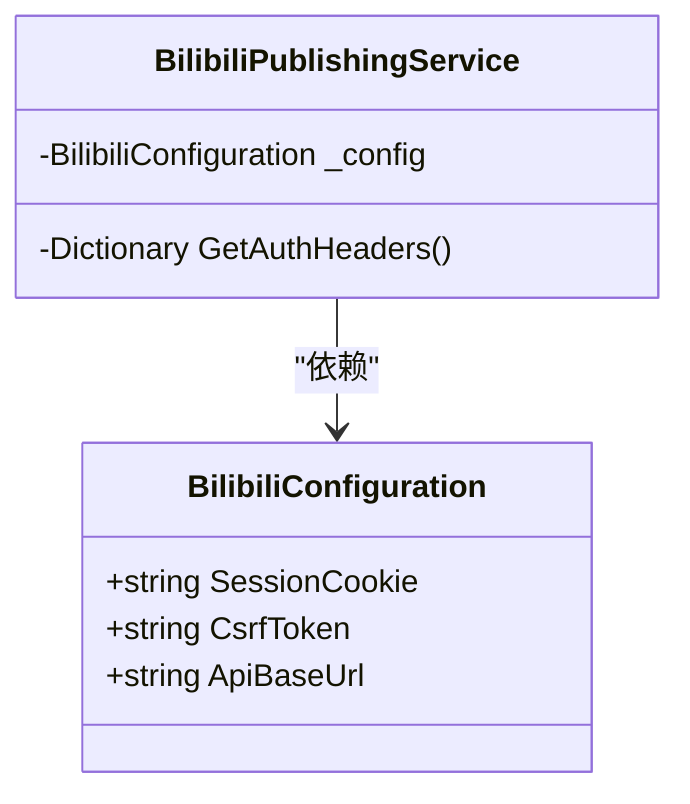
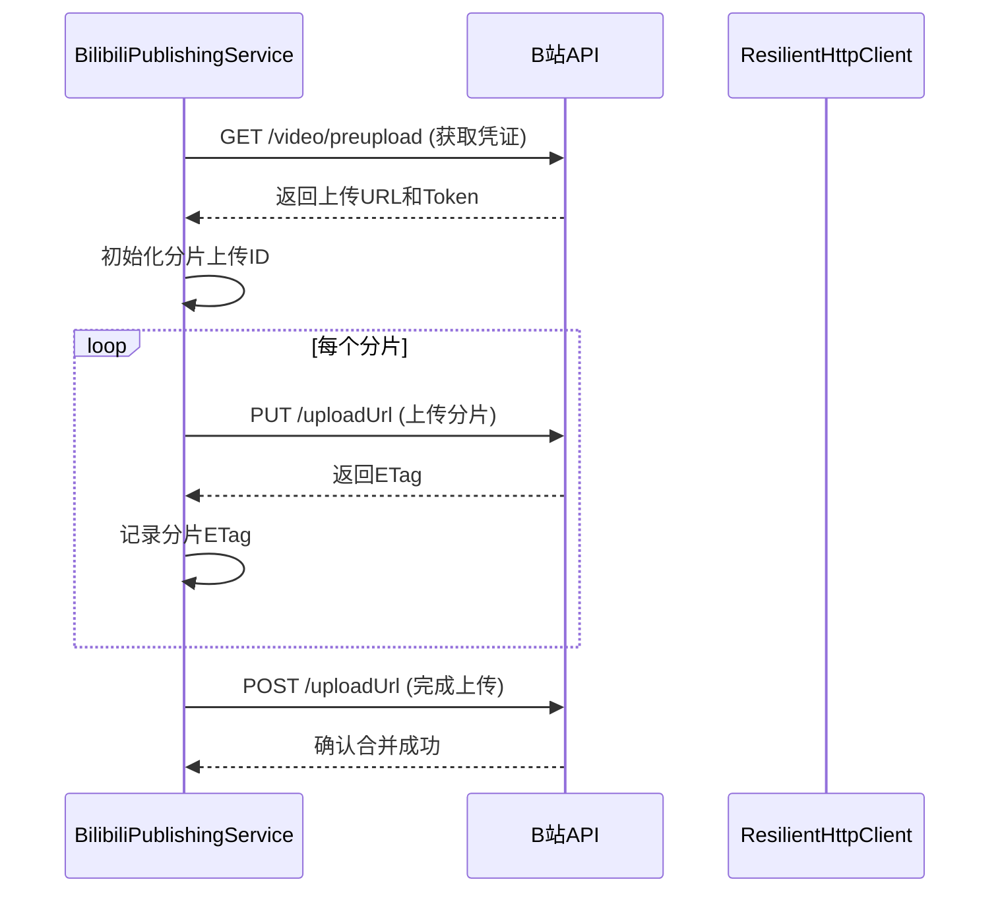
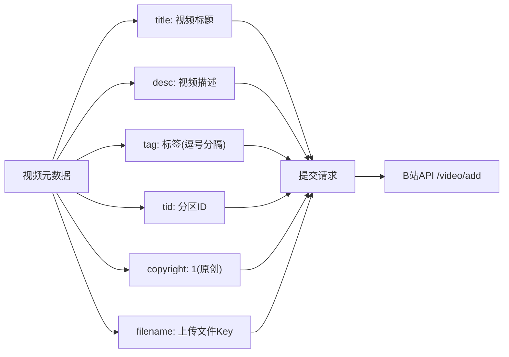
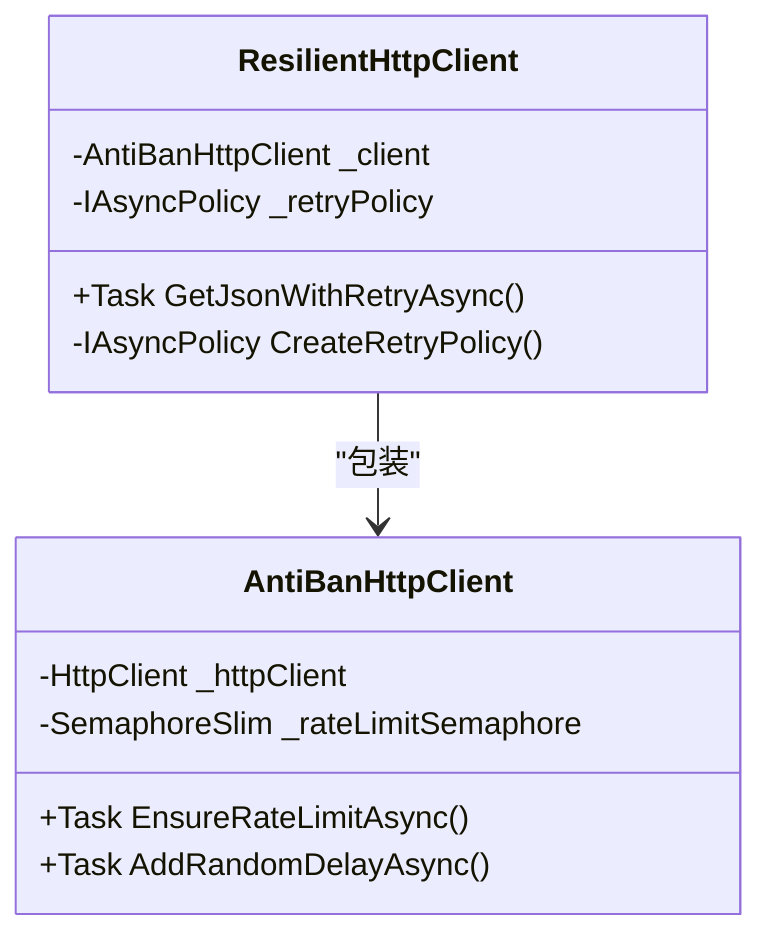
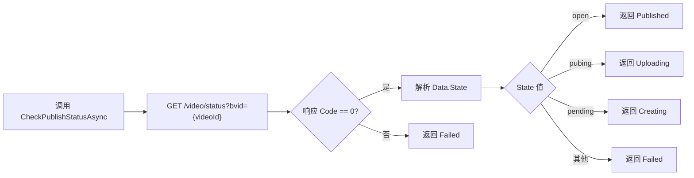
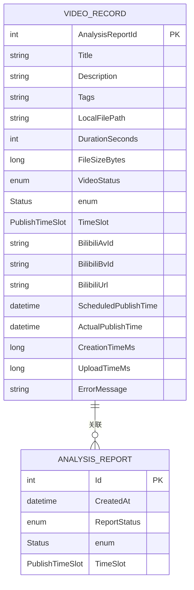
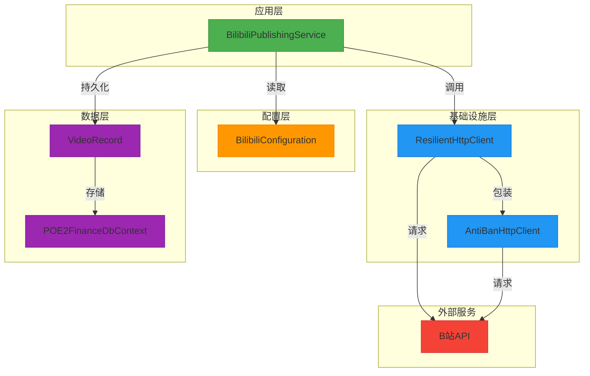

# B站发布服务

<cite>
**本文档引用文件**  
- [BilibiliPublishingService.cs](file://src/POE2Finance.Services/Publishing/BilibiliPublishingService.cs)
- [VideoRecord.cs](file://src/POE2Finance.Core/Entities/VideoRecord.cs)
- [BilibiliConfiguration.cs](file://src/POE2Finance.Services/Configuration/BilibiliConfiguration.cs)
- [ResilientHttpClient.cs](file://src/POE2Finance.Services/Infrastructure/AntiBanHttpClient.cs)
- [CommonEnums.cs](file://src/POE2Finance.Core/Enums/CommonEnums.cs)
- [ServiceInterfaces.cs](file://src/POE2Finance.Core/Interfaces/ServiceInterfaces.cs)
</cite>

## 目录
1. [简介](#简介)
2. [核心发布流程](#核心发布流程)
3. [认证与安全机制](#认证与安全机制)
4. [分片上传实现](#分片上传实现)
5. [元数据与发布调用](#元数据与发布调用)
6. [弹性HTTP客户端](#弹性http客户端)
7. [发布状态监控](#发布状态监控)
8. [错误处理与优化策略](#错误处理与优化策略)
9. [发布结果持久化](#发布结果持久化)
10. [系统架构图](#系统架构图)

## 简介
BilibiliPublishingService 是 POE2Finance 系统中的核心组件，负责通过 B站开放API 实现自动化视频上传与发布。该服务封装了完整的发布流程，包括认证、分片上传、元数据设置、最终发布调用、状态监控和错误处理。服务通过 ResilientHttpClient 提供网络弹性能力，确保在复杂网络环境下仍能稳定运行。发布结果通过 VideoRecord 实体进行持久化记录，形成完整的发布生命周期管理。

## 核心发布流程

BilibiliPublishingService 的核心发布流程由 `PublishToBilibiliAsync` 方法驱动，遵循两阶段提交模式：预上传文件和提交视频信息。

**流程说明：**
1. **文件验证**：首先检查本地视频文件是否存在，避免无效操作。
2. **预上传**：调用 B站API 获取上传凭证（URL 和 Token），为分片上传做准备。
3. **分片上传**：将大视频文件切分为多个分片，逐个上传。
4. **完成上传**：通知 B站 服务端合并所有分片。
5. **提交信息**：将视频元数据（标题、描述、标签等）与已上传的文件关联，完成发布。

**代码路径：**
- `PublishToBilibiliAsync`：主发布入口
- `UploadVideoFileAsync`：文件上传协调器
- `SubmitVideoAsync`：信息提交处理器

**本节来源**
- [BilibiliPublishingService.cs](file://src/POE2Finance.Services/Publishing/BilibiliPublishingService.cs#L37-L73)
- [BilibiliPublishingService.cs](file://src/POE2Finance.Services/Publishing/BilibiliPublishingService.cs#L116-L152)
- [BilibiliPublishingService.cs](file://src/POE2Finance.Services/Publishing/BilibiliPublishingService.cs#L371-L425)

## 认证与安全机制

服务通过 Cookie 和 CSRF Token 实现 B站 账户的认证，确保 API 调用的合法性。

**认证头构建：**
`GetAuthHeaders` 方法构建了包含以下关键信息的请求头：
- **Cookie**：包含 SESSDATA 等会话信息，用于身份验证。
- **User-Agent**：模拟浏览器访问，避免被识别为爬虫。
- **Referer & Origin**：设置为 B站 会员中心，符合同源策略。
- **X-CSRF-TOKEN**：如果配置了 CSRF Token，则添加以防止跨站请求伪造。

此机制确保了服务在调用 B站 API 时具有与真实用户浏览器相同的权限。

**代码路径：**
- `GetAuthHeaders`：认证头生成逻辑

**本节来源**
- [BilibiliPublishingService.cs](file://src/POE2Finance.Services/Publishing/BilibiliPublishingService.cs#L431-L447)
- [BilibiliConfiguration.cs](file://src/POE2Finance.Services/Configuration/BilibiliConfiguration.cs#L15-L25)

## 分片上传实现

为应对大文件上传和网络波动，服务实现了标准的分片上传（Multipart Upload）机制。

**关键步骤：**
1. **获取凭证**：`GetUploadCredentialsAsync` 调用 `/video/preupload` 接口，获取唯一的上传 URL 和 Token。
2. **分片处理**：`UploadFileInChunksAsync` 将文件按配置的 `ChunkSize`（默认4MB）切分。
3. **上传分片**：`UploadChunkAsync` 使用 `PUT` 请求上传每个分片，并获取服务端返回的 ETag。
4. **完成上传**：`CompleteMultipartUploadAsync` 发送包含所有分片 ETag 的 `POST` 请求，通知 B站 合并文件。

此机制提高了大文件上传的可靠性和效率，单个分片失败可独立重试，不影响整体流程。

**代码路径：**
- `GetUploadCredentialsAsync`：获取上传凭证
- `UploadFileInChunksAsync`：协调分片上传
- `UploadChunkAsync`：执行单个分片上传
- `CompleteMultipartUploadAsync`：完成上传流程

**本节来源**
- [BilibiliPublishingService.cs](file://src/POE2Finance.Services/Publishing/BilibiliPublishingService.cs#L161-L205)
- [BilibiliPublishingService.cs](file://src/POE2Finance.Services/Publishing/BilibiliPublishingService.cs#L215-L270)
- [BilibiliPublishingService.cs](file://src/POE2Finance.Services/Publishing/BilibiliPublishingService.cs#L282-L313)
- [BilibiliPublishingService.cs](file://src/POE2Finance.Services/Publishing/BilibiliPublishingService.cs#L324-L360)

## 元数据与发布调用

在文件成功上传后，服务通过 `SubmitVideoAsync` 方法提交视频的元数据信息。

**元数据设置：**
- **标题与描述**：直接使用传入的参数。
- **标签**：使用 `string.Join(",", tags.Take(10))` 限制最多10个标签，符合 B站 规则。
- **分区**：通过 `BilibiliConfiguration.CategoryId` 配置，当前为游戏分区（ID=4）。
- **版权**：固定为 `1`，表示原创内容。
- **文件关联**：使用预上传阶段获得的 `fileKey` 将元数据与已上传的视频文件关联。

**本节来源**
- [BilibiliPublishingService.cs](file://src/POE2Finance.Services/Publishing/BilibiliPublishingService.cs#L371-L425)
- [BilibiliConfiguration.cs](file://src/POE2Finance.Services/Configuration/BilibiliConfiguration.cs#L30-L35)

## 弹性HTTP客户端

`ResilientHttpClient` 为所有 API 调用提供了重试和熔断能力，是系统稳定性的关键。

**核心能力：**
1. **重试策略**：`CreateRetryPolicy` 定义了基于 Polly 库的重试策略，处理 `HttpRequestException`、`TaskCanceledException` 和非成功状态码。
2. **指数退避**：重试间隔为 `retryDelayBaseSeconds * 2^(attempt-1)`，避免雪崩效应。
3. **速率限制**：`AntiBanHttpClient` 通过 `SemaphoreSlim` 和 `Thread.Sleep` 实现请求频率控制，防止被 B站 封禁。
4. **随机延迟**：每次请求后添加随机延迟，模拟人类行为。
5. **User-Agent 轮换**：从配置列表中随机选择 User-Agent，增强反爬虫能力。

该客户端确保了在面对网络抖动、服务端临时错误或反爬虫机制时，发布任务仍能最终成功。

**代码路径：**
- `ResilientHttpClient`：重试策略核心
- `AntiBanHttpClient`：防封禁机制

**本节来源**
- [AntiBanHttpClient.cs](file://src/POE2Finance.Services/Infrastructure/AntiBanHttpClient.cs#L183-L272)
- [AntiBanHttpClient.cs](file://src/POE2Finance.Services/Infrastructure/AntiBanHttpClient.cs#L1-L182)

## 发布状态监控

服务提供 `CheckPublishStatusAsync` 方法，用于查询已发布视频的实时状态。

**状态映射：**
- `open` → `VideoStatus.Published`
- `pubing` → `VideoStatus.Uploading`
- `pending` → `VideoStatus.Creating`
- 其他 → `VideoStatus.Failed`

此功能允许系统轮询发布状态，实现发布进度的可视化和自动化监控。

**本节来源**
- [BilibiliPublishingService.cs](file://src/POE2Finance.Services/Publishing/BilibiliPublishingService.cs#L75-L114)

## 错误处理与优化策略

服务实现了全面的错误处理和发布成功率优化策略。

**错误码处理：**
- **403 权限不足**：通常由无效的 `SessionCookie` 引起。系统应捕获此错误并触发 Cookie 更新流程。
- **网络错误**：由 `ResilientHttpClient` 自动处理，通过重试策略恢复。
- **文件不存在**：在发布前进行校验，提前返回错误。

**发布成功率优化：**
1. **配置化重试**：`BilibiliConfiguration.MaxRetries` 允许动态调整重试次数。
2. **内容审核**：`ContentModerationConfiguration` 在发布前检查标题、描述和标签的合规性，避免因违规被拒。
3. **视频质量预检**：`VideoQualityConfiguration` 确保视频格式、分辨率和比特率符合 B站 要求。
4. **定时发布**：`PublishingStrategyConfiguration.EnableScheduledPublish` 支持在流量高峰时段发布，提高曝光率。

这些策略共同作用，最大限度地提高了自动化发布的成功率。

**本节来源**
- [BilibiliConfiguration.cs](file://src/POE2Finance.Services/Configuration/BilibiliConfiguration.cs#L40-L150)
- [BilibiliPublishingService.cs](file://src/POE2Finance.Services/Publishing/BilibiliPublishingService.cs#L37-L73)

## 发布结果持久化

发布结果通过 `VideoRecord` 实体与数据库持久化，形成完整的审计日志。

**关键字段：**
- **关联关系**：`AnalysisReportId` 外键，将视频与市场分析报告关联。
- **发布标识**：`BilibiliBvId` 和 `BilibiliAvId` 存储 B站 视频ID。
- **时间记录**：`ScheduledPublishTime` 和 `ActualPublishTime` 记录计划与实际发布时间。
- **性能指标**：`CreationTimeMs` 和 `UploadTimeMs` 用于性能分析和优化。
- **错误追踪**：`ErrorMessage` 记录发布失败的详细原因。

此设计支持对发布历史的全面查询、分析和故障排查。

**本节来源**
- [VideoRecord.cs](file://src/POE2Finance.Core/Entities/VideoRecord.cs#L9-L110)
- [CommonEnums.cs](file://src/POE2Finance.Core/Enums/CommonEnums.cs#L109-L135)
- [CommonEnums.cs](file://src/POE2Finance.Core/Enums/CommonEnums.cs#L140-L156)

## 系统架构图

**架构说明：**
- **BilibiliPublishingService** 是业务逻辑核心，协调整个发布流程。
- **ResilientHttpClient** 和 **AntiBanHttpClient** 提供网络通信的可靠性和安全性。
- **BilibiliConfiguration** 集中管理所有发布相关的配置参数。
- **VideoRecord** 实体通过 Entity Framework Core 与数据库交互，实现数据持久化。
- 整个系统通过 HTTP 协议与 **B站API** 进行交互。

此架构实现了关注点分离，确保了系统的可维护性和可扩展性。

**本节来源**
- [BilibiliPublishingService.cs](file://src/POE2Finance.Services/Publishing/BilibiliPublishingService.cs)
- [AntiBanHttpClient.cs](file://src/POE2Finance.Services/Infrastructure/AntiBanHttpClient.cs)
- [BilibiliConfiguration.cs](file://src/POE2Finance.Services/Configuration/BilibiliConfiguration.cs)
- [VideoRecord.cs](file://src/POE2Finance.Core/Entities/VideoRecord.cs)
- [ServiceInterfaces.cs](file://src/POE2Finance.Core/Interfaces/ServiceInterfaces.cs)