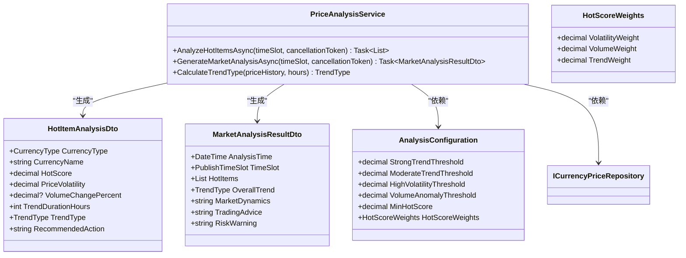
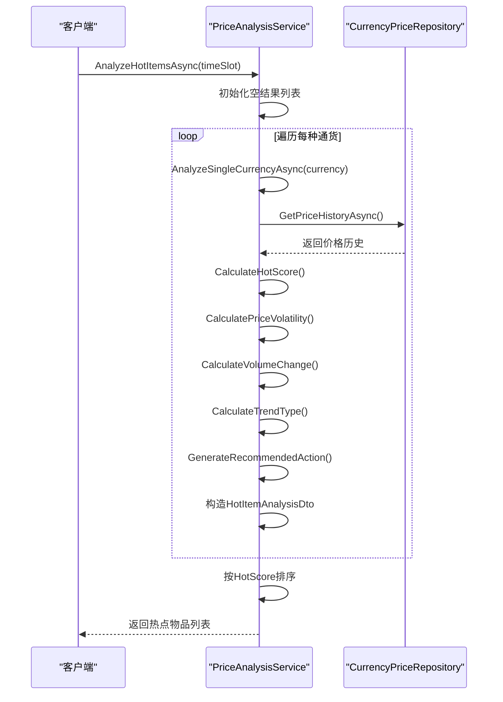
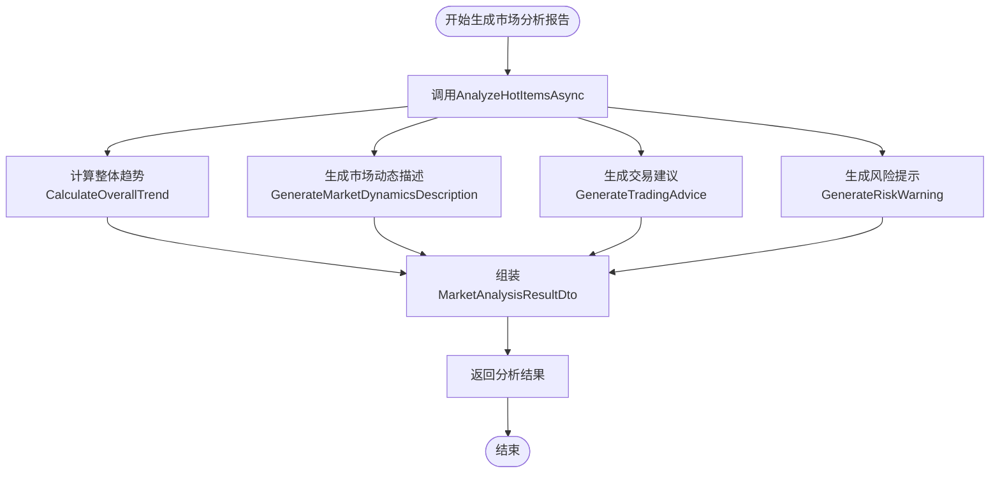
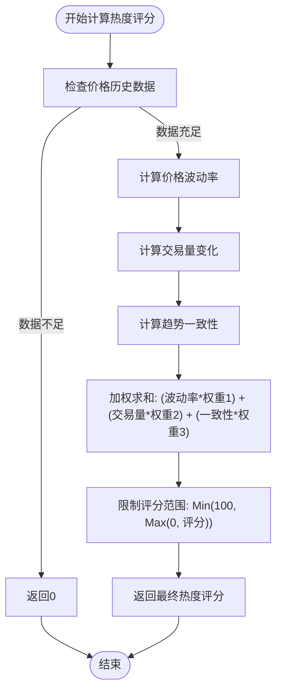
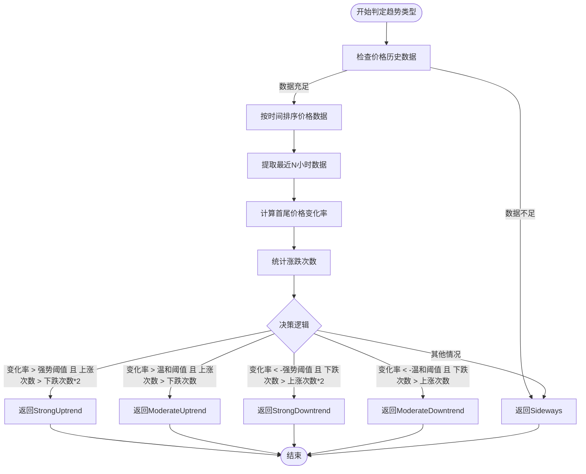
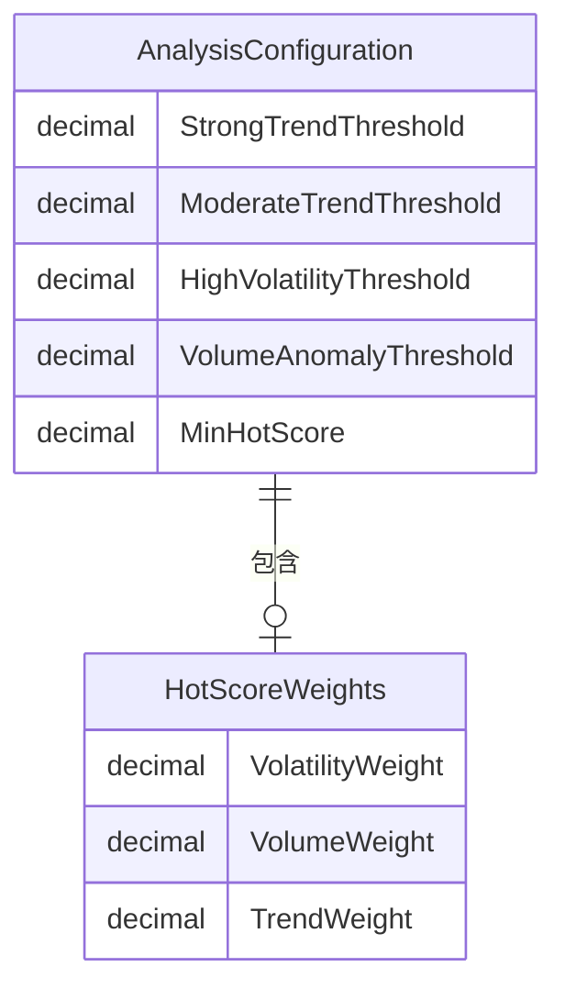
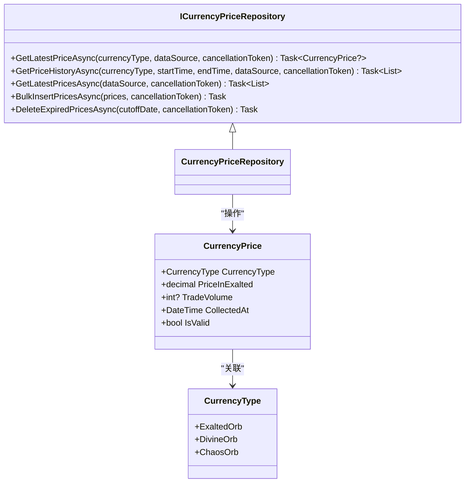

# 价格分析服务

<cite>
**本文档引用的文件**
- [PriceAnalysisService.cs](file://src/POE2Finance.Services/Analysis/PriceAnalysisService.cs)
- [AnalysisConfiguration.cs](file://src/POE2Finance.Services/Configuration/AnalysisConfiguration.cs)
- [CurrencyPriceRepository.cs](file://src/POE2Finance.Data/Repositories/CurrencyPriceRepository.cs)
- [DataTransferObjects.cs](file://src/POE2Finance.Core/Models/DataTransferObjects.cs)
- [CommonEnums.cs](file://src/POE2Finance.Core/Enums/CommonEnums.cs)
- [CurrencyPrice.cs](file://src/POE2Finance.Core/Entities/CurrencyPrice.cs)
</cite>

## 目录
1. [简介](#简介)
2. [核心组件分析](#核心组件分析)
3. [工作流程解析](#工作流程解析)
4. [参数化配置机制](#参数化配置机制)
5. [数据访问实现](#数据访问实现)
6. [实际调用示例](#实际调用示例)
7. [性能瓶颈分析与扩展建议](#性能瓶颈分析与扩展建议)
8. [结论](#结论)

## 简介
价格分析服务（PriceAnalysisService）是POE2Finance系统中的核心分析模块，负责基于历史价格数据执行市场趋势分析与热点物品识别。该服务通过整合多源价格数据，运用量化模型对市场动态进行评估，为后续的内容生成和视频制作提供数据支持。服务主要功能包括：识别当前市场中最活跃的通货物品、评估价格趋势类型、生成综合市场分析报告，并提供交易建议和风险提示。

## 核心组件分析

**Section sources**
- [PriceAnalysisService.cs](file://src/POE2Finance.Services/Analysis/PriceAnalysisService.cs#L14-L475)
- [DataTransferObjects.cs](file://src/POE2Finance.Core/Models/DataTransferObjects.cs#L53-L94)
- [DataTransferObjects.cs](file://src/POE2Finance.Core/Models/DataTransferObjects.cs#L99-L135)

### 核心方法概览
价格分析服务包含两个核心公开方法：`AnalyzeHotItemsAsync`和`GenerateMarketAnalysisAsync`。前者专注于识别和评估单个通货的市场热度，后者则基于前者的结果生成全面的市场分析报告。服务通过依赖注入获取`ICurrencyPriceRepository`用于数据访问，并使用`AnalysisConfiguration`进行参数化控制。



**Diagram sources**
- [PriceAnalysisService.cs](file://src/POE2Finance.Services/Analysis/PriceAnalysisService.cs#L14-L475)
- [DataTransferObjects.cs](file://src/POE2Finance.Core/Models/DataTransferObjects.cs#L53-L135)
- [AnalysisConfiguration.cs](file://src/POE2Finance.Services/Configuration/AnalysisConfiguration.cs#L5-L51)

## 工作流程解析

**Section sources**
- [PriceAnalysisService.cs](file://src/POE2Finance.Services/Analysis/PriceAnalysisService.cs#L37-L58)
- [PriceAnalysisService.cs](file://src/POE2Finance.Services/Analysis/PriceAnalysisService.cs#L61-L84)
- [PriceAnalysisService.cs](file://src/POE2Finance.Services/Analysis/PriceAnalysisService.cs#L131-L171)

### AnalyzeHotItemsAsync 方法流程
`AnalyzeHotItemsAsync`方法是热点物品分析的核心入口。其工作流程如下：首先，根据输入的时间段确定分析的时间跨度；然后，对预设的三种主要通货（崇高石、神圣石、混沌石）逐一调用`AnalyzeSingleCurrencyAsync`进行分析；最后，将所有分析结果按热度评分降序排列并返回。



**Diagram sources**
- [PriceAnalysisService.cs](file://src/POE2Finance.Services/Analysis/PriceAnalysisService.cs#L37-L58)
- [PriceAnalysisService.cs](file://src/POE2Finance.Services/Analysis/PriceAnalysisService.cs#L131-L171)
- [CurrencyPriceRepository.cs](file://src/POE2Finance.Data/Repositories/CurrencyPriceRepository.cs#L20-L42)

### GenerateMarketAnalysisAsync 方法流程
`GenerateMarketAnalysisAsync`方法构建在`AnalyzeHotItemsAsync`之上，负责生成完整的市场分析报告。其流程为：首先调用`AnalyzeHotItemsAsync`获取热点物品数据；然后计算整体市场趋势、生成市场动态描述、交易建议和风险提示；最后将所有信息整合到`MarketAnalysisResultDto`对象中返回。



**Diagram sources**
- [PriceAnalysisService.cs](file://src/POE2Finance.Services/Analysis/PriceAnalysisService.cs#L61-L84)
- [PriceAnalysisService.cs](file://src/POE2Finance.Services/Analysis/PriceAnalysisService.cs#L318-L329)
- [PriceAnalysisService.cs](file://src/POE2Finance.Services/Analysis/PriceAnalysisService.cs#L337-L404)

### 热度评分（HotScore）计算模型
热度评分采用加权计算模型，综合考虑三个核心指标：价格波动率、交易量变化和趋势一致性。各指标权重由`AnalysisConfiguration`中的`HotScoreWeights`配置项控制，默认权重分别为：波动率40%、交易量35%、趋势一致性25%。最终评分通过线性加权求和，并限制在0-100范围内。



**Diagram sources**
- [PriceAnalysisService.cs](file://src/POE2Finance.Services/Analysis/PriceAnalysisService.cs#L178-L192)
- [PriceAnalysisService.cs](file://src/POE2Finance.Services/Analysis/PriceAnalysisService.cs#L199-L232)
- [PriceAnalysisService.cs](file://src/POE2Finance.Services/Analysis/PriceAnalysisService.cs#L264-L283)
- [AnalysisConfiguration.cs](file://src/POE2Finance.Services/Configuration/AnalysisConfiguration.cs#L35-L44)

### 趋势类型判定逻辑（CalculateTrendType）
`CalculateTrendType`方法通过分析价格历史数据来判定趋势类型。其决策依据包括：价格总体变化百分比和价格波动的一致性。首先计算指定时间段内（默认24小时）的首尾价格变化率；然后统计价格上涨和下跌的次数；最后结合配置的阈值（`StrongTrendThreshold`和`ModerateTrendThreshold`）和一致性条件，判定为强势上涨、温和上涨、横盘整理、温和下跌或强势下跌。



**Diagram sources**
- [PriceAnalysisService.cs](file://src/POE2Finance.Services/Analysis/PriceAnalysisService.cs#L87-L122)
- [CommonEnums.cs](file://src/POE2Finance.Core/Enums/CommonEnums.cs#L52-L78)
- [AnalysisConfiguration.cs](file://src/POE2Finance.Services/Configuration/AnalysisConfiguration.cs#L10-L15)

## 参数化配置机制

**Section sources**
- [AnalysisConfiguration.cs](file://src/POE2Finance.Services/Configuration/AnalysisConfiguration.cs#L5-L51)
- [PriceAnalysisService.cs](file://src/POE2Finance.Services/Analysis/PriceAnalysisService.cs#L18-L18)

价格分析服务通过`AnalysisConfiguration`类实现全面的参数化控制。该配置类定义了多个关键阈值和权重，允许在不修改代码的情况下调整分析逻辑。主要配置项包括：
- **趋势阈值**：`StrongTrendThreshold`（默认10%）和`ModerateTrendThreshold`（默认5%），用于判定趋势强度。
- **风险阈值**：`HighVolatilityThreshold`（默认15%）和`VolumeAnomalyThreshold`（默认50%），用于风险提示。
- **权重配置**：`HotScoreWeights`中的`VolatilityWeight`、`VolumeWeight`和`TrendWeight`，用于调整热度评分的计算模型。



**Diagram sources**
- [AnalysisConfiguration.cs](file://src/POE2Finance.Services/Configuration/AnalysisConfiguration.cs#L5-L51)

## 数据访问实现

**Section sources**
- [CurrencyPriceRepository.cs](file://src/POE2Finance.Data/Repositories/CurrencyPriceRepository.cs#L8-L51)
- [CurrencyPrice.cs](file://src/POE2Finance.Core/Entities/CurrencyPrice.cs#L9-L64)

服务通过`ICurrencyPriceRepository`接口访问持久化的价格数据。该仓储实现提供了`GetPriceHistoryAsync`方法，用于获取指定通货在特定时间范围内的价格历史。`CurrencyPrice`实体包含价格（`PriceInExalted`）、交易量（`TradeVolume`）、采集时间（`CollectedAt`）等关键字段，为分析提供了必要的数据基础。



**Diagram sources**
- [CurrencyPriceRepository.cs](file://src/POE2Finance.Data/Repositories/CurrencyPriceRepository.cs#L8-L51)
- [CurrencyPrice.cs](file://src/POE2Finance.Core/Entities/CurrencyPrice.cs#L9-L64)

## 实际调用示例

**Section sources**
- [PriceAnalysisService.cs](file://src/POE2Finance.Services/Analysis/PriceAnalysisService.cs#L37-L58)
- [PriceAnalysisService.cs](file://src/POE2Finance.Services/Analysis/PriceAnalysisService.cs#L61-L84)

以下为`PriceAnalysisService`的典型调用方式：

```csharp
// 1. 分析热点物品
var hotItems = await priceAnalysisService.AnalyzeHotItemsAsync(PublishTimeSlot.Evening);

// 2. 生成市场分析报告
var marketAnalysis = await priceAnalysisService.GenerateMarketAnalysisAsync(PublishTimeSlot.Evening);

// 3. 获取特定通货的趋势
var priceHistory = await currencyPriceRepository.GetPriceHistoryAsync(CurrencyType.ExaltedOrb, DateTime.UtcNow.AddHours(-24), DateTime.UtcNow);
var trendType = priceAnalysisService.CalculateTrendType(priceHistory);
```

## 性能瓶颈分析与扩展建议

**Section sources**
- [PriceAnalysisService.cs](file://src/POE2Finance.Services/Analysis/PriceAnalysisService.cs#L131-L171)
- [CurrencyPriceRepository.cs](file://src/POE2Finance.Data/Repositories/CurrencyPriceRepository.cs#L20-L42)

### 性能瓶颈分析
当前实现的主要性能瓶颈在于`AnalyzeHotItemsAsync`方法中对三种通货的串行分析。每次分析都需要从数据库获取价格历史数据，存在多次I/O操作。此外，`CalculateVolumeChange`方法对交易量数据的处理可能因数据量大而影响性能。

### 扩展建议
1. **并行化处理**：将对三种通货的分析改为并行执行，可显著减少总执行时间。
2. **引入缓存**：对频繁访问的价格历史数据进行缓存，减少数据库查询压力。
3. **机器学习预测模型**：如配置中`PricePredictionConfig`所示，可扩展实现机器学习预测功能。通过`PredictionModelType`枚举，可集成线性回归、移动平均等模型，提供未来价格预测能力，增强分析深度。

## 结论
价格分析服务通过系统化的量化模型，实现了对游戏内通货市场的有效分析。其模块化设计和参数化配置使其具有良好的可维护性和扩展性。通过进一步优化性能和引入高级预测模型，该服务有望成为更强大的市场分析工具。