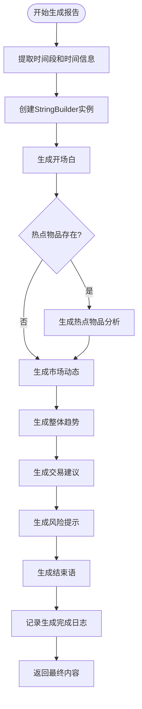

# 内容生成服务

<cite>
**Referenced Files in This Document**  
- [ContentGenerationService.cs](file://src/POE2Finance.Services/AI/ContentGenerationService.cs)
- [DataTransferObjects.cs](file://src/POE2Finance.Core/Models/DataTransferObjects.cs)
- [CommonEnums.cs](file://src/POE2Finance.Core/Enums/CommonEnums.cs)
</cite>

## 目录
1. [简介](#简介)
2. [核心组件](#核心组件)
3. [内容生成流程](#内容生成流程)
4. [段落生成逻辑](#段落生成逻辑)
5. [辅助方法与数据映射](#辅助方法与数据映射)
6. [可读性优化策略](#可读性优化策略)
7. [多语言支持潜力](#多语言支持潜力)
8. [AI模型集成扩展路径](#ai模型集成扩展路径)
9. [日志与执行监控](#日志与执行监控)

## 简介
内容生成服务（ContentGenerationService）是POE2Finance系统中的关键组件，负责将结构化的市场分析结果（MarketAnalysisResultDto）转化为自然语言文本内容。该服务通过模板化文本与动态数据的结合，生成包含开场白、热点分析、市场动态、交易建议等多段落的完整分析报告。服务实现了高度模块化的文本生成逻辑，并通过日志记录关键执行节点，确保生成过程的可追溯性和稳定性。

## 核心组件

内容生成服务的核心功能围绕`GenerateReportContentAsync`方法展开，该方法接收`MarketAnalysisResultDto`作为输入，输出格式化的自然语言文本。服务实现了`IContentGenerationService`接口，提供了生成报告内容、视频标题、描述和标签的完整功能集。整个服务采用依赖注入模式，通过配置对象和日志记录器进行初始化，确保了良好的可测试性和可配置性。

**Section sources**
- [ContentGenerationService.cs](file://src/POE2Finance.Services/AI/ContentGenerationService.cs#L32-L91)
- [DataTransferObjects.cs](file://src/POE2Finance.Core/Models/DataTransferObjects.cs#L99-L135)
- [CommonEnums.cs](file://src/POE2Finance.Core/Enums/CommonEnums.cs#L140-L156)

## 内容生成流程

**Diagram sources**
- [ContentGenerationService.cs](file://src/POE2Finance.Services/AI/ContentGenerationService.cs#L32-L91)

**Section sources**
- [ContentGenerationService.cs](file://src/POE2Finance.Services/AI/ContentGenerationService.cs#L32-L91)

## 段落生成逻辑

### 开场白生成
开场白段落通过`GenerateOpening`方法生成，结合了时间段问候语和当前时间信息。方法首先调用`GetTimeSlotGreeting`获取对应时间段的问候语（如"大家上午好！"），然后拼接固定模板和格式化的时间戳，形成亲切自然的开场白。

### 热点物品分析
热点分析段落通过`GenerateHotItemDescription`方法为每个热点物品生成描述。该方法结合了物品名称、热度评分、价格波动率和趋势类型等动态数据，使用`GetIntensityDescription`和`GetTrendDisplayName`等辅助方法将数值数据转化为自然语言描述。

### 整体趋势分析
整体趋势段落通过`GenerateTrendAnalysis`方法生成，不仅描述了整体市场趋势，还统计了活跃通货的数量，并通过`GetTrendImplication`提供趋势影响分析，增强了内容的深度和实用性。

### 交易建议与风险提示
交易建议和风险提示段落直接使用`MarketAnalysisResultDto`中预计算的文本字段，确保了专业性和一致性。这些字段由上游分析服务生成，内容生成服务仅负责格式化输出。

### 结束语生成
结束语通过`GenerateClosing`方法生成，包含本期总结、下次更新时间和标准风险提示，形成了完整的报告闭环。

**Section sources**
- [ContentGenerationService.cs](file://src/POE2Finance.Services/AI/ContentGenerationService.cs#L229-L277)

## 辅助方法与数据映射

### 时间段显示名称
`GetTimeSlotDisplayName`方法将`PublishTimeSlot`枚举值映射为中文显示名称（如"上午场"、"下午场"、"晚间场"），确保了用户界面的一致性和可读性。该方法在多个服务中被重复实现，体现了核心业务逻辑的通用性。

### 趋势类型映射
`GetTrendDisplayName`方法将`TrendType`枚举值映射为描述性中文文本（如"强势上涨"、"横盘整理"），将技术性数据转化为用户友好的语言。`GetTrendIcon`方法进一步将趋势类型映射为表情符号，增强了文本的视觉表现力。

### 热度强度描述
`GetIntensityDescription`方法根据热度评分（0-100）的数值范围，将其分类为"非常活跃"、"较为活跃"等描述性文本，实现了数值到自然语言的平滑转换。

### 趋势影响分析
`GetTrendImplication`方法为每种趋势类型提供了专业的市场解读，如"市场情绪较为乐观，但需要注意高位风险"，显著提升了内容的专业价值。

**Section sources**
- [ContentGenerationService.cs](file://src/POE2Finance.Services/AI/ContentGenerationService.cs#L284-L362)
- [ContentGenerationService.cs](file://src/POE2Finance.Services/AI/ContentGenerationService.cs#L385-L394)
- [CommonEnums.cs](file://src/POE2Finance.Core/Enums/CommonEnums.cs#L52-L78)

## 可读性优化策略

内容生成服务采用了多项可读性优化策略。首先，通过`StringBuilder`高效地组织内容结构，避免了字符串拼接的性能问题。其次，使用方括号【】包裹段落标题（如【热点通货分析】），形成了清晰的视觉层次。再者，通过表情符号（如🚀、📈）增强文本的表现力，符合视频平台用户的阅读习惯。最后，合理控制段落长度和句子复杂度，确保内容易于理解和消化。

## 多语言支持潜力

当前服务已具备良好的多语言支持基础。通过将所有文本模板和映射逻辑（如`GetTimeSlotGreeting`、`GetTrendDisplayName`）抽象为资源文件或配置项，可以轻松实现多语言切换。服务的模块化设计使得添加新的语言包只需提供相应的翻译映射，而无需修改核心逻辑。此外，`GenerateVideoTitle`和`GenerateVideoDescription`等方法生成的B站平台专用内容，也可以通过语言配置适配不同地区的视频平台。

## AI模型集成扩展路径

内容生成服务为AI模型集成提供了清晰的扩展路径。当前的模板化生成逻辑可以作为基线，与AI模型生成的内容进行对比和融合。例如，可以将`MarketAnalysisResultDto`作为提示词（prompt）输入大语言模型，生成更丰富、更具创造性的分析内容，然后通过规则引擎与模板化内容进行混合。服务的接口设计也支持A/B测试，可以同时运行多种生成策略，通过用户反馈优化内容质量。未来还可以集成语音合成服务（如EdgeTTS），实现从文本到语音的完整自动化流程。

## 日志与执行监控

服务通过结构化日志记录关键执行节点，确保了可追溯性和问题排查能力。在`GenerateReportContentAsync`方法开始时，记录"开始生成分析报告文本内容"的日志，包含时间段信息。在生成完成后，记录"报告内容生成完成"的日志，包含内容长度统计。任何异常都会被捕获并记录详细的错误日志，包括异常堆栈信息。这种全面的日志策略不仅有助于监控服务健康状况，也为性能优化提供了数据支持，例如通过分析内容长度分布来优化文本生成策略。

**Section sources**
- [ContentGenerationService.cs](file://src/POE2Finance.Services/AI/ContentGenerationService.cs#L32-L91)