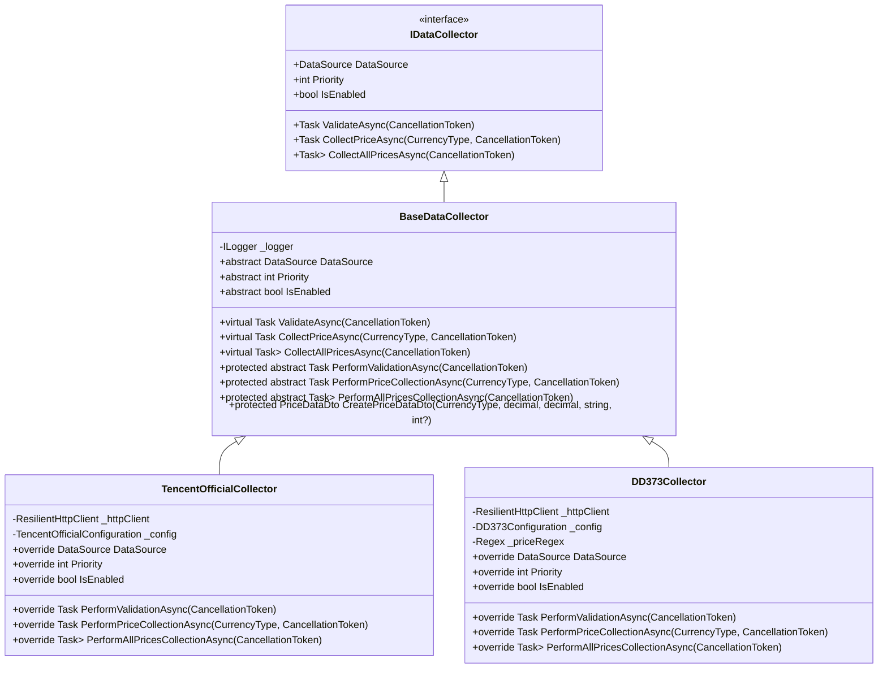
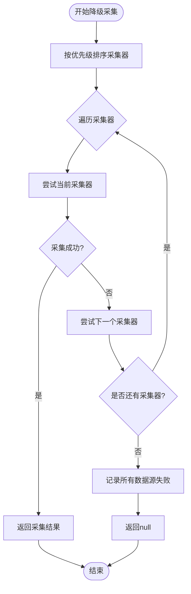
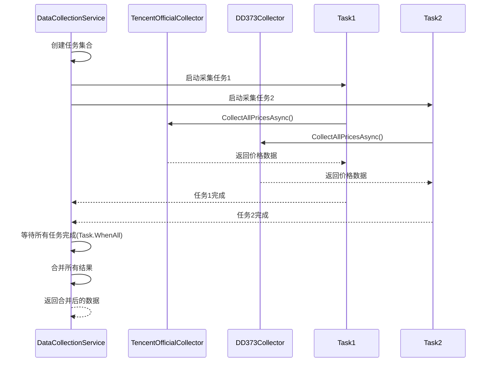
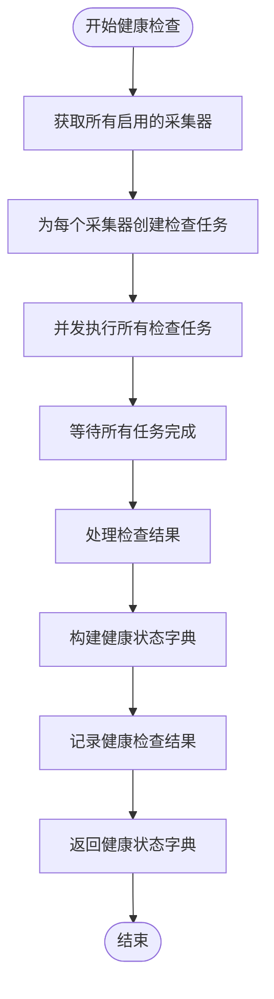
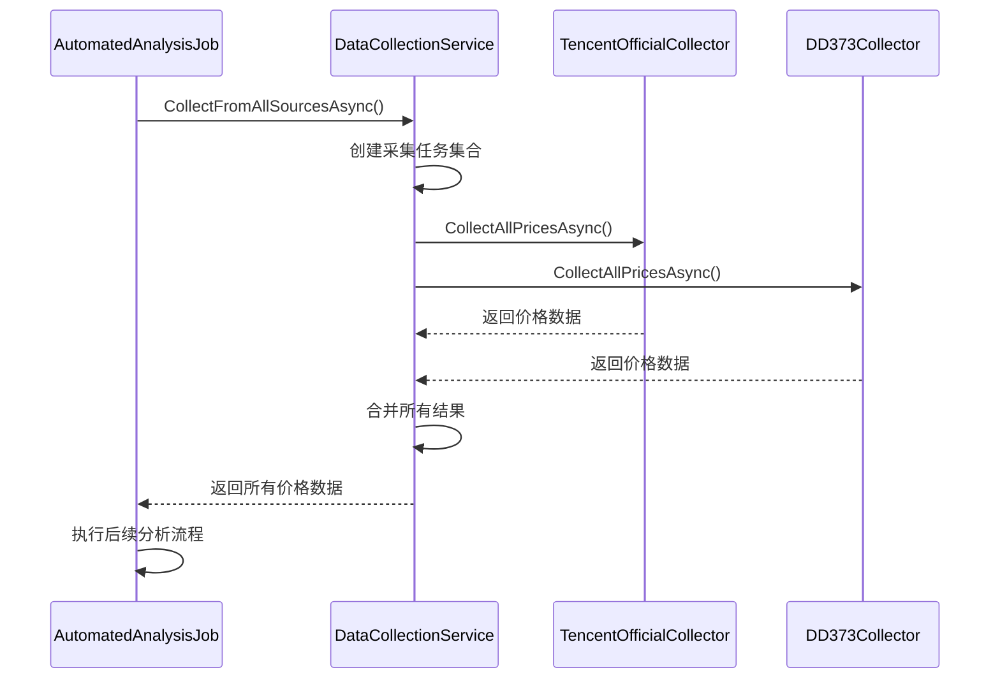
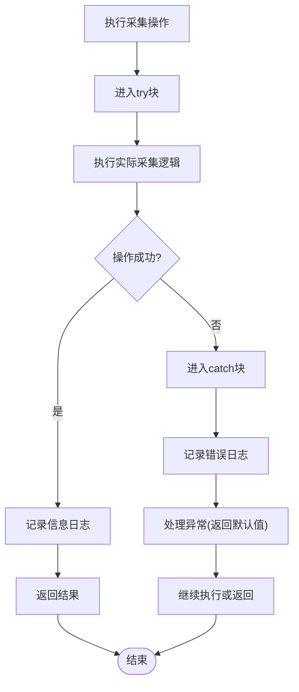

# 数据采集服务

<cite>
**Referenced Files in This Document**   
- [DataCollectionService.cs](file://src/POE2Finance.Services/DataCollection/DataCollectionService.cs)
- [TencentOfficialCollector.cs](file://src/POE2Finance.Services/DataCollection/Collectors/TencentOfficialCollector.cs)
- [DD373Collector.cs](file://src/POE2Finance.Services/DataCollection/Collectors/DD373Collector.cs)
- [BaseDataCollector.cs](file://src/POE2Finance.Services/DataCollection/BaseDataCollector.cs)
- [DataCollectionConfiguration.cs](file://src/POE2Finance.Services/Configuration/DataCollectionConfiguration.cs)
- [AntiBanHttpClient.cs](file://src/POE2Finance.Services/Infrastructure/AntiBanHttpClient.cs)
- [AutomatedAnalysisJob.cs](file://src/POE2Finance.Services/Jobs/AutomatedAnalysisJob.cs)
</cite>

## 目录
1. [简介](#简介)
2. [核心组件](#核心组件)
3. [依赖注入与数据采集器](#依赖注入与数据采集器)
4. [降级采集策略](#降级采集策略)
5. [并行采集机制](#并行采集机制)
6. [健康检查流程](#健康检查流程)
7. [定时任务执行路径](#定时任务执行路径)
8. [异常处理与日志记录](#异常处理与日志记录)
9. [性能优化建议](#性能优化建议)
10. [配置项影响](#配置项影响)

## 简介
数据采集服务是POE2Finance系统的核心组件，负责从多个外部数据源（如腾讯官方、DD373等）采集《流放之路2》游戏内通货价格数据。该服务采用依赖注入模式管理多个数据采集器实现，通过优先级机制实现降级采集策略，并支持并行采集和健康检查功能。服务被定时任务触发，为后续的价格分析、图表生成和视频创作提供基础数据支持。

## 核心组件

数据采集服务的核心由`DataCollectionService`类实现，该类实现了`IDataCollectionService`接口。服务通过依赖注入获取所有实现了`IDataCollector`接口的数据采集器集合，并基于配置的优先级执行价格采集任务。服务提供了多种采集模式，包括单数据源采集、降级采集、并行采集和健康检查等功能。

**Section sources**
- [DataCollectionService.cs](file://src/POE2Finance.Services/DataCollection/DataCollectionService.cs#L11-L240)

## 依赖注入与数据采集器

数据采集服务通过依赖注入获取所有`IDataCollector`实现。系统中主要实现了两个数据采集器：`TencentOfficialCollector`（腾讯官方采集器）和`DD373Collector`（DD373采集器）。这些采集器都继承自`BaseDataCollector`抽象基类，实现了统一的采集接口。

**Diagram sources**
- [BaseDataCollector.cs](file://src/POE2Finance.Services/DataCollection/BaseDataCollector.cs#L9-L47)
- [TencentOfficialCollector.cs](file://src/POE2Finance.Services/DataCollection/Collectors/TencentOfficialCollector.cs#L13-L158)
- [DD373Collector.cs](file://src/POE2Finance.Services/DataCollection/Collectors/DD373Collector.cs#L15-L234)

**Section sources**
- [BaseDataCollector.cs](file://src/POE2Finance.Services/DataCollection/BaseDataCollector.cs#L52-L216)
- [TencentOfficialCollector.cs](file://src/POE2Finance.Services/DataCollection/Collectors/TencentOfficialCollector.cs#L13-L158)
- [DD373Collector.cs](file://src/POE2Finance.Services/DataCollection/Collectors/DD373Collector.cs#L15-L234)

## 降级采集策略

`CollectPriceWithFallbackAsync`方法实现了基于优先级的降级采集策略。当首选数据源不可用时，服务会自动尝试下一个优先级的数据源，直到成功采集到数据或所有数据源都尝试失败。

该方法首先获取所有启用的数据采集器，并按优先级排序。然后按顺序尝试每个采集器，一旦某个采集器成功返回数据，立即返回结果并停止后续尝试。如果所有采集器都失败，则记录错误日志并返回null。

**Diagram sources**
- [DataCollectionService.cs](file://src/POE2Finance.Services/DataCollection/DataCollectionService.cs#L116-L148)

**Section sources**
- [DataCollectionService.cs](file://src/POE2Finance.Services/DataCollection/DataCollectionService.cs#L116-L148)

## 并行采集机制

`CollectFromAllSourcesAsync`方法实现了并行采集机制，能够同时从所有可用数据源采集价格数据并合并结果。该方法使用`Task.WhenAll`来并发执行所有采集任务，提高了数据采集的效率。

方法首先创建所有启用采集器的异步任务集合，每个任务独立执行`CollectAllPricesAsync`方法。然后使用`Task.WhenAll`等待所有任务完成，最后将所有结果合并到一个列表中返回。

**Diagram sources**
- [DataCollectionService.cs](file://src/POE2Finance.Services/DataCollection/DataCollectionService.cs#L155-L186)

**Section sources**
- [DataCollectionService.cs](file://src/POE2Finance.Services/DataCollection/DataCollectionService.cs#L155-L186)

## 健康检查流程

`CheckAllDataSourcesHealthAsync`方法实现了对所有数据源的健康检查流程。该方法并发检查每个启用的数据采集器的可用性，并返回一个包含所有数据源健康状态的字典。

健康检查通过调用每个采集器的`ValidateAsync`方法实现，该方法会向数据源发送验证请求。检查结果会记录在日志中，包括成功和失败的采集器数量，便于监控和故障排查。

**Diagram sources**
- [DataCollectionService.cs](file://src/POE2Finance.Services/DataCollection/DataCollectionService.cs#L206-L239)

**Section sources**
- [DataCollectionService.cs](file://src/POE2Finance.Services/DataCollection/DataCollectionService.cs#L206-L239)

## 定时任务执行路径

数据采集服务通常由`AutomatedAnalysisJob`定时任务触发。当定时任务执行时，会调用`CollectFromAllSourcesAsync`方法从所有数据源采集最新价格数据，为后续的市场分析提供数据支持。

**Diagram sources**
- [AutomatedAnalysisJob.cs](file://src/POE2Finance.Services/Jobs/AutomatedAnalysisJob.cs#L116-L123)
- [DataCollectionService.cs](file://src/POE2Finance.Services/DataCollection/DataCollectionService.cs#L155-L186)

**Section sources**
- [AutomatedAnalysisJob.cs](file://src/POE2Finance.Services/Jobs/AutomatedAnalysisJob.cs#L116-L123)

## 异常处理与日志记录

数据采集服务实现了完善的异常处理和日志记录机制。每个采集操作都包含try-catch块，捕获并处理可能发生的异常，确保单个采集器的失败不会影响整个服务的运行。

服务使用`ILogger`接口记录不同级别的日志信息，包括：
- `LogInformation`：记录正常操作和成功结果
- `LogWarning`：记录非致命错误和降级情况
- `LogError`：记录严重错误和异常

**Section sources**
- [DataCollectionService.cs](file://src/POE2Finance.Services/DataCollection/DataCollectionService.cs#L35-L50)
- [DataCollectionService.cs](file://src/POE2Finance.Services/DataCollection/DataCollectionService.cs#L125-L135)
- [DataCollectionService.cs](file://src/POE2Finance.Services/DataCollection/DataCollectionService.cs#L165-L175)

## 性能优化建议

1. **合理设置采集间隔**：通过`DataCollectionConfiguration`中的`CollectionIntervalHours`配置项控制采集频率，避免过于频繁的请求导致被封禁。
2. **优化重试策略**：调整`MaxRetries`和`RetryDelayBaseSeconds`配置，平衡重试次数和等待时间。
3. **使用随机延迟**：通过`RandomDelay`配置添加随机延迟，模拟人类操作行为，降低被检测为爬虫的风险。
4. **并发控制**：在并行采集时注意控制并发数量，避免对目标服务器造成过大压力。
5. **缓存机制**：考虑在应用层添加缓存，减少对相同数据的重复采集。

**Section sources**
- [DataCollectionConfiguration.cs](file://src/POE2Finance.Services/Configuration/DataCollectionConfiguration.cs#L5-L40)

## 配置项影响

数据采集行为受到`DataCollectionConfiguration`配置类的多个参数影响：

| 配置项 | 描述 | 影响 |
|--------|------|------|
| CollectionIntervalHours | 采集间隔（小时） | 控制数据采集的频率 |
| MinRequestIntervalSeconds | 最小请求间隔（秒） | 防止请求过于频繁 |
| RandomDelay | 随机延迟范围 | 增加请求的随机性，防反爬 |
| RequestTimeoutSeconds | 请求超时时间（秒） | 控制单个请求的最大等待时间 |
| MaxRetries | 最大重试次数 | 影响采集的容错能力 |
| RetryDelayBaseSeconds | 重试延迟基数（秒） | 影响重试策略的等待时间 |
| UserAgents | User-Agent池 | 轮换User-Agent，降低被封禁风险 |
| Priority | 数据源优先级 | 决定降级采集的顺序 |

**Section sources**
- [DataCollectionConfiguration.cs](file://src/POE2Finance.Services/Configuration/DataCollectionConfiguration.cs#L5-L40)