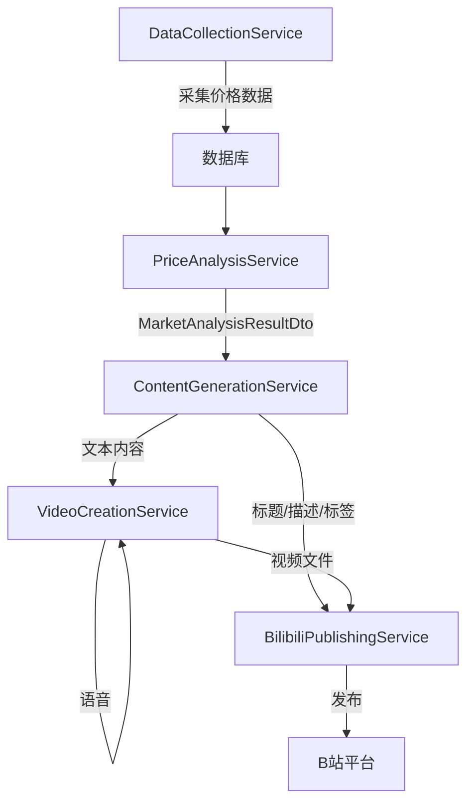

# 核心服务与业务逻辑

<cite>
**本文档引用的文件**   
- [DataCollectionService.cs](file://src/POE2Finance.Services/DataCollection/DataCollectionService.cs)
- [PriceAnalysisService.cs](file://src/POE2Finance.Services/Analysis/PriceAnalysisService.cs)
- [ContentGenerationService.cs](file://src/POE2Finance.Services/AI/ContentGenerationService.cs)
- [VideoCreationService.cs](file://src/POE2Finance.Services/Video/VideoCreationService.cs)
- [BilibiliPublishingService.cs](file://src/POE2Finance.Services/Publishing/BilibiliPublishingService.cs)
- [ServiceInterfaces.cs](file://src/POE2Finance.Core/Interfaces/ServiceInterfaces.cs)
- [TencentOfficialCollector.cs](file://src/POE2Finance.Services/DataCollection/Collectors/TencentOfficialCollector.cs)
- [DD373Collector.cs](file://src/POE2Finance.Services/DataCollection/Collectors/DD373Collector.cs)
- [ChartGenerationService.cs](file://src/POE2Finance.Services/Charts/ChartGenerationService.cs)
- [EdgeTtsService.cs](file://src/POE2Finance.Services/AI/EdgeTtsService.cs)
</cite>

## 目录
1. [数据采集服务](#数据采集服务)
2. [价格分析服务](#价格分析服务)
3. [内容生成服务](#内容生成服务)
4. [视频制作服务](#视频制作服务)
5. [B站发布服务](#b站发布服务)
6. [服务调用关系与数据流转](#服务调用关系与数据流转)
7. [服务接口定义与调用示例](#服务接口定义与调用示例)

## 数据采集服务

`DataCollectionService` 是系统的核心数据采集协调器，负责管理多个数据采集器（如 `TencentOfficialCollector` 和 `DD373Collector`）并协调它们从不同数据源获取市场价格数据。该服务通过依赖注入接收所有实现了 `IDataCollector` 接口的采集器实例，并根据配置的优先级和可用性进行调度。

服务提供了多种采集策略：`CollectPriceDataAsync` 方法用于从指定数据源采集单个通货的价格；`CollectPriceWithFallbackAsync` 方法则实现了故障转移机制，会按优先级顺序尝试多个数据源，确保数据获取的可靠性；`CollectFromAllSourcesAsync` 方法则会并行地从所有可用数据源采集数据，用于数据对比和验证。服务还提供了 `CheckAllDataSourcesHealthAsync` 方法来定期检查所有数据源的健康状态，确保数据采集的稳定性。

数据采集器的实现遵循了统一的基类 `BaseDataCollector`，该基类定义了采集器的通用行为和异常处理逻辑。具体的采集器（如 `TencentOfficialCollector` 和 `DD373Collector`）继承此基类，并实现 `PerformPriceCollectionAsync` 等抽象方法来处理特定数据源的API调用和HTML解析。例如，`TencentOfficialCollector` 通过调用腾讯官方的JSON API获取数据，而 `DD373Collector` 则通过解析DD373网站的HTML页面来提取价格信息，并使用正则表达式处理文本中的价格。

**Section sources**
- [DataCollectionService.cs](file://src/POE2Finance.Services/DataCollection/DataCollectionService.cs#L11-L240)
- [BaseDataCollector.cs](file://src/POE2Finance.Services/DataCollection/BaseDataCollector.cs#L1-L217)
- [TencentOfficialCollector.cs](file://src/POE2Finance.Services/DataCollection/Collectors/TencentOfficialCollector.cs#L13-L158)
- [DD373Collector.cs](file://src/POE2Finance.Services/DataCollection/Collectors/DD373Collector.cs#L15-L234)

## 价格分析服务

`PriceAnalysisService` 负责执行市场趋势分析和热点识别。它依赖于 `ICurrencyPriceRepository` 从数据库获取历史价格数据，并根据 `AnalysisConfiguration` 中的配置参数进行复杂的计算。

服务的核心方法 `AnalyzeHotItemsAsync` 会分析主要通货（崇高石、神圣石、混沌石）的价格数据。其算法思路是综合多个维度来计算一个“热度评分”（HotScore）。该评分由三个加权因素构成：**价格波动率**（通过最高价与最低价的差值计算）、**交易量变化百分比**（比较近期与早期的平均交易量）和**趋势一致性**（统计价格上涨、下跌和持平的次数，取最大值作为一致性评分）。这些权重在配置文件中定义，允许灵活调整。

在计算出每个通货的热度评分后，服务会调用 `CalculateTrendType` 方法来判断其趋势类型。该方法不仅计算价格的总体变化百分比，还会分析价格变动的“一致性”，即上涨或下跌的连续性。例如，即使总体变化不大，但如果价格连续小幅上涨，也会被判定为“温和上涨”趋势。最终，`GenerateMarketAnalysisAsync` 方法会整合所有热点物品的分析结果，生成包含整体市场趋势、市场动态描述、交易建议和风险提示的完整市场分析报告。

**Section sources**
- [PriceAnalysisService.cs](file://src/POE2Finance.Services/Analysis/PriceAnalysisService.cs#L14-L475)
- [AnalysisConfiguration.cs](file://src/POE2Finance.Services/Configuration/AnalysisConfiguration.cs#L1-L161)

## 内容生成服务

`ContentGenerationService` 利用预定义的模板和AI生成技术，将 `PriceAnalysisService` 生成的结构化分析结果转化为自然语言的分析报告和视频脚本。该服务通过 `ContentGenerationConfiguration` 中的模板配置来构建内容。

服务的核心方法 `GenerateReportContentAsync` 会遍历市场分析结果，使用 `StringBuilder` 按照固定的结构（开场白、热点物品分析、市场动态、整体趋势、交易建议）拼接文本。每个部分都使用了可配置的模板，例如，热点物品描述会使用 `HotItemTemplates` 中的模板，将通货名称、热度评分、波动率等变量动态填充进去。服务还提供了 `GenerateVideoTitle`、`GenerateVideoDescription` 和 `GenerateVideoTags` 等方法，用于生成符合B站平台要求的视频元数据，如标题会根据市场热度选择“市场速报”或“行情分析”等模板。

**Section sources**
- [ContentGenerationService.cs](file://src/POE2Finance.Services/AI/ContentGenerationService.cs#L15-L71)
- [ContentGenerationConfiguration.cs](file://src/POE2Finance.Services/Configuration/ContentGenerationConfiguration.cs#L1-L304)

## 视频制作服务

`VideoCreationService` 负责结合图表与语音合成最终的视频。它是一个复合服务，依赖于 `EdgeTtsService` 进行语音合成，依赖于 `ChartGenerationService` 生成图表，并依赖于 `IContentGenerationService` 获取脚本内容。

视频制作流程分为三个主要步骤：首先，服务调用 `EdgeTtsService.GenerateAudioAsync` 将分析报告文本转换为语音音频文件（MP3）。其次，服务调用 `ChartGenerationService` 生成价格趋势图和热点物品对比图。最后，服务进入核心的 `CreateVideoAsync` 方法，该方法会创建一个临时目录，并调用一系列 `CreateXXXFrameAsync` 方法（如 `CreateOpeningFrameAsync`、`CreateChartFrameAsync`）来生成视频的每一帧PNG图片。这些帧图片按照时间顺序排列，构成了视频的视觉内容。最后，服务使用 `FFMpegCore` 库将这些帧图片序列和语音音频文件合成为一个最终的MP4视频文件。

**Section sources**
- [VideoCreationService.cs](file://src/POE2Finance.Services/Video/VideoCreationService.cs#L20-L649)
- [EdgeTtsService.cs](file://src/POE2Finance.Services/AI/EdgeTtsService.cs#L12-L21)
- [ChartGenerationService.cs](file://src/POE2Finance.Services/Charts/ChartGenerationService.cs#L17-L469)

## B站发布服务

`BilibiliPublishingService` 负责与B站API交互，完成视频上传。它通过 `ResilientHttpClient` 发送HTTP请求，并使用 `BilibiliConfiguration` 中的认证信息（Session Cookie和CSRF Token）进行身份验证。

发布流程分为两个关键步骤：首先是**预上传**（preupload），服务调用B站的预上传接口获取上传凭证（包括上传URL和令牌）；然后是**分片上传**，服务将视频文件分割成多个块（chunk），并使用获取到的凭证并行地上传这些分片。上传完成后，服务会调用“完成多分片上传”接口来合并所有分片。最后，服务调用 `video/add` 接口提交视频的元数据（标题、描述、标签、分区等），完成整个发布流程。服务还提供了 `CheckPublishStatusAsync` 方法来查询视频的发布状态。

**Section sources**
- [BilibiliPublishingService.cs](file://src/POE2Finance.Services/Publishing/BilibiliPublishingService.cs#L14-L175)
- [BilibiliConfiguration.cs](file://src/POE2Finance.Services/Configuration/BilibiliConfiguration.cs#L1-L437)

## 服务调用关系与数据流转

各核心服务之间通过清晰的接口进行调用，形成了一条完整的自动化流水线。数据流转始于 `DataCollectionService`，它从外部数据源采集原始价格数据并存入数据库。随后，`PriceAnalysisService` 从数据库读取这些历史数据，执行分析算法，生成结构化的 `MarketAnalysisResultDto` 对象。

这个分析结果被传递给 `ContentGenerationService`，后者将其转化为人类可读的文本内容和视频元数据。接着，`VideoCreationService` 接收这些文本和元数据，调用 `ChartGenerationService` 生成图表，并调用 `EdgeTtsService` 将文本合成为语音，最终将所有元素（帧图片、音频）合成为视频文件。

最后，`BilibiliPublishingService` 接收生成的视频文件路径，以及由 `ContentGenerationService` 提供的标题、描述和标签，通过B站API将视频上传发布。整个流程体现了高内聚、低耦合的设计原则，每个服务都专注于单一职责。

**Diagram sources **
- [DataCollectionService.cs](file://src/POE2Finance.Services/DataCollection/DataCollectionService.cs#L11-L240)
- [PriceAnalysisService.cs](file://src/POE2Finance.Services/Analysis/PriceAnalysisService.cs#L14-L475)
- [ContentGenerationService.cs](file://src/POE2Finance.Services/AI/ContentGenerationService.cs#L15-L71)
- [VideoCreationService.cs](file://src/POE2Finance.Services/Video/VideoCreationService.cs#L20-L649)
- [BilibiliPublishingService.cs](file://src/POE2Finance.Services/Publishing/BilibiliPublishingService.cs#L14-L175)

## 服务接口定义与调用示例

所有核心服务均通过接口进行定义，确保了实现的可替换性和代码的可测试性。主要接口定义在 `ServiceInterfaces.cs` 文件中。

### 服务接口定义

| 服务接口 | 关键方法 | 说明 |
| :--- | :--- | :--- |
| `IDataCollectionService` | `CollectPriceWithFallbackAsync` | 