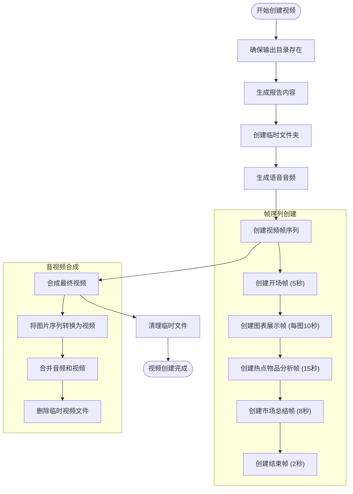
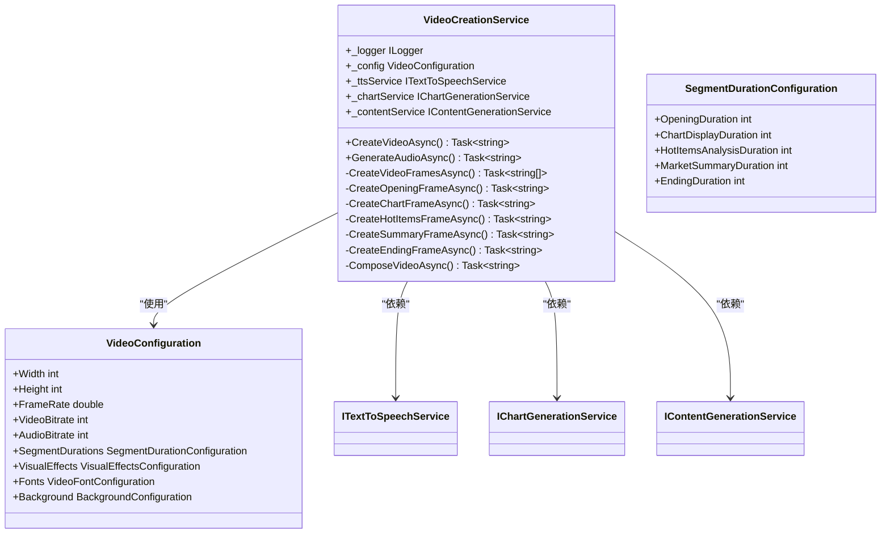
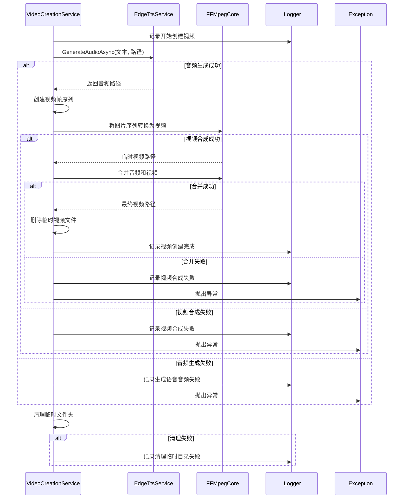
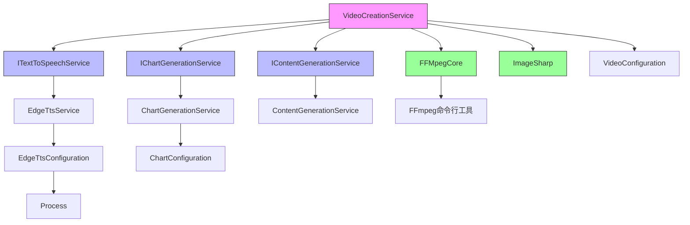

# 视频制作服务

<cite>
**本文档引用的文件**   
- [VideoCreationService.cs](file://src\POE2Finance.Services\Video\VideoCreationService.cs)
- [EdgeTtsService.cs](file://src\POE2Finance.Services\AI\EdgeTtsService.cs)
- [ChartGenerationService.cs](file://src\POE2Finance.Services\Charts\ChartGenerationService.cs)
- [VideoConfiguration.cs](file://src\POE2Finance.Services\Configuration\VideoConfiguration.cs)
- [ChartConfiguration.cs](file://src\POE2Finance.Services\Configuration\ChartConfiguration.cs)
- [ContentGenerationConfiguration.cs](file://src\POE2Finance.Services\Configuration\ContentGenerationConfiguration.cs)
- [ServiceInterfaces.cs](file://src\POE2Finance.Core\Interfaces\ServiceInterfaces.cs)
- [DataTransferObjects.cs](file://src\POE2Finance.Core\Models\DataTransferObjects.cs)
</cite>

## 目录
1. [简介](#简介)
2. [核心组件](#核心组件)
3. [执行流程分析](#执行流程分析)
4. [视频模板与定制化功能](#视频模板与定制化功能)
5. [性能优化与错误恢复](#性能优化与错误恢复)
6. [配置管理](#配置管理)
7. [依赖关系图](#依赖关系图)

## 简介
视频制作服务（VideoCreationService）是POE2Finance系统中的核心组件，负责将市场分析数据转化为完整的视频内容。该服务整合了图表生成、语音合成和音视频合成三大功能模块，通过自动化流程生成专业的市场分析视频。服务采用模块化设计，依赖EdgeTtsService进行语音合成，ChartGenerationService生成价格趋势图，并使用FFMpegCore库完成最终的音视频合成。整个流程从脚本生成开始，经过语音合成、图像帧序列创建，最终封装成完整的视频文件，为用户提供直观的市场分析内容。

## 核心组件

视频制作服务的核心功能围绕`CreateVideoAsync`方法展开，该方法协调多个服务组件完成视频生成任务。服务通过依赖注入获取`ITextToSpeechService`、`IChartGenerationService`和`IContentGenerationService`接口实例，实现了松耦合的设计。视频配置（VideoConfiguration）定义了分辨率、帧率、比特率等关键参数，确保输出视频符合平台要求。服务采用临时文件夹管理中间产物，确保生成过程的原子性和可清理性。

**本节来源**
- [VideoCreationService.cs](file://src\POE2Finance.Services\Video\VideoCreationService.cs#L19-L648)
- [ServiceInterfaces.cs](file://src\POE2Finance.Core\Interfaces\ServiceInterfaces.cs#L159-L179)
- [VideoConfiguration.cs](file://src\POE2Finance.Services\Configuration\VideoConfiguration.cs#L0-L437)

## 执行流程分析

视频生成流程分为三个主要阶段：脚本生成、语音合成和视频合成。`CreateVideoAsync`方法首先调用内容生成服务创建报告文本，然后使用TTS服务生成语音音频文件，接着创建视频帧序列，最后通过FFmpeg将图像序列和音频合并为最终视频。

**图表来源**
- [VideoCreationService.cs](file://src\POE2Finance.Services\Video\VideoCreationService.cs#L50-L106)

**本节来源**
- [VideoCreationService.cs](file://src\POE2Finance.Services\Video\VideoCreationService.cs#L50-L106)
- [VideoCreationService.cs](file://src\POE2Finance.Services\Video\VideoCreationService.cs#L122-L169)

## 视频模板与定制化功能

视频制作服务支持多种定制化功能，包括视频模板管理、分辨率适配和品牌元素嵌入。服务通过`VideoConfiguration`类定义了视频的宽度、高度和帧率等基本参数，支持1920x1080等标准分辨率。视频内容分为五个逻辑段落：开场、图表展示、热点物品分析、市场总结和结束，每个段落的时长可通过配置进行调整。

服务在图像处理层面实现了品牌元素嵌入，通过ImageSharp库在视频帧中添加标题、装饰线条和品牌标识。例如，开场帧包含"POE2国服{时间段}市场分析"的标题和日期时间信息，结束帧包含"感谢观看"和订阅提醒等品牌元素。这些元素的颜色、字体和位置都可在配置中定义，确保视频风格的一致性。

**图表来源**
- [VideoCreationService.cs](file://src\POE2Finance.Services\Video\VideoCreationService.cs#L19-L648)
- [VideoConfiguration.cs](file://src\POE2Finance.Services\Configuration\VideoConfiguration.cs#L0-L437)

**本节来源**
- [VideoCreationService.cs](file://src\POE2Finance.Services\Video\VideoCreationService.cs#L171-L460)
- [VideoConfiguration.cs](file://src\POE2Finance.Services\Configuration\VideoConfiguration.cs#L0-L437)

## 性能优化与错误恢复

视频制作服务在性能优化方面采用了多项策略。首先，服务使用临时文件夹集中管理中间文件，避免了文件系统的碎片化访问。其次，通过配置合理的帧率（默认30fps）和CRF值（默认23），在视频质量和文件大小之间取得平衡。服务还实现了错误恢复机制，在合成失败时会记录详细日志，并保留临时文件以便调试。

在资源管理方面，服务使用`using`语句确保图像资源的及时释放，避免内存泄漏。临时文件夹在操作完成后会被自动清理，即使发生异常也会通过`finally`块执行清理操作。对于关键的FFmpeg合成步骤，服务捕获所有异常并重新抛出，确保错误不会被静默忽略。

**图表来源**
- [VideoCreationService.cs](file://src\POE2Finance.Services\Video\VideoCreationService.cs#L464-L520)
- [EdgeTtsService.cs](file://src\POE2Finance.Services\AI\EdgeTtsService.cs#L12-L431)

**本节来源**
- [VideoCreationService.cs](file://src\POE2Finance.Services\Video\VideoCreationService.cs#L464-L520)
- [EdgeTtsService.cs](file://src\POE2Finance.Services\AI\EdgeTtsService.cs#L12-L431)

## 配置管理

系统通过多个配置类实现灵活的参数管理。`VideoConfiguration`定义了视频的基本属性，`ChartConfiguration`管理图表生成参数，`ContentGenerationConfiguration`控制内容生成行为。这些配置通过依赖注入系统注入到相应服务中，支持运行时修改而无需重新编译代码。

配置结构采用分层设计，将相关参数组织在嵌套类中。例如，`VideoConfiguration`包含`SegmentDurations`、`VisualEffects`和`Fonts`等子配置类，使配置结构清晰且易于维护。所有配置类都提供了合理的默认值，确保在缺少配置文件时系统仍能正常运行。

**本节来源**
- [VideoConfiguration.cs](file://src\POE2Finance.Services\Configuration\VideoConfiguration.cs#L0-L437)
- [ChartConfiguration.cs](file://src\POE2Finance.Services\Configuration\ChartConfiguration.cs#L0-L251)
- [ContentGenerationConfiguration.cs](file://src\POE2Finance.Services\Configuration\ContentGenerationConfiguration.cs#L0-L303)

## 依赖关系图

**图表来源**
- [VideoCreationService.cs](file://src\POE2Finance.Services\Video\VideoCreationService.cs#L19-L648)
- [EdgeTtsService.cs](file://src\POE2Finance.Services\AI\EdgeTtsService.cs#L12-L4