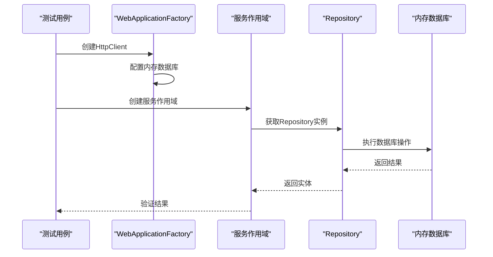
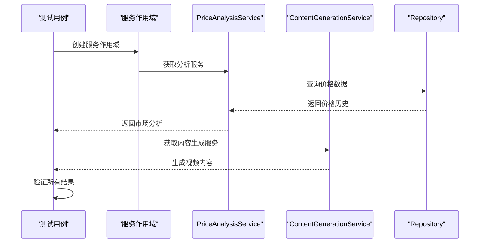
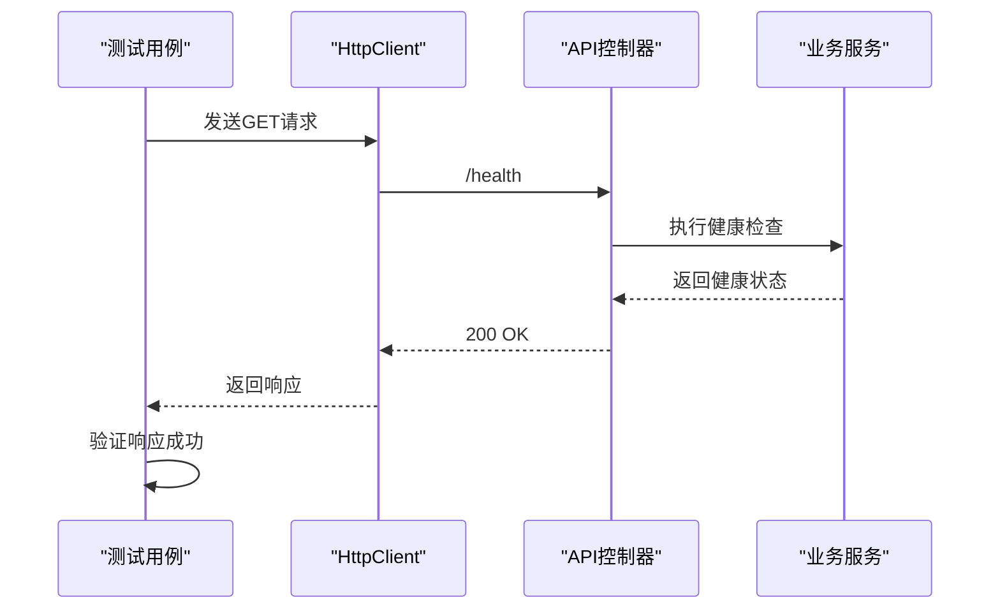

# 测试策略

<cite>
**Referenced Files in This Document**  
- [IntegrationTests.cs](file://tests/POE2Finance.Tests/Integration/IntegrationTests.cs)
- [ServiceTests.cs](file://tests/POE2Finance.Tests/Services/ServiceTests.cs)
- [Program.cs](file://src/POE2Finance.Web/Program.cs)
- [docker-compose.yml](file://docker-compose.yml)
- [POE2Finance.Tests.csproj](file://tests/POE2Finance.Tests/POE2Finance.Tests.csproj)
</cite>

## 目录
1. [集成测试方法论](#集成测试方法论)
2. [测试用例分析](#测试用例分析)
3. [测试覆盖范围评估](#测试覆盖范围评估)
4. [测试执行与报告](#测试执行与报告)
5. [测试改进建议](#测试改进建议)
6. [结论](#结论)

## 集成测试方法论

POE2Finance项目采用`WebApplicationFactory<Program>`作为核心集成测试框架，通过创建轻量级的Web应用实例来模拟真实运行环境。该方法论允许测试覆盖从HTTP请求处理到数据库操作的完整服务间交互流程。

测试基类`IntegrationTestBase`通过`WebApplicationFactory<Program>`配置测试专用的服务容器，其中最关键的配置是使用内存数据库替代生产环境的持久化存储。这种设计确保了测试的隔离性和可重复性，同时避免了对真实数据库的依赖和污染。

在服务配置方面，测试工厂通过`WithWebHostBuilder`方法重构服务集合，移除原有的`DbContextOptions<POE2FinanceDbContext>`服务并注入内存数据库实例。每个测试用例都会创建独立的内存数据库实例，通过`Guid.NewGuid()`生成唯一数据库名称，防止测试间的相互干扰。

**Section sources**
- [IntegrationTests.cs](file://tests/POE2Finance.Tests/Integration/IntegrationTests.cs#L10-L50)

## 测试用例分析

### 数据库集成测试

数据库集成测试验证了数据访问层的完整生命周期操作，包括数据创建、种子数据填充、实体插入、检索和更新。测试用例`Database_ShouldCreateAndSeedData`验证了应用程序启动时数据库的自动创建和初始货币元数据的正确填充，确保三种核心货币类型（崇高石、神石、混沌石）被正确初始化。

`CurrencyPriceRepository_ShouldInsertAndRetrieveData`测试用例验证了价格数据的持久化能力，通过插入测试价格记录并验证其可检索性，确保`ICurrencyPriceRepository`接口的`AddAsync`和`GetLatestPriceAsync`方法正常工作。类似地，`AnalysisReportRepository_ShouldHandleReportLifecycle`测试用例验证了分析报告的完整生命周期，从创建、状态更新到按日期和时段检索。



**Diagram sources**
- [IntegrationTests.cs](file://tests/POE2Finance.Tests/Integration/IntegrationTests.cs#L55-L107)

### 服务集成测试

服务集成测试验证了核心业务服务的交互和功能正确性。`PriceAnalysisService_ShouldAnalyzeEmptyData`测试用例验证了价格分析服务在无历史数据情况下的行为，确保其能正确处理空数据集并返回空的热点项目列表。

`PriceAnalysisService_ShouldGenerateMarketAnalysis`测试用例验证了市场分析生成功能，确保服务能正确生成包含市场动态、交易建议和风险提示的完整分析报告。`ContentGenerationService_ShouldGenerateContent`测试用例则验证了内容生成服务的功能，确保视频标题、描述和标签的生成符合预期格式和内容要求。



**Diagram sources**
- [IntegrationTests.cs](file://tests/POE2Finance.Tests/Integration/IntegrationTests.cs#L154-L210)

### API集成测试

API集成测试直接通过HTTP客户端验证API端点的可用性和正确性。`HealthCheck_ShouldReturnSuccess`测试用例验证了健康检查端点`/health`的可达性和成功响应，这是监控系统健康状态的关键接口。

`SwaggerUI_ShouldBeAccessible`测试用例验证了Swagger文档界面的可访问性，确保API文档能够正常加载。这些测试通过`HttpClient`直接发送HTTP请求并验证响应状态码，模拟了真实客户端的API调用行为。



**Diagram sources**
- [IntegrationTests.cs](file://tests/POE2Finance.Tests/Integration/IntegrationTests.cs#L213-L230)

### 端到端集成测试

端到端集成测试`CompleteWorkflow_ShouldExecuteSuccessfully`验证了从数据采集到内容生成的完整工作流。该测试首先通过仓库插入模拟的价格数据，然后调用价格分析服务生成市场分析，最后使用内容生成服务创建视频标题、描述和报告内容。

这种测试方法验证了多个服务间的协同工作能力，确保整个自动化流程的连贯性和正确性。测试验证了分析结果的时间段、生成内容中包含正确的时段标识（如"上午场"）以及报告内容的完整性。

**Section sources**
- [IntegrationTests.cs](file://tests/POE2Finance.Tests/Integration/IntegrationTests.cs#L233-L318)

## 测试覆盖范围评估

当前项目的测试覆盖范围主要集中在集成测试层面，涵盖了数据库操作、服务间交互和API端点验证。项目结构显示存在`Integration`和`Services`两个测试目录，其中`ServiceTests.cs`文件包含对`PriceAnalysisService`和`ContentGenerationService`的单元测试。

单元测试采用Moq框架进行依赖注入，通过模拟`ICurrencyPriceRepository`和日志服务等依赖项，隔离测试目标服务的业务逻辑。例如，`PriceAnalysisServiceTests`中的`CalculateTrendType`测试用例验证了趋势计算算法的正确性，而`ContentGenerationServiceTests`中的`GenerateVideoTitle`测试用例验证了视频标题生成的格式和长度限制。

然而，当前测试策略存在明显的覆盖缺口。缺少对数据采集服务（如`TencentOfficialCollector`）、视频创建服务和Bilibili发布服务的专门测试。此外，缺少端到端的UI测试或真实API集成测试，无法验证与外部服务的实际交互。

**Section sources**
- [IntegrationTests.cs](file://tests/POE2Finance.Tests/Integration/IntegrationTests.cs)
- [ServiceTests.cs](file://tests/POE2Finance.Tests/Services/ServiceTests.cs)

## 测试执行与报告

项目通过`coverlet.collector`包集成代码覆盖率收集功能，如`POE2Finance.Tests.csproj`文件所示。这表明项目具备生成测试覆盖率报告的能力。虽然`docker-compose.yml`文件中未直接包含测试配置，但可以通过Docker构建上下文执行测试套件。

运行测试套件的标准命令为：
```bash
dotnet test tests/POE2Finance.Tests/POE2Finance.Tests.csproj --collect:"XPlat Code Coverage" --settings:coverlet.runsettings
```

生成覆盖率报告后，可以使用`reportgenerator`工具将原始覆盖率数据转换为可读的HTML报告：
```bash
reportgenerator -reports:coverage.cobertura.xml -targetdir:coverage-report -reporttypes:HTML
```

测试执行应作为CI/CD流水线的一部分，在代码提交或合并请求时自动运行，确保每次变更都经过充分验证。

**Section sources**
- [POE2Finance.Tests.csproj](file://tests/POE2Finance.Tests/POE2Finance.Tests.csproj#L18)
- [docker-compose.yml](file://docker-compose.yml)

## 测试改进建议

### 增加单元测试覆盖

建议为所有核心服务添加全面的单元测试，特别是目前缺少测试的`DataCollectionService`、`VideoCreationService`和`BilibiliPublishingService`。对于数据采集器，应测试其解析HTML或API响应的能力，验证数据提取的准确性和错误处理机制。

### 实现端到端测试

建议添加端到端测试，模拟真实用户场景。这包括测试定时任务的触发和执行、验证生成的视频文件是否符合配置要求，以及测试Bilibili API的实际发布流程（可使用测试账号或模拟API响应）。

### 引入性能和压力测试

由于项目涉及定时数据采集和分析，建议添加性能测试以验证在高负载情况下的系统稳定性。可以使用`BenchmarkDotNet`等工具测试价格分析算法的性能，或使用`k6`等工具对API端点进行压力测试。

### 完善测试数据管理

当前集成测试使用硬编码的测试数据，建议引入测试数据工厂模式，创建可重用的测试数据构建器。这将提高测试的可维护性，并支持更复杂的数据场景测试。

### 增强错误处理测试

当前测试主要关注正常流程，建议增加对异常情况的测试，如数据库连接失败、API限流、网络超时等场景。这将确保系统的健壮性和故障恢复能力。

## 结论

POE2Finance项目的测试策略以集成测试为核心，有效验证了关键业务流程的正确性。通过`WebApplicationFactory<Program>`和内存数据库的组合，实现了高效、隔离的集成测试环境。现有的测试套件覆盖了数据库操作、服务交互和API端点，为系统的可靠性提供了基本保障。

然而，测试覆盖范围有待扩展，特别是对数据采集和发布服务的测试。建议实施全面的测试改进计划，包括增加单元测试、实现端到端测试和引入性能测试，以构建更加完善和可靠的测试体系。自动化测试在确保POE2Finance自动化流程的稳定性和准确性方面发挥着至关重要的作用，是项目持续交付和质量保证的基石。