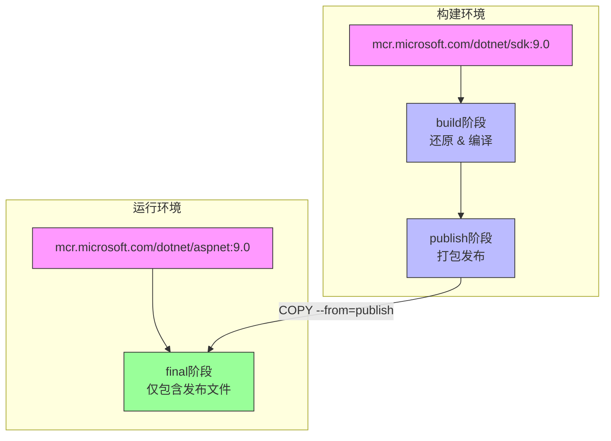

# Docker镜像构建

<cite>
**本文档引用的文件**   
- [Dockerfile](file://Dockerfile)
- [Program.cs](file://src/POE2Finance.Web/Program.cs)
- [DEPLOYMENT.md](file://DEPLOYMENT.md)
- [docker-compose.yml](file://docker-compose.yml)
- [EdgeTtsService.cs](file://src/POE2Finance.Services/AI/EdgeTtsService.cs)
- [VideoCreationService.cs](file://src/POE2Finance.Services/Video/VideoCreationService.cs)
- [ContentGenerationConfiguration.cs](file://src/POE2Finance.Services/Configuration/ContentGenerationConfiguration.cs)
</cite>

## 目录
1. [简介](#简介)
2. [基础镜像与系统依赖](#基础镜像与系统依赖)
3. [多阶段构建策略](#多阶段构建策略)
4. [工作目录与权限设置](#工作目录与权限设置)
5. [端口暴露与环境变量](#端口暴露与环境变量)
6. [健康检查机制](#健康检查机制)
7. [入口点与容器启动](#入口点与容器启动)
8. [构建参数与配置优化](#构建参数与配置优化)
9. [依赖关系与服务集成](#依赖关系与服务集成)
10. [部署与运行时配置](#部署与运行时配置)

## 简介
本文档详细解析POE2Finance项目的Docker镜像构建流程，涵盖从基础镜像选择到最终容器运行的完整生命周期。该Dockerfile采用多阶段构建策略，确保生产镜像的轻量化和安全性，同时集成FFmpeg、Python、中文字体和Edge-TTS等关键依赖，支持自动化市场分析视频的生成与发布。文档将深入剖析各构建阶段的职责划分、优化目的及实际应用中的配置方法。

## 基础镜像与系统依赖

Dockerfile以`mcr.microsoft.com/dotnet/aspnet:9.0`作为运行时基础镜像，这是一个官方维护的轻量级.NET 9运行时环境，专为生产部署优化。在此基础上，通过`apt-get`安装了项目运行所必需的系统级依赖：

- **FFmpeg**：用于视频的编码、解码和合成，是`VideoCreationService`服务生成最终视频文件的核心工具。
- **Python3及pip**：为Edge-TTS语音合成服务提供运行环境，通过`pip3 install edge-tts`命令安装Python包。
- **中文字体（fonts-wqy-zenhei, fonts-wqy-microhei）**：确保在生成视频帧时，中文文本能够正确渲染，避免乱码或方框问题。

所有`apt`缓存（`/var/lib/apt/lists/*`）在安装后立即清理，这是减少最终镜像体积的标准实践。

**Section sources**
- [Dockerfile](file://Dockerfile#L1-L15)

## 多阶段构建策略

本项目采用三阶段（build, publish, final）的多阶段构建策略，有效分离了构建环境与运行环境，实现了镜像的精简和安全。

### 构建阶段 (build)
使用`mcr.microsoft.com/dotnet/sdk:9.0`作为构建镜像，该镜像包含完整的.NET SDK，用于编译项目。此阶段的主要任务包括：
1.  **还原依赖**：执行`dotnet restore`，根据`.csproj`文件下载所有NuGet包。
2.  **编译代码**：执行`dotnet build`，将C#源代码编译为中间语言（IL）。

### 发布阶段 (publish)
继承自`build`阶段，执行`dotnet publish`命令。此命令不仅编译代码，还会将所有依赖项（包括NuGet包和本地引用）打包到一个独立的输出目录（`/app/publish`）中，生成一个“自包含”的应用发布包，便于部署。

### 最终阶段 (final)
继承自`base`阶段（即运行时镜像），仅从`publish`阶段复制已发布的应用文件（`COPY --from=publish /app/publish .`）。这确保了最终镜像中不包含任何编译工具、源代码或开发依赖，极大地减小了镜像体积并降低了安全风险。



**Diagram sources**
- [Dockerfile](file://Dockerfile#L1-L68)

**Section sources**
- [Dockerfile](file://Dockerfile#L16-L68)

## 工作目录与权限设置

Dockerfile通过`WORKDIR /app`指令在所有阶段统一设置工作目录，为应用提供一个一致的运行环境。

在`final`阶段，执行了以下关键操作：
- **创建目录**：使用`RUN mkdir -p`创建`/app/logs`、`/app/data`和`/app/temp`目录，用于挂载外部卷，分别存储日志、数据库和临时文件（如生成的图表和视频）。
- **设置权限**：执行`RUN chmod +x /app/POE2Finance.Web`，确保主程序文件具有可执行权限，避免容器启动时因权限问题而失败。

这些操作确保了应用在容器内拥有正确的文件系统结构和访问权限。

**Section sources**
- [Dockerfile](file://Dockerfile#L50-L55)

## 端口暴露与环境变量

### 端口暴露
通过`EXPOSE 8080`和`EXPOSE 8081`指令声明容器在运行时会监听这两个端口。`8080`是ASP.NET Core应用的HTTP服务端口，而`8081`可能预留用于健康检查或管理接口（尽管当前配置主要使用8080）。

### 环境变量
在`final`阶段设置了两个关键环境变量：
- `ASPNETCORE_ENVIRONMENT=Production`：告知ASP.NET Core框架当前处于生产环境，从而加载`appsettings.Production.json`配置并启用生产级优化。
- `ASPNETCORE_URLS=http://+:8080`：指定Kestrel服务器监听所有网络接口的8080端口。

这些变量也可在`docker-compose.yml`中被覆盖，提供了灵活的运行时配置能力。

**Section sources**
- [Dockerfile](file://Dockerfile#L3-L4)
- [Dockerfile](file://Dockerfile#L57-L58)
- [docker-compose.yml](file://docker-compose.yml#L10-L11)

## 健康检查机制

Dockerfile定义了`HEALTHCHECK`指令，这是容器健康状态监控的核心。

```dockerfile
HEALTHCHECK --interval=30s --timeout=10s --start-period=5s --retries=3 \
    CMD curl -f http://localhost:8080/health || exit 1
```

- **原理**：容器启动后，Docker守护进程会定期（每30秒）在容器内部执行`curl`命令，访问`/health`端点。
- **与应用集成**：`Program.cs`中配置了Quartz定时任务，其中`MaintenanceJobs`包含一个`Execute`方法，会定期调用`DataCollectionService`的`CheckAllDataSourcesHealthAsync`方法，检查数据源（如腾讯官网、DD373）的连通性，并记录日志。集成测试`IntegrationTests.cs`也验证了`/health`端点的可用性。
- **目的**：当应用因数据库连接失败、外部API不可用等原因无法正常工作时，`/health`端点会返回非200状态码，导致健康检查失败。Docker可以根据此状态自动重启容器或触发告警。

**Section sources**
- [Dockerfile](file://Dockerfile#L60-L62)
- [Program.cs](file://src/POE2Finance.Web/Program.cs#L110-L138)
- [MaintenanceJobs.cs](file://src/POE2Finance.Services/Jobs/MaintenanceJobs.cs#L300-L387)
- [IntegrationTests.cs](file://tests/POE2Finance.Tests/Integration/IntegrationTests.cs#L210-L262)

## 入口点与容器启动

`ENTRYPOINT ["dotnet", "POE2Finance.Web.dll"]`指令定义了容器启动时执行的命令。它直接运行编译后的.NET程序集。

- **与`CMD`的区别**：`ENTRYPOINT`定义了容器的主进程，而`CMD`通常用于提供默认参数。在此配置中，`ENTRYPOINT`固定了运行时，确保容器始终以正确的方式启动应用。
- **服务启动**：`Program.cs`中的`app.RunAsync()`会启动Kestrel服务器，监听`ASPNETCORE_URLS`指定的端口，并开始处理HTTP请求。

**Section sources**
- [Dockerfile](file://Dockerfile#L64)
- [Program.cs](file://src/POE2Finance.Web/Program.cs#L142-L145)

## 构建参数与配置优化

### 构建参数 (BUILD_CONFIGURATION)
Dockerfile使用`ARG BUILD_CONFIGURATION=Release`定义了一个构建参数，其默认值为`Release`。
- **用途**：该参数在`dotnet build`和`dotnet publish`命令中被引用（`-c $BUILD_CONFIGURATION`），控制编译优化级别。
- **使用方法**：在构建镜像时，可以通过`--build-arg`覆盖默认值。例如，`docker build --build-arg BUILD_CONFIGURATION=Debug ...`可用于构建调试版本，便于问题排查。

### 优化目的
整个Dockerfile的设计体现了多项优化原则：
- **减少镜像体积**：多阶段构建移除了SDK和中间文件；清理`apt`缓存；使用官方精简的基础镜像。
- **提升安全性**：最终镜像不包含编译器和源代码，攻击面更小；应用以非root用户运行（Docker最佳实践，但需在`docker-compose.yml`中明确指定）。
- **增强可维护性**：清晰的阶段划分使构建过程易于理解和修改。

**Section sources**
- [Dockerfile](file://Dockerfile#L17-L18)
- [Dockerfile](file://Dockerfile#L35-L36)

## 依赖关系与服务集成

Dockerfile中安装的系统依赖与应用内的服务紧密集成：
- **Edge-TTS**：`EdgeTtsService.cs`通过`ProcessStartInfo`调用`edge-tts`命令行工具，利用Python环境和中文字体，将分析报告文本转换为语音音频（`.mp3`）。
- **FFmpeg**：`VideoCreationService.cs`使用`FFMpegArguments`库（封装了FFmpeg命令行）将生成的PNG帧序列和MP3音频合成为最终的MP4视频文件。
- **配置驱动**：`ContentGenerationConfiguration.cs`中的`EdgeTtsConfiguration`类定义了`edge-tts`命令的路径、语音、语速等参数，实现了外部化配置。

```mermaid
classDiagram
class EdgeTtsService {
+GenerateAudioAsync(text, outputPath) string
-ExecuteEdgeTtsAsync(textFile, outputPath) bool
-BuildEdgeTtsArguments(textFile, outputPath) string
}
class VideoCreationService {
+CreateVideoAsync(config, analysisResult, chartPaths) string
-ComposeVideoAsync(framePaths, audioPath, outputPath) string
}
class EdgeTtsConfiguration {
+string EdgeTtsCommand
+string VoiceName
+string Rate
+string Volume
+string Pitch
}
EdgeTtsService --> EdgeTtsConfiguration : "使用配置"
VideoCreationService --> EdgeTtsService : "依赖TTS服务"
VideoCreationService --> "FFmpeg" : "调用命令行"
EdgeTtsService --> "Python/edge-tts" : "调用命令行"
```

**Diagram sources**
- [EdgeTtsService.cs](file://src/POE2Finance.Services/AI/EdgeTtsService.cs#L12-L432)
- [VideoCreationService.cs](file://src/POE2Finance.Services/Video/VideoCreationService.cs#L20-L649)
- [ContentGenerationConfiguration.cs](file://src/POE2Finance.Services/Configuration/ContentGenerationConfiguration.cs#L192-L303)

## 部署与运行时配置

`docker-compose.yml`文件定义了服务的运行时配置，与Dockerfile协同工作：
- **卷挂载**：将宿主机的`./data`, `./logs`, `./temp`目录挂载到容器内，实现数据持久化。
- **端口映射**：将容器的8080端口映射到宿主机的8080端口。
- **环境变量**：在`environment`部分再次声明，可覆盖Dockerfile中的默认值。
- **健康检查**：`docker-compose.yml`中也定义了`healthcheck`，与Dockerfile中的保持一致，确保编排工具能正确监控服务状态。

`DEPLOYMENT.md`提供了完整的部署指南，包括服务器准备、配置文件修改、构建启动和故障排除。

**Section sources**
- [docker-compose.yml](file://docker-compose.yml#L1-L50)
- [DEPLOYMENT.md](file://DEPLOYMENT.md#L0-L324)