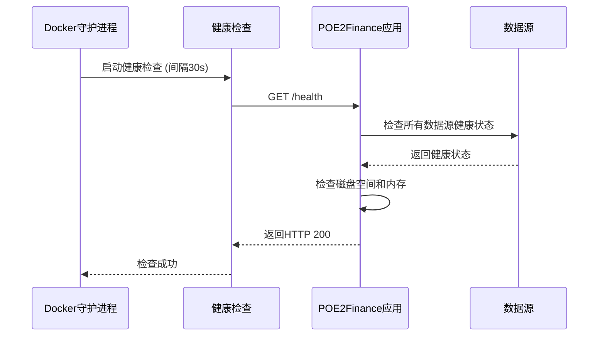

# 服务编排

<cite>
**Referenced Files in This Document**   
- [docker-compose.yml](file://docker-compose.yml)
- [Dockerfile](file://Dockerfile)
- [DEPLOYMENT.md](file://DEPLOYMENT.md)
- [src/POE2Finance.Web/Program.cs](file://src/POE2Finance.Web/Program.cs)
</cite>

## 目录
1. [服务定义与核心配置](#服务定义与核心配置)
2. [构建上下文与镜像管理](#构建上下文与镜像管理)
3. [容器运行时配置](#容器运行时配置)
4. [网络与依赖关系](#网络与依赖关系)
5. [健康检查机制](#健康检查机制)
6. [Nginx反向代理配置](#nginx反向代理配置)
7. [腾讯云部署实践](#腾讯云部署实践)
8. [最佳实践与维护建议](#最佳实践与维护建议)

## 服务定义与核心配置

`docker-compose.yml` 文件定义了两个核心服务：`poe2finance` 主应用服务和可选的 `nginx` 反向代理服务。`poe2finance` 服务作为系统的核心，负责数据采集、分析和视频生成等主要业务逻辑。

该服务通过 `container_name` 指令明确指定了容器名称为 `poe2finance-app`，便于在系统中进行识别和管理。服务的端口映射配置为 `"8080:8080"`，将主机的 8080 端口映射到容器内部的 8080 端口，这是应用的主要通信端口。

环境变量配置通过 `environment` 指令注入，设置了 `ASPNETCORE_ENVIRONMENT=Production` 和 `ASPNETCORE_URLS=http://+:8080`，确保应用在生产环境中运行，并监听所有网络接口的 8080 端口。

**Section sources**
- [docker-compose.yml](file://docker-compose.yml#L1-L50)

## 构建上下文与镜像管理

`poe2finance` 服务的构建配置指定了上下文为当前目录（`.`），并明确引用了 `Dockerfile` 作为构建指令文件。这种配置方式确保了构建过程能够访问项目根目录下的所有必要文件。

`Dockerfile` 采用了多阶段构建策略，首先使用 `mcr.microsoft.com/dotnet/sdk:9.0` 作为构建镜像来编译应用，然后将编译结果复制到基于 `mcr.microsoft.com/dotnet/aspnet:9.0` 的运行时镜像中。这种策略显著减小了最终镜像的大小，提高了部署效率。

在构建过程中，Dockerfile 还安装了必要的系统依赖，包括 `ffmpeg`（用于视频处理）、`python3` 和 `edge-tts`（用于文本转语音），以及中文字体包，确保应用功能的完整性。

**Section sources**
- [docker-compose.yml](file://docker-compose.yml#L5-L10)
- [Dockerfile](file://Dockerfile#L1-L69)

## 容器运行时配置

容器的重启策略配置为 `unless-stopped`，这意味着除非容器被手动停止，否则在任何情况下（包括 Docker 服务重启或容器崩溃）都会自动重启，确保了服务的高可用性。

数据卷挂载配置了三个关键目录：
- `./data:/app/data`：用于持久化存储应用数据，如数据库文件
- `./logs:/app/logs`：用于持久化存储应用日志
- `./temp:/app/temp`：用于存储临时文件

这种配置确保了即使容器被重建，重要数据也不会丢失，符合容器化应用的最佳实践。

**Section sources**
- [docker-compose.yml](file://docker-compose.yml#L11-L24)

## 网络与依赖关系

服务配置了自定义的 `poe2finance-network` 网络，该网络使用 `bridge` 驱动，为容器间通信提供了隔离的网络环境。`bridge` 网络是 Docker 的默认网络驱动，适用于大多数单主机部署场景。

`nginx` 服务通过 `depends_on` 指令声明了对 `poe2finance` 服务的依赖，这确保了在 `nginx` 启动之前，`poe2finance` 服务已经启动。然而，`depends_on` 仅控制启动顺序，并不等待 `poe2finance` 服务完全就绪。为此，配置了健康检查机制来确保服务真正可用。

**Section sources**
- [docker-compose.yml](file://docker-compose.yml#L25-L50)

## 健康检查机制

`poe2finance` 服务配置了详细的健康检查机制，通过执行 `curl -f http://localhost:8080/health` 命令来检测服务的健康状态。健康检查的参数配置如下：
- `interval`: 30秒，检查间隔
- `timeout`: 10秒，检查超时时间
- `retries`: 3次，失败重试次数
- `start_period`: 40秒，容器启动后的初始等待期

该健康检查通过调用应用的 `/health` 端点来验证服务的可用性。根据代码分析，健康检查不仅验证应用的基本响应能力，还检查数据源的健康状态、磁盘空间和内存使用情况，提供全面的系统健康视图。

**Diagram sources**
- [docker-compose.yml](file://docker-compose.yml#L30-L37)
- [src/POE2Finance.Web/Program.cs](file://src/POE2Finance.Web/Program.cs#L1-L146)
- [Dockerfile](file://Dockerfile#L65-L68)

**Section sources**
- [docker-compose.yml](file://docker-compose.yml#L30-L37)
- [Dockerfile](file://Dockerfile#L65-L68)

## Nginx反向代理配置

`nginx` 服务作为可选的反向代理层，提供了额外的功能和安全性。该服务使用 `nginx:alpine` 镜像，这是一个轻量级的 Nginx 版本，适合生产环境。

Nginx 服务将主机的 80 端口（HTTP）和 443 端口（HTTPS）映射到容器内部，使其能够处理外部的 Web 请求。通过 `volumes` 指令，将本地的 `./nginx/nginx.conf` 配置文件和 `./nginx/ssl` 证书目录挂载到容器中，实现了配置的外部化管理。

Nginx 的主要作用包括：
1. **SSL终止**：在 Nginx 层处理 HTTPS 加密和解密，减轻后端应用服务器的负担
2. **反向代理**：将外部请求转发到内部的 `poe2finance` 服务
3. **静态文件服务**：可以配置为服务静态资源
4. **负载均衡**：在多实例部署时提供负载均衡功能

**Section sources**
- [docker-compose.yml](file://docker-compose.yml#L39-L50)

## 腾讯云部署实践

根据 `DEPLOYMENT.md` 文档，腾讯云轻量级服务器的部署流程包括系统准备、代码获取、应用配置、构建启动和验证部署等步骤。部署指南详细说明了如何在腾讯云环境中安装 Docker 和 Docker Compose，以及如何配置防火墙和 SSL 证书。

部署过程中，建议使用 `docker-compose up -d` 命令在后台启动服务，并通过 `docker-compose logs -f poe2finance` 实时监控应用日志。验证部署时，可以通过 `curl http://localhost:8080/health` 命令检查服务的健康状态。

对于生产环境，部署指南还提供了数据备份策略、系统监控方法和故障排除指南，包括定期备份数据库、监控系统资源使用情况和处理常见问题的步骤。

**Section sources**
- [DEPLOYMENT.md](file://DEPLOYMENT.md#L1-L325)

## 最佳实践与维护建议

在服务编排方面，最佳实践包括：
1. **环境分离**：使用不同的 `.env` 文件管理开发、测试和生产环境的配置
2. **资源限制**：在生产环境中为容器设置内存和CPU限制，防止资源耗尽
3. **日志管理**：配置集中式日志收集，便于问题排查
4. **安全加固**：定期更新基础镜像，减少安全漏洞

维护建议包括：
- 定期执行 `docker-compose pull` 更新基础镜像
- 使用 `docker system prune` 清理未使用的镜像和容器
- 配置监控告警，及时发现服务异常
- 制定灾难恢复计划，定期测试备份的可用性

这些实践和建议确保了 `POE2Finance` 应用在生产环境中的稳定运行和可维护性。

**Section sources**
- [DEPLOYMENT.md](file://DEPLOYMENT.md#L1-L325)