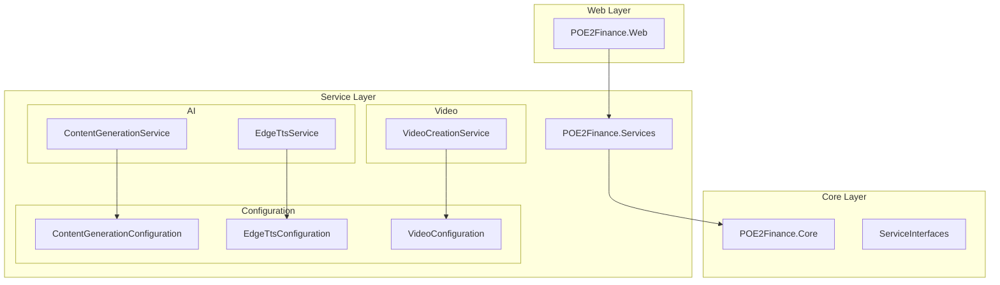
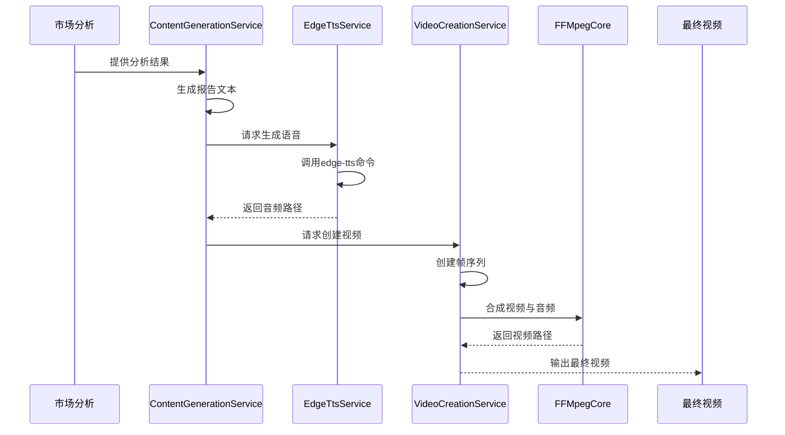
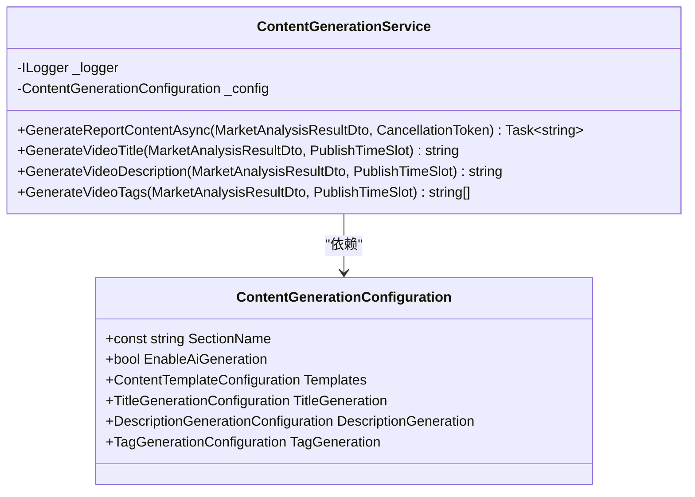
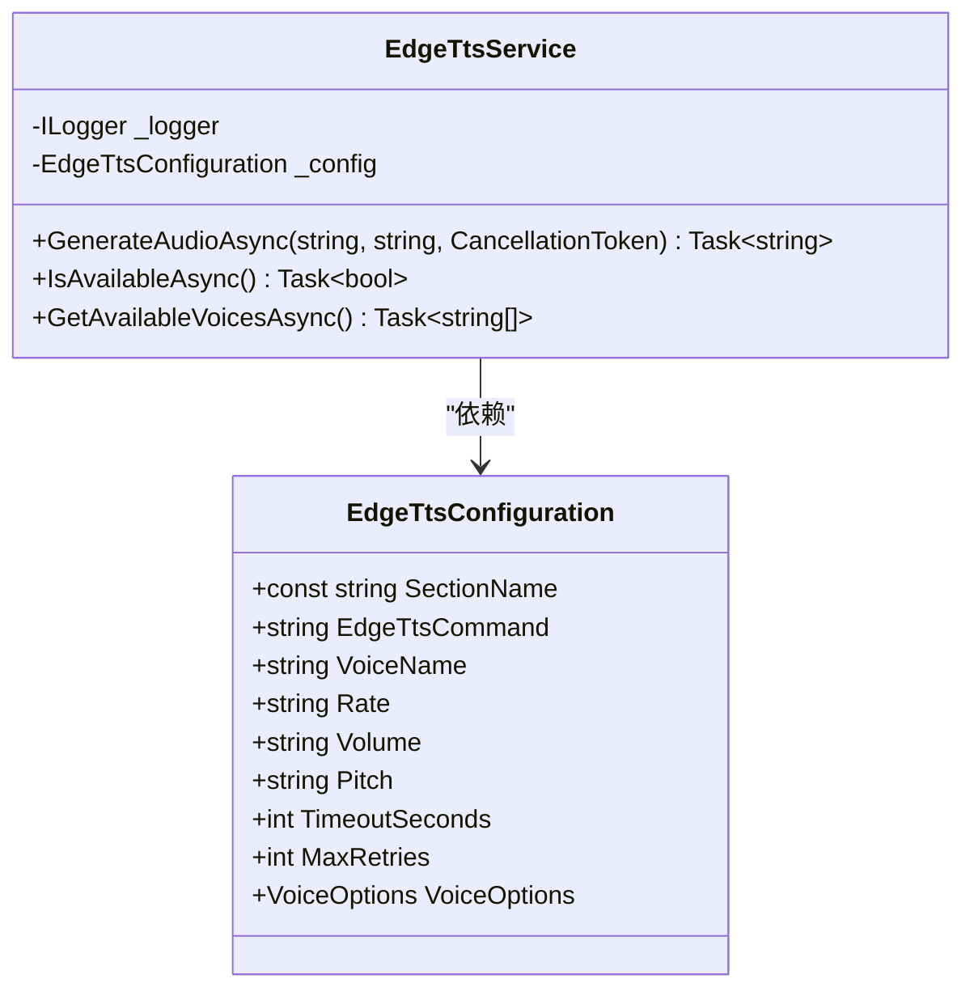

# 内容与视频配置

<cite>
**本文档引用的文件**
- [appsettings.json](file://src/POE2Finance.Web/appsettings.json)
- [ContentGenerationConfiguration.cs](file://src/POE2Finance.Services/Configuration/ContentGenerationConfiguration.cs)
- [EdgeTtsConfiguration.cs](file://src/POE2Finance.Services/Configuration/EdgeTtsConfiguration.cs)
- [VideoConfiguration.cs](file://src/POE2Finance.Services/Configuration/VideoConfiguration.cs)
- [ContentGenerationService.cs](file://src/POE2Finance.Services/AI/ContentGenerationService.cs)
- [EdgeTtsService.cs](file://src/POE2Finance.Services/AI/EdgeTtsService.cs)
- [VideoCreationService.cs](file://src/POE2Finance.Services/Video/VideoCreationService.cs)
</cite>

## 目录
1. [简介](#简介)
2. [项目结构](#项目结构)
3. [核心组件](#核心组件)
4. [架构概述](#架构概述)
5. [详细组件分析](#详细组件分析)
6. [依赖分析](#依赖分析)
7. [性能考虑](#性能考虑)
8. [故障排除指南](#故障排除指南)
9. [结论](#结论)

## 简介
本文档全面解析 `appsettings.json` 文件中的 `ContentGeneration`、`EdgeTts` 和 `Video` 配置节。详细说明这些配置如何影响 AI 内容生成、语音合成和视频制作，并结合 `ContentGenerationService`、`EdgeTtsService` 和 `VideoCreationService` 的实现，阐述其协同工作机制。同时提供音色选择、码率设置和分段时长调整的最佳实践建议，以优化最终视频的质量和生成效率。

## 项目结构
本项目采用分层架构设计，主要分为核心实体、数据访问、业务服务和 Web 入口四个部分。AI 内容生成、语音合成和视频创建功能集中在 `POE2Finance.Services` 项目下的 `AI` 和 `Video` 模块中。配置管理通过独立的 `Configuration` 类实现，与 `appsettings.json` 文件中的配置节一一对应。

**图示来源**
- [appsettings.json](file://src/POE2Finance.Web/appsettings.json)
- [ContentGenerationConfiguration.cs](file://src/POE2Finance.Services/Configuration/ContentGenerationConfiguration.cs)
- [EdgeTtsConfiguration.cs](file://src/POE2Finance.Services/Configuration/EdgeTtsConfiguration.cs)
- [VideoConfiguration.cs](file://src/POE2Finance.Services/Configuration/VideoConfiguration.cs)

**本节来源**
- [appsettings.json](file://src/POE2Finance.Web/appsettings.json)
- [ContentGenerationConfiguration.cs](file://src/POE2Finance.Services/Configuration/ContentGenerationConfiguration.cs)

## 核心组件
系统的核心功能由三个主要服务构成：`ContentGenerationService` 负责生成市场分析报告文本内容；`EdgeTtsService` 负责将文本内容转换为语音音频；`VideoCreationService` 负责整合图表、语音和视觉元素，生成最终的视频文件。这三个服务通过依赖注入机制紧密协作，共同完成从数据到视频的自动化生成流程。

**本节来源**
- [ContentGenerationService.cs](file://src/POE2Finance.Services/AI/ContentGenerationService.cs#L15-L413)
- [EdgeTtsService.cs](file://src/POE2Finance.Services/AI/EdgeTtsService.cs#L12-L431)
- [VideoCreationService.cs](file://src/POE2Finance.Services/Video/VideoCreationService.cs#L19-L639)

## 架构概述
整个内容生成与视频制作流程遵循清晰的流水线架构。首先，`ContentGenerationService` 根据市场分析结果生成结构化的文本报告。然后，`EdgeTtsService` 接收该文本并调用外部 `edge-tts` 工具生成语音音频文件。最后，`VideoCreationService` 将图表图像、语音音频和动态文本元素组合起来，使用 `FFMpegCore` 库合成最终的视频文件。所有服务的配置均通过 `IOptions<T>` 模式从 `appsettings.json` 文件中注入。

**图示来源**
- [ContentGenerationService.cs](file://src/POE2Finance.Services/AI/ContentGenerationService.cs#L15-L413)
- [EdgeTtsService.cs](file://src/POE2Finance.Services/AI/EdgeTtsService.cs#L12-L431)
- [VideoCreationService.cs](file://src/POE2Finance.Services/Video/VideoCreationService.cs#L19-L639)

## 详细组件分析
本节深入分析 `ContentGeneration`、`EdgeTts` 和 `Video` 三个配置模块及其对应的服务实现，揭示其内部工作原理和协同机制。

### ContentGeneration 配置与服务分析
`ContentGeneration` 配置节控制着 AI 内容生成功能的开关。当 `EnableAiGeneration` 设置为 `true` 时，系统将启用自动化报告生成。`ContentGenerationService` 会根据市场分析结果，按照预设的模板生成包含开场白、热点物品分析、市场动态、整体趋势、交易建议和风险提示在内的完整报告文本。该服务还负责生成符合平台要求的视频标题、描述和标签。

**图示来源**
- [ContentGenerationConfiguration.cs](file://src/POE2Finance.Services/Configuration/ContentGenerationConfiguration.cs#L1-L304)
- [ContentGenerationService.cs](file://src/POE2Finance.Services/AI/ContentGenerationService.cs#L15-L413)

**本节来源**
- [ContentGenerationConfiguration.cs](file://src/POE2Finance.Services/Configuration/ContentGenerationConfiguration.cs#L1-L304)
- [ContentGenerationService.cs](file://src/POE2Finance.Services/AI/ContentGenerationService.cs#L15-L413)

### EdgeTts 配置与服务分析
`EdgeTts` 配置节定义了语音合成的各项参数。`EdgeTtsService` 通过调用外部 `edge-tts` 命令行工具来生成语音。在生成语音前，服务会对文本进行预处理，包括替换特殊字符、处理数字读音、统一通货名称等，以确保语音输出的自然流畅。配置中的 `VoiceName`、`Rate`、`Volume` 和 `Pitch` 参数直接传递给 `edge-tts` 工具，用于控制语音的音色、语速、音量和音调。

**图示来源**
- [EdgeTtsConfiguration.cs](file://src/POE2Finance.Services/Configuration/EdgeTtsConfiguration.cs#L1-L304)
- [EdgeTtsService.cs](file://src/POE2Finance.Services/AI/EdgeTtsService.cs#L12-L431)

**本节来源**
- [EdgeTtsConfiguration.cs](file://src/POE2Finance.Services/Configuration/EdgeTtsConfiguration.cs#L1-L304)
- [EdgeTtsService.cs](file://src/POE2Finance.Services/AI/EdgeTtsService.cs#L12-L431)

### Video 配置与服务分析
`Video` 配置节定义了视频的