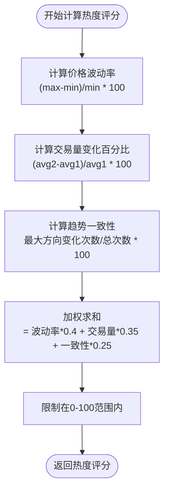
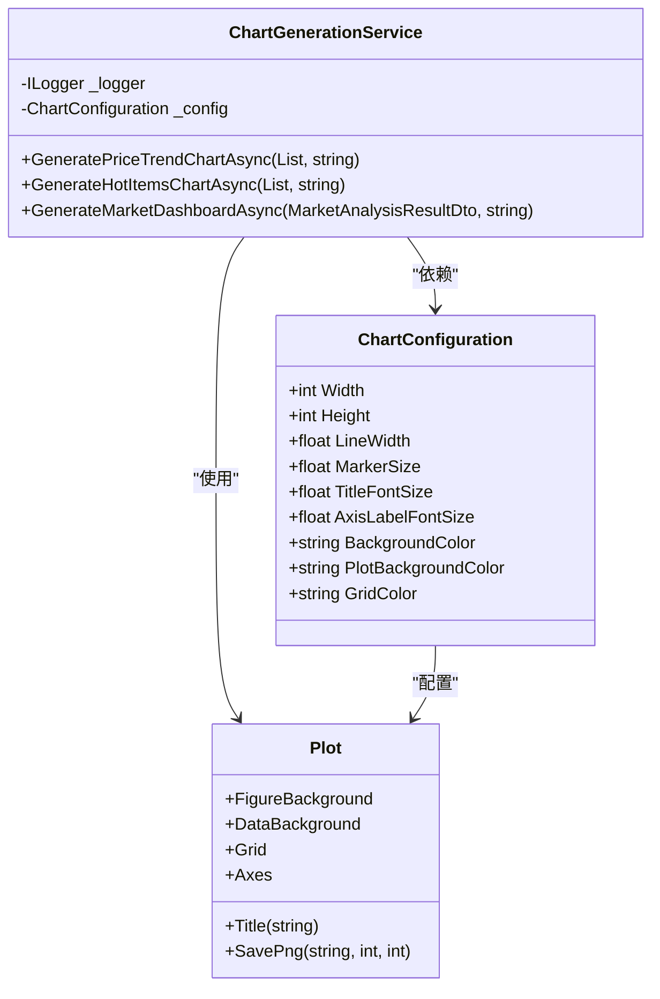
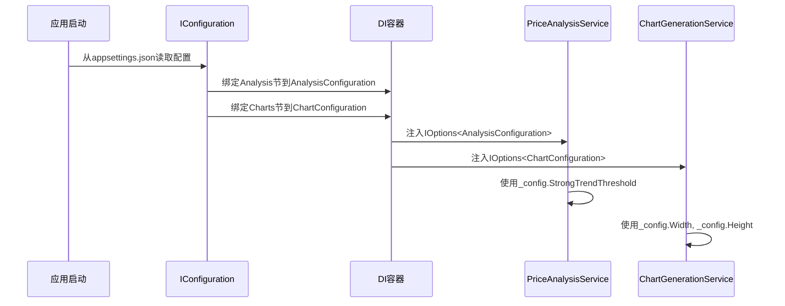

# 分析与图表配置

<cite>
**Referenced Files in This Document**   
- [appsettings.json](file://src/POE2Finance.Web/appsettings.json)
- [PriceAnalysisService.cs](file://src/POE2Finance.Services/Analysis/PriceAnalysisService.cs)
- [ChartGenerationService.cs](file://src/POE2Finance.Services/Charts/ChartGenerationService.cs)
- [AnalysisConfiguration.cs](file://src/POE2Finance.Services/Configuration/AnalysisConfiguration.cs)
- [ChartConfiguration.cs](file://src/POE2Finance.Services/Configuration/ChartConfiguration.cs)
</cite>

## 目录
1. [分析配置详解](#分析配置详解)
2. [图表配置详解](#图表配置详解)
3. [配置与服务的集成](#配置与服务的集成)
4. [配置建议](#配置建议)

## 分析配置详解

`Analysis`配置节定义了价格趋势识别和热点物品发现算法的核心参数。这些参数通过`AnalysisConfiguration`类加载，并在`PriceAnalysisService`中被用于执行市场分析。

### 趋势与波动阈值

`Analysis`配置节中的阈值参数用于量化市场行为，区分不同级别的价格变动。

- **强趋势阈值 (StrongTrendThreshold)**: 设定为10.0，表示当价格在指定时间内变动超过10%时，被视为强势趋势。该值在`PriceAnalysisService`的`CalculateTrendType`方法中用于判断`TrendType.StrongUptrend`和`TrendType.StrongDowntrend`。
- **中等趋势阈值 (ModerateTrendThreshold)**: 设定为5.0，表示当价格变动在5%到10%之间时，被视为温和趋势。该值同样在`CalculateTrendType`方法中用于判断`TrendType.ModerateUptrend`和`TrendType.ModerateDowntrend`。
- **高波动率阈值 (HighVolatilityThreshold)**: 设定为15.0，表示当价格波动率（最高价与最低价之差除以最低价）超过15%时，被标记为高波动。该值在`GenerateRiskWarning`方法中用于生成风险提示。
- **交易量异常阈值 (VolumeAnomalyThreshold)**: 设定为50.0，表示当后半段的平均交易量比前半段高出50%时，被视为交易量异常。该值在`GenerateRiskWarning`方法中用于检测潜在的市场操纵风险。

**Section sources**
- [appsettings.json](file://src/POE2Finance.Web/appsettings.json#L100-L107)
- [AnalysisConfiguration.cs](file://src/POE2Finance.Services/Configuration/AnalysisConfiguration.cs#L10-L35)
- [PriceAnalysisService.cs](file://src/POE2Finance.Services/Analysis/PriceAnalysisService.cs#L240-L270)

### 热点物品评分系统

`MinHotScore`和`HotScoreWeights`共同构成了热点物品的评分和筛选机制。

- **热门物品最低评分 (MinHotScore)**: 设定为30.0，表示只有热度评分高于30的物品才会被认定为热点物品。该值在`AnalyzeHotItemsAsync`方法中用于过滤结果。
- **各项评分权重 (HotScoreWeights)**: 定义了热度评分的计算公式，由三个维度加权而成：
  - **VolatilityWeight (0.4)**: 价格波动率的权重为40%，反映了价格剧烈变动对热度的贡献。
  - **VolumeWeight (0.35)**: 交易量变化的权重为35%，反映了市场活跃度对热度的贡献。
  - **TrendWeight (0.25)**: 趋势一致性的权重为25%，反映了价格变动方向的持续性对热度的贡献。

热度评分的计算在`PriceAnalysisService`的`CalculateHotScore`方法中实现，通过将三个维度的得分乘以各自的权重后相加得出最终评分。

**Diagram sources**
- [appsettings.json](file://src/POE2Finance.Web/appsettings.json#L108-L112)
- [AnalysisConfiguration.cs](file://src/POE2Finance.Services/Configuration/AnalysisConfiguration.cs#L37-L51)
- [PriceAnalysisService.cs](file://src/POE2Finance.Services/Analysis/PriceAnalysisService.cs#L300-L315)

## 图表配置详解

`Charts`配置节定义了所有生成图表的视觉属性，确保输出的图表具有一致且专业的外观。

### 图表尺寸与线条属性

- **Width/Height**: 均设置为1920x1080，符合全高清（FHD）标准，适用于视频嵌入和大屏幕展示。这些值在`ChartGenerationService`的`GeneratePriceTrendChartAsync`和`GenerateHotItemsChartAsync`方法中被传递给`SavePng`函数。
- **LineWidth**: 设置为2.0，定义了图表中线条的粗细，确保在不同尺寸下都清晰可见。
- **MarkerSize**: 设置为5.0，定义了数据点标记的大小，便于在趋势图中识别关键数据点。

### 字体与颜色配置

- **字体大小**: `TitleFontSize`为16.0，`AxisLabelFontSize`为12.0，提供了清晰的层次结构，使标题和坐标轴标签易于阅读。
- **背景色**: `BackgroundColor`为`#FFFFFF`（白色），`PlotBackgroundColor`为`#F8F8F8`（浅灰），创建了清晰的视觉层次，将绘图区与图表背景区分开。
- **网格颜色**: `GridColor`为`#E0E0E0`（淡灰），提供了足够的引导线，同时不会过于突兀，干扰数据的可视化。

这些视觉属性在`ChartGenerationService`的`ConfigurePlotAppearance`方法中被应用到ScottPlot图表对象上。

**Diagram sources**
- [appsettings.json](file://src/POE2Finance.Web/appsettings.json#L114-L125)
- [ChartConfiguration.cs](file://src/POE2Finance.Services/Configuration/ChartConfiguration.cs#L10-L45)
- [ChartGenerationService.cs](file://src/POE2Finance.Services/Charts/ChartGenerationService.cs#L100-L125)

## 配置与服务的集成

`Analysis`和`Charts`配置通过依赖注入（DI）容器与`PriceAnalysisService`和`ChartGenerationService`紧密集成，实现了配置驱动的业务逻辑。

### 服务初始化流程

1. **配置加载**: 应用启动时，`IConfiguration`从`appsettings.json`文件中读取`Analysis`和`Charts`两个节的内容。
2. **选项绑定**: 使用`IOptions<T>`模式，将配置节绑定到`AnalysisConfiguration`和`ChartConfiguration`类的实例上。
3. **服务注入**: 在服务构造函数中，通过`IOptions<AnalysisConfiguration>`和`IOptions<ChartConfiguration>`参数注入配置实例。
4. **逻辑执行**: 服务在执行分析和图表生成任务时，直接使用`_config`字段中的配置值。

此集成模式确保了配置的集中管理和动态更新，无需修改代码即可调整系统行为。

**Diagram sources**
- [AnalysisConfiguration.cs](file://src/POE2Finance.Services/Configuration/AnalysisConfiguration.cs#L5-L51)
- [ChartConfiguration.cs](file://src/POE2Finance.Services/Configuration/ChartConfiguration.cs#L5-L86)
- [PriceAnalysisService.cs](file://src/POE2Finance.Services/Analysis/PriceAnalysisService.cs#L26-L34)
- [ChartGenerationService.cs](file://src/POE2Finance.Services/Charts/ChartGenerationService.cs#L29-L33)

## 配置建议

根据不同的使用场景，可以调整`Charts`配置以获得最佳效果。

### 高清视频嵌入

对于需要嵌入高清视频的场景，当前的1920x1080配置是理想的。为了进一步提升视觉质量，可以考虑：
- 将`Dpi`从默认的300提高到600，以获得更精细的打印或显示效果。
- 将`Quality`从95提高到100，确保PNG图像无损压缩。

### 移动端或快速预览

对于移动端展示或需要快速生成预览的场景，可以优化配置以提高性能：
- 将`Width`和`Height`调整为1080x720或更低，减少生成时间和文件大小。
- 适当减小`LineWidth`和`MarkerSize`，以适应较小的屏幕尺寸。

### 深色主题适配

为了适配深色主题的用户界面，可以修改颜色配置：
- 将`BackgroundColor`和`PlotBackgroundColor`改为深灰色（如`#121212`和`#1E1E1E`）。
- 将`GridColor`改为更暗的灰色（如`#333333`），以保持对比度。

这些调整可以在不修改任何代码的情况下，通过编辑`appsettings.json`文件即时生效。