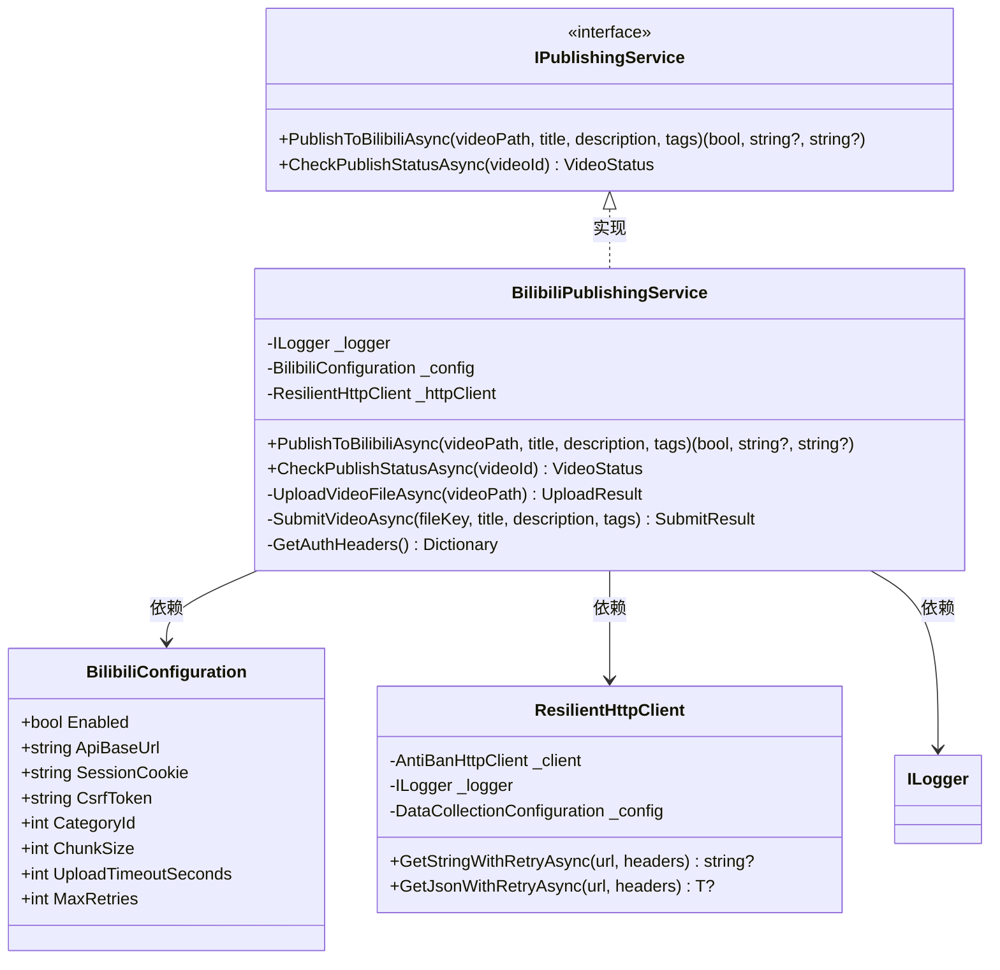
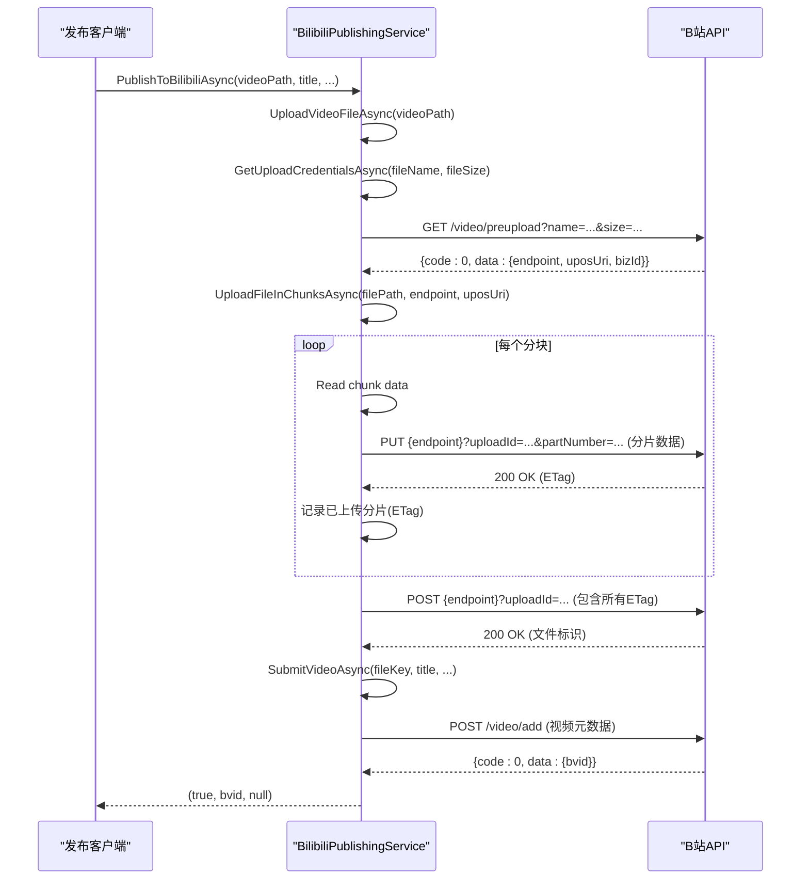

# 发布与安全配置

<cite>
**Referenced Files in This Document**   
- [appsettings.json](file://src/POE2Finance.Web/appsettings.json)
- [DEPLOYMENT.md](file://DEPLOYMENT.md)
- [BilibiliConfiguration.cs](file://src/POE2Finance.Services/Configuration/BilibiliConfiguration.cs)
- [BilibiliPublishingService.cs](file://src/POE2Finance.Services/Publishing/BilibiliPublishingService.cs)
- [ServiceInterfaces.cs](file://src/POE2Finance.Core/Interfaces/ServiceInterfaces.cs)
- [AntiBanHttpClient.cs](file://src/POE2Finance.Services/Infrastructure/AntiBanHttpClient.cs)
</cite>

## 目录
1. [Bilibili配置节详解](#bilibili配置节详解)
2. [认证信息安全获取与配置](#认证信息安全获取与配置)
3. [Bilibili发布服务实现](#bilibili发布服务实现)
4. [分块上传策略与超时处理](#分块上传策略与超时处理)
5. [Serilog日志配置](#serilog日志配置)
6. [配置验证与错误排查](#配置验证与错误排查)

## Bilibili配置节详解

`appsettings.json` 文件中的 `Bilibili` 配置节定义了与B站视频发布相关的所有参数。该配置通过 `BilibiliConfiguration` 类进行强类型绑定，确保配置的类型安全和可维护性。

```json
"Bilibili": {
    "Enabled": false,
    "ApiBaseUrl": "https://member.bilibili.com/x",
    "SessionCookie": "",
    "CsrfToken": "",
    "CategoryId": 4,
    "ChunkSize": 4194304,
    "UploadTimeoutSeconds": 3600,
    "MaxRetries": 3
}
```

### 配置参数说明

| 参数 | 说明 | 默认值/示例 | 作用域 |
|------|------|------------|--------|
| **Enabled** | 发布功能开关，控制是否启用B站自动发布功能 | `false` | 全局开关 |
| **ApiBaseUrl** | B站API的基础URL，用于构建所有API请求的完整路径 | `"https://member.bilibili.com/x"` | API通信 |
| **SessionCookie** | 会话Cookie，包含SESSDATA等关键认证信息，用于身份验证 | `""` | 认证 |
| **CsrfToken** | CSRF令牌，用于防止跨站请求伪造攻击，增强安全性 | `""` | 安全防护 |
| **CategoryId** | 视频分类ID，用于指定视频发布的分区，游戏区ID为4 | `4` | 内容分类 |
| **ChunkSize** | 分块上传大小，单位为字节，影响上传性能和稳定性 | `4194304` (4MB) | 上传策略 |
| **UploadTimeoutSeconds** | 上传超时时间，单位为秒，防止上传过程无限期挂起 | `3600` (1小时) | 超时控制 |
| **MaxRetries** | 最大重试次数，用于处理网络波动或临时错误 | `3` | 错误恢复 |

**Section sources**
- [appsettings.json](file://src/POE2Finance.Web/appsettings.json#L100-L110)
- [BilibiliConfiguration.cs](file://src/POE2Finance.Services/Configuration/BilibiliConfiguration.cs#L5-L71)

## 认证信息安全获取与配置

### 安全获取Cookie和CSRF令牌

根据 `DEPLOYMENT.md` 中的部署指南，获取B站认证信息是部署过程中的关键步骤。必须通过安全的方式获取 `SessionCookie` 和 `CsrfToken`，避免使用他人分享的凭证。

**获取步骤：**

1. 使用个人B站账号登录网页版（https://www.bilibili.com）
2. 打开浏览器开发者工具（F12），切换到“网络”(Network)标签
3. 刷新页面，查找任意API请求（如`/x/web-interface/nav`）
4. 在请求头(Headers)中找到 `Cookie` 字段，复制包含 `SESSDATA=` 的完整字符串
5. 在请求头中查找 `X-CSRF-TOKEN` 字段，复制其值
6. 将获取的值填入 `appsettings.json` 的对应字段

### 凭证保护最佳实践

**绝对禁止：**
- ❌ 将 `appsettings.json` 文件提交到版本控制系统（如Git）
- ❌ 在代码中硬编码Cookie和CSRF令牌
- ❌ 通过不安全的渠道（如明文邮件、即时通讯）传输凭证

**推荐做法：**
- ✅ 使用环境变量覆盖配置（如 `BILIBILI_SESSION_COOKIE`）
- ✅ 在生产环境中使用 `appsettings.Production.json` 并将其排除在版本控制之外
- ✅ 定期更换Cookie和CSRF令牌，降低泄露风险
- ✅ 为自动化账号设置独立的B站账号，避免影响主账号安全

**Section sources**
- [DEPLOYMENT.md](file://DEPLOYMENT.md#L20-L50)
- [appsettings.json](file://src/POE2Finance.Web/appsettings.json#L104-L105)

## Bilibili发布服务实现

`BilibiliPublishingService` 是实现B站视频发布的核心服务，它实现了 `IPublishingService` 接口，遵循依赖注入和单一职责原则。



**Diagram sources**
- [BilibiliPublishingService.cs](file://src/POE2Finance.Services/Publishing/BilibiliPublishingService.cs#L18-L73)
- [ServiceInterfaces.cs](file://src/POE2Finance.Core/Interfaces/ServiceInterfaces.cs#L184-L204)
- [BilibiliConfiguration.cs](file://src/POE2Finance.Services/Configuration/BilibiliConfiguration.cs#L5-L71)
- [AntiBanHttpClient.cs](file://src/POE2Finance.Services/Infrastructure/AntiBanHttpClient.cs#L183-L272)

**Section sources**
- [BilibiliPublishingService.cs](file://src/POE2Finance.Services/Publishing/BilibiliPublishingService.cs#L18-L73)
- [ServiceInterfaces.cs](file://src/POE2Finance.Core/Interfaces/ServiceInterfaces.cs#L184-L204)

## 分块上传策略与超时处理

B站视频发布采用分块上传（Multipart Upload）策略，以提高大文件上传的稳定性和效率。该流程由 `BilibiliPublishingService` 中的一系列私有方法协同完成。



**Diagram sources**
- [BilibiliPublishingService.cs](file://src/POE2Finance.Services/Publishing/BilibiliPublishingService.cs#L116-L459)

**Section sources**
- [BilibiliPublishingService.cs](file://src/POE2Finance.Services/Publishing/BilibiliPublishingService.cs#L116-L459)

### 分块上传流程

1. **预上传 (Pre-upload)**: 调用 `/video/preupload` API，提供文件名和大小，获取上传所需的 `uploadUrl` 和 `uploadToken`。
2. **分片上传 (Chunk Upload)**: 将视频文件按 `ChunkSize` 大小分割，逐个上传。每个分片上传成功后，B站服务器会返回一个 `ETag`。
3. **完成上传 (Complete Upload)**: 所有分片上传完成后，发送一个包含所有 `ETag` 的请求，通知B站服务器合并分片。
4. **提交视频 (Submit Video)**: 使用合并后的文件标识，调用 `/video/add` API 提交视频标题、描述、标签等元数据。

### 超时与重试机制

- **上传超时**: 由 `UploadTimeoutSeconds` 配置项控制，防止上传过程因网络问题无限期挂起。
- **HTTP重试**: `ResilientHttpClient` 使用Polly库实现了指数退避重试策略，最大重试次数由 `MaxRetries` 控制。
- **错误处理**: 服务对文件不存在、网络错误、API调用失败等场景进行了全面的异常捕获和日志记录。

## Serilog日志配置

`appsettings.json` 中的 `Serilog` 配置节定义了应用程序的日志记录行为，确保操作的可追溯性和问题排查能力。

```json
"Serilog": {
    "Using": ["Serilog.Sinks.Console", "Serilog.Sinks.File"],
    "MinimumLevel": {
        "Default": "Information",
        "Override": {
            "Microsoft": "Warning",
            "System": "Warning",
            "Quartz": "Information"
        }
    },
    "WriteTo": [
        { "Name": "Console" },
        {
            "Name": "File",
            "Args": {
                "path": "logs/poe2finance-.log",
                "rollingInterval": "Day",
                "retainedFileCountLimit": 7,
                "outputTemplate": "{Timestamp:yyyy-MM-dd HH:mm:ss.fff zzz} [{Level:u3}] {Message:lj}{NewLine}{Exception}"
            }
        }
    ]
}
```

### 日志配置要点

- **输出目标**: 同时输出到控制台和文件，便于开发和生产环境监控。
- **滚动策略**: `rollingInterval` 设置为 `Day`，每天生成一个新的日志文件。
- **保留策略**: `retainedFileCountLimit` 设置为 `7`，最多保留7天的日志文件，防止磁盘空间耗尽。
- **日志级别**: 默认级别为 `Information`，对 `Microsoft` 和 `System` 相关的日志进行降级，减少噪音。
- **格式化**: `outputTemplate` 定义了详细的日志格式，包含时间戳、日志级别、消息和异常堆栈。

**Section sources**
- [appsettings.json](file://src/POE2Finance.Web/appsettings.json#L111-L130)

## 配置验证与错误排查

### 配置验证方法

1. **启动时验证**: 应用启动时，依赖注入容器会验证 `BilibiliConfiguration` 是否正确绑定。
2. **发布前检查**: `PublishToBilibiliAsync` 方法首先检查视频文件是否存在。
3. **认证检查**: `GetAuthHeaders` 方法会检查 `SessionCookie` 是否为空。
4. **API响应验证**: 所有API调用都会检查返回的 `code` 字段，非0值视为失败。

### 常见错误与排查

| 错误现象 | 可能原因 | 解决方案 |
|---------|--------|---------|
| **认证失败 (401/403)** | `SessionCookie` 过期或无效 | 重新登录B站，获取新的Cookie和CSRF令牌 |
| **上传中断** | 网络不稳定或超时 | 检查网络连接，适当增加 `UploadTimeoutSeconds` |
| **分片上传失败** | `uploadToken` 无效 | 确保 `GetUploadCredentialsAsync` 调用成功，`uploadToken` 正确传递 |
| **提交视频失败** | `CategoryId` 无效或标签过多 | 检查分区ID是否正确，确保标签数量不超过10个 |
| **日志文件未生成** | `logs` 目录无写入权限 | 检查应用运行用户对 `logs` 目录的写权限 |

**Section sources**
- [BilibiliPublishingService.cs](file://src/POE2Finance.Services/Publishing/BilibiliPublishingService.cs#L37-L73)
- [appsettings.json](file://src/POE2Finance.Web/appsettings.json#L100-L110)