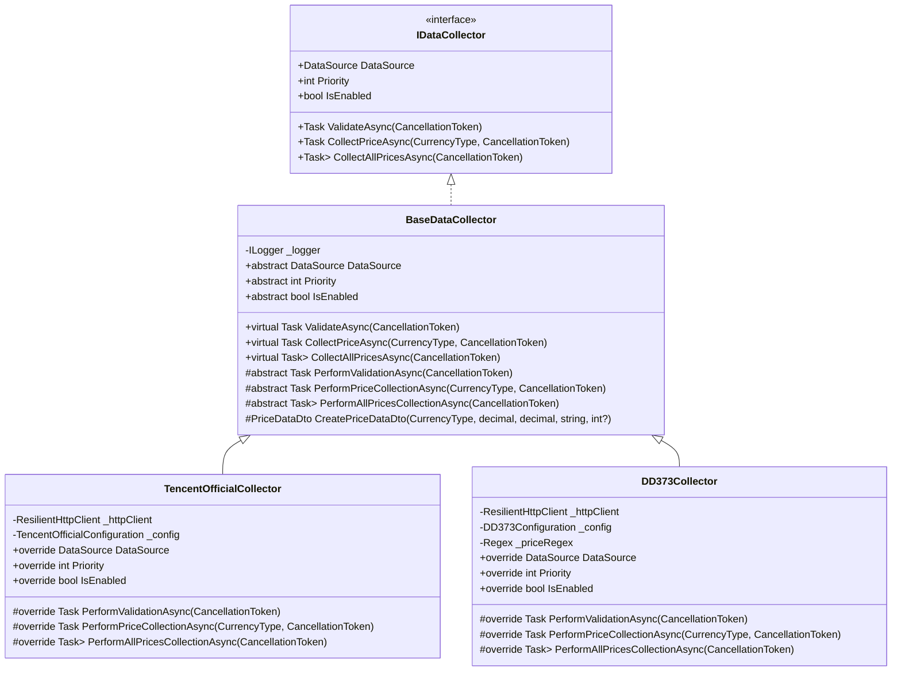
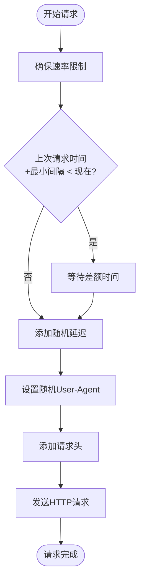
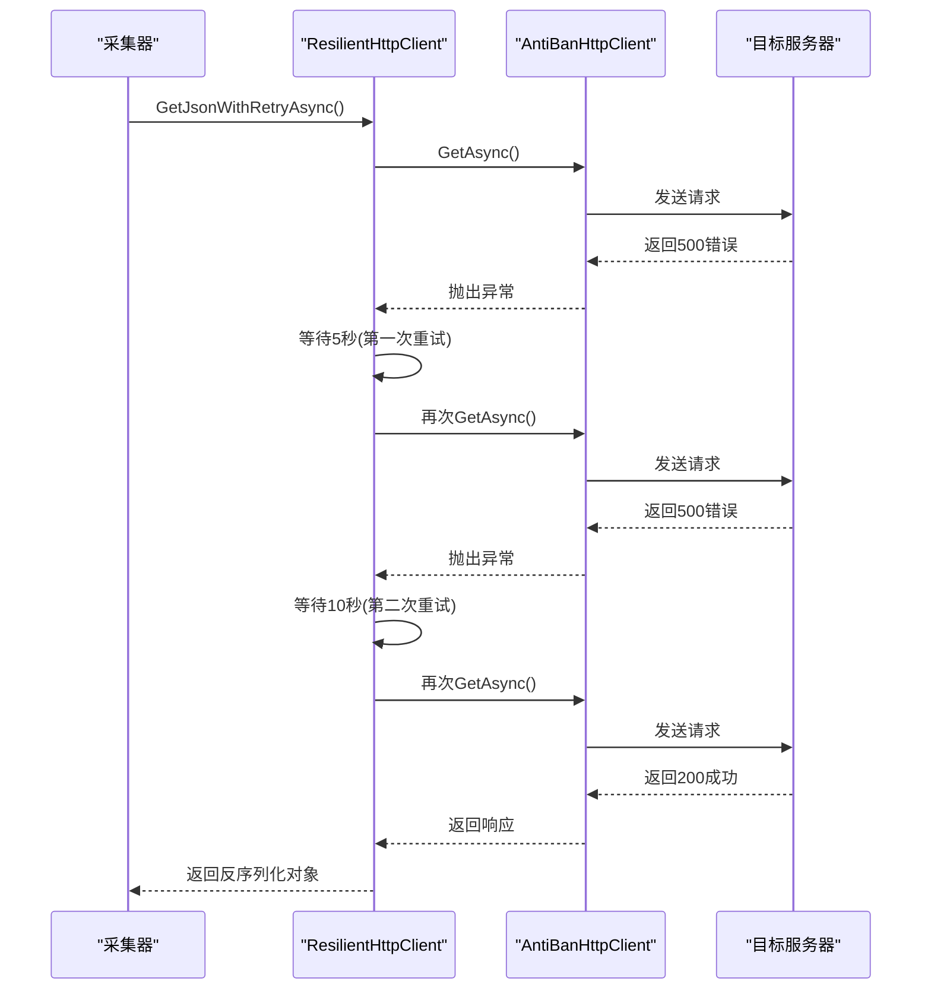

# 数据采集配置

<cite>
**Referenced Files in This Document**   
- [appsettings.json](file://src/POE2Finance.Web/appsettings.json)
- [DataCollectionConfiguration.cs](file://src/POE2Finance.Services/Configuration/DataCollectionConfiguration.cs)
- [DataCollectionService.cs](file://src/POE2Finance.Services/DataCollection/DataCollectionService.cs)
- [BaseDataCollector.cs](file://src/POE2Finance.Services/DataCollection/BaseDataCollector.cs)
- [TencentOfficialCollector.cs](file://src/POE2Finance.Services/DataCollection/Collectors/TencentOfficialCollector.cs)
- [DD373Collector.cs](file://src/POE2Finance.Services/DataCollection/Collectors/DD373Collector.cs)
- [AntiBanHttpClient.cs](file://src/POE2Finance.Services/Infrastructure/AntiBanHttpClient.cs)
</cite>

## 目录
1. [核心配置参数详解](#核心配置参数详解)
2. [多数据源配置结构](#多数据源配置结构)
3. [采集行为与防Ban策略](#采集行为与防Ban策略)
4. [容错与重试机制](#容错与重试机制)
5. [配置调优建议](#配置调优建议)
6. [常见配置错误与解决方案](#常见配置错误与解决方案)

## 核心配置参数详解

`appsettings.json` 文件中的 `DataCollection` 配置节定义了数据采集的核心行为。这些参数通过 `DataCollectionConfiguration` 类进行强类型绑定，确保了配置的类型安全和可维护性。

### 采集间隔（CollectionIntervalHours）
该参数定义了系统执行数据采集任务的周期，单位为小时。默认值为1小时，表示系统每小时会触发一次数据采集作业。此配置直接影响数据的实时性，但过短的间隔会增加服务器负载和被目标网站封禁的风险。

### 请求最小间隔（MinRequestIntervalSeconds）
此参数设置了连续两次HTTP请求之间的最小时间间隔，单位为秒。默认值为3600秒（1小时），这是防Ban策略的核心组成部分。系统通过 `AntiBanHttpClient` 类中的 `EnsureRateLimitAsync` 方法强制执行此限制，确保不会因请求过于频繁而触发反爬虫机制。

### 随机延迟范围（RandomDelay）
该配置包含 `MinSeconds` 和 `MaxSeconds` 两个子参数，定义了在每次请求后添加的随机延迟时间范围。默认范围为30到180秒。此随机性是模仿人类用户行为的关键，能有效规避基于固定模式的反爬虫检测。`AntiBanHttpClient` 的 `AddRandomDelayAsync` 方法负责实现此功能。

### HTTP请求超时（RequestTimeoutSeconds）
设置单个HTTP请求的超时时间，单位为秒。默认值为30秒。超时时间过短可能导致在高延迟网络环境下请求失败，而过长则会阻塞采集线程。此值在 `AntiBanHttpClient` 的构造函数中被用于配置底层 `HttpClient` 实例。

### 最大重试次数（MaxRetries）
当请求因网络问题或服务器错误失败时，系统会自动重试。此参数定义了最大重试次数，默认为3次。超过此次数后，系统将放弃该次采集任务并记录错误。

### 重试基础延迟（RetryDelayBaseSeconds）
定义了重试机制的初始延迟时间，单位为秒。默认值为5秒。系统采用指数退避（Exponential Backoff）算法，每次重试的延迟时间为 `RetryDelayBaseSeconds * 2^(retry_attempt-1)`，例如第一次重试延迟5秒，第二次延迟10秒，第三次延迟20秒。

### User-Agent轮换列表
配置了一个User-Agent字符串列表，系统在每次请求时会从中随机选择一个。此策略可以模拟不同浏览器和设备的访问，是避免被识别为爬虫的重要手段。默认配置包含了多个主流浏览器的最新版本标识。

**Section sources**
- [DataCollectionConfiguration.cs](file://src/POE2Finance.Services/Configuration/DataCollectionConfiguration.cs#L5-L58)
- [appsettings.json](file://src/POE2Finance.Web/appsettings.json#L10-L30)

## 多数据源配置结构

系统支持配置多个数据源，当前实现了腾讯官方API和DD373两个数据源。每个数据源都有独立的配置，允许进行精细化的控制。

### 腾讯官方API配置
- **启用状态 (Enabled)**: 布尔值，决定是否启用该数据源。默认为 `true`。
- **优先级 (Priority)**: 整数值，数字越小优先级越高。腾讯官方API的默认优先级为1，意味着在多源采集时会首先尝试。
- **基础URL (BaseUrl)**: API的基础地址，`https://poe2.qq.com`。
- **特定请求头 (Headers)**: 针对该API的特定请求头，包括 `Accept`, `Accept-Language`, 和 `Referer`，以确保请求符合API的要求。

### DD373配置
- **启用状态 (Enabled)**: 布尔值，决定是否启用该数据源。默认为 `true`。
- **优先级 (Priority)**: 整数值，DD373的默认优先级为2，低于腾讯官方API。
- **基础URL (BaseUrl)**: 网站的基础地址，`https://www.dd373.com`。
- **POE2区域页面 (Poe2Section)**: 网站内POE2相关页面的路径。
- **特定请求头 (Headers)**: 针对DD373网站的特定请求头，与腾讯官方API有所不同。

**Section sources**
- [DataCollectionConfiguration.cs](file://src/POE2Finance.Services/Configuration/DataCollectionConfiguration.cs#L80-L150)
- [appsettings.json](file://src/POE2Finance.Web/appsettings.json#L31-L50)

## 采集行为与防Ban策略

系统的数据采集行为由 `DataCollectionService` 和具体的 `Collector` 实现类共同决定，其核心是 `BaseDataCollector` 抽象基类。

**Diagram sources**
- [BaseDataCollector.cs](file://src/POE2Finance.Services/DataCollection/BaseDataCollector.cs#L9-L47)
- [TencentOfficialCollector.cs](file://src/POE2Finance.Services/DataCollection/Collectors/TencentOfficialCollector.cs#L10-L182)
- [DD373Collector.cs](file://src/POE2Finance.Services/DataCollection/Collectors/DD373Collector.cs#L10-L234)

### 防Ban策略实现

防Ban策略主要通过 `AntiBanHttpClient` 类实现，其工作流程如下：

**Diagram sources**
- [AntiBanHttpClient.cs](file://src/POE2Finance.Services/Infrastructure/AntiBanHttpClient.cs#L12-L178)

**Section sources**
- [DataCollectionService.cs](file://src/POE2Finance.Services/DataCollection/DataCollectionService.cs#L11-L240)
- [BaseDataCollector.cs](file://src/POE2Finance.Services/DataCollection/BaseDataCollector.cs#L52-L216)

## 容错与重试机制

系统具备强大的容错能力，通过分层的重试机制确保数据采集的稳定性。

### 重试策略

`ResilientHttpClient` 类封装了基于Polly库的重试策略。该策略会针对 `HttpRequestException`、`TaskCanceledException`、`TimeoutException` 以及非成功的HTTP状态码（4xx, 5xx）进行重试。重试间隔采用指数退避算法，有效避免了在服务器故障期间对目标造成过大压力。

**Diagram sources**
- [ResilientHttpClient.cs](file://src/POE2Finance.Services/Infrastructure/AntiBanHttpClient.cs#L183-L272)
- [AntiBanHttpClient.cs](file://src/POE2Finance.Services/Infrastructure/AntiBanHttpClient.cs#L12-L178)

### 多源容错

`DataCollectionService` 提供了 `CollectPriceWithFallbackAsync` 方法，实现了多数据源的故障转移。系统会按照配置的优先级顺序依次尝试各个数据源，一旦某个数据源成功返回数据，立即返回结果，无需等待其他数据源。这极大地提高了系统的可用性。

**Section sources**
- [DataCollectionService.cs](file://src/POE2Finance.Services/DataCollection/DataCollectionService.cs#L110-L145)
- [AntiBanHttpClient.cs](file://src/POE2Finance.Services/Infrastructure/AntiBanHttpClient.cs#L183-L272)

## 配置调优建议

### 高频率采集的风险与平衡
虽然缩短 `CollectionIntervalHours` 可以获得更实时的数据，但这会显著增加被封禁的风险。建议将采集间隔保持在1小时以上。如果需要更高频率的数据，应优先考虑目标API是否提供Webhook或实时推送功能，而不是盲目增加轮询频率。

### 参数平衡
- **MinRequestIntervalSeconds** 应远大于 `CollectionIntervalHours` * 3600 / 预期请求数量。例如，如果每小时采集一次，涉及10个请求，则最小间隔应至少为360秒。
- **RandomDelay** 的范围应足够大（建议60-300秒），以确保请求时间分布足够随机。
- **MaxRetries** 设置为3-5次较为合理，过多的重试可能被视为攻击行为。

## 常见配置错误与解决方案

### 无效User-Agent
**问题**: 配置的User-Agent字符串格式错误或包含已过时的浏览器版本。
**解决方案**: 确保User-Agent字符串符合标准格式，建议定期更新为当前主流浏览器的真实标识。

### 过短的采集间隔
**问题**: 将 `CollectionIntervalHours` 设置为0.1（6分钟）或更短，导致请求过于频繁。
**解决方案**: 立即恢复为1小时或更长的间隔。如果已被封禁，应暂停采集服务24小时以上，并更换IP地址。

### 数据源优先级配置错误
**问题**: 将可靠性较低的第三方网站（如DD373）配置为比官方API更高的优先级。
**解决方案**: 检查 `Priority` 配置，确保官方API的优先级数字最小（最高）。

### 忽略特定请求头
**问题**: 对于需要特定 `Referer` 或 `Origin` 头的API，未在配置中正确设置。
**解决方案**: 参考API文档，将必要的请求头添加到对应数据源的 `Headers` 字典中。

**Section sources**
- [appsettings.json](file://src/POE2Finance.Web/appsettings.json#L10-L50)
- [DataCollectionConfiguration.cs](file://src/POE2Finance.Services/Configuration/DataCollectionConfiguration.cs)