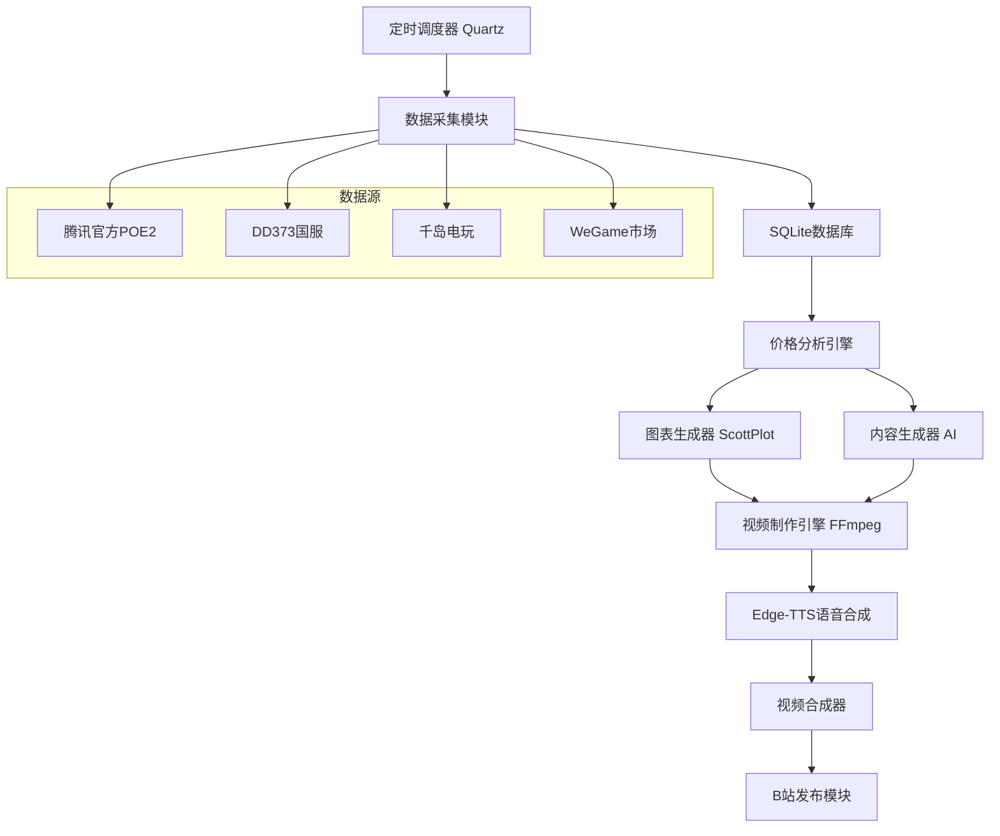
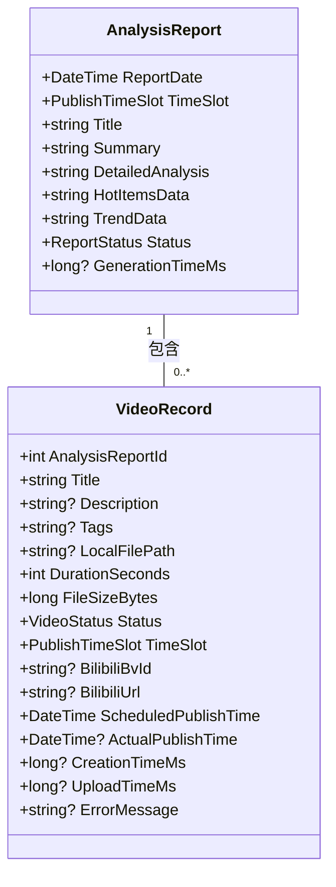
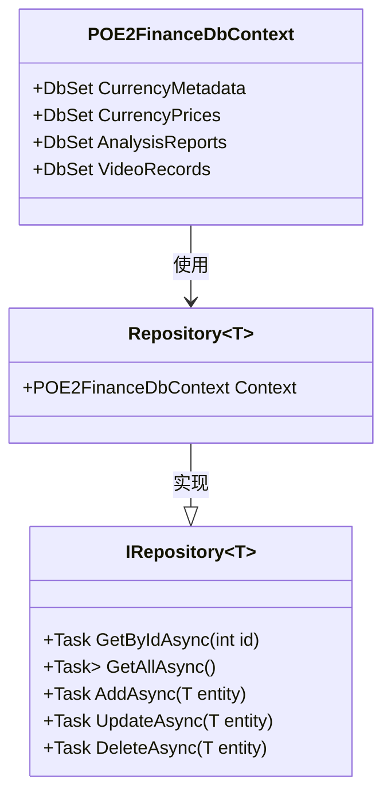
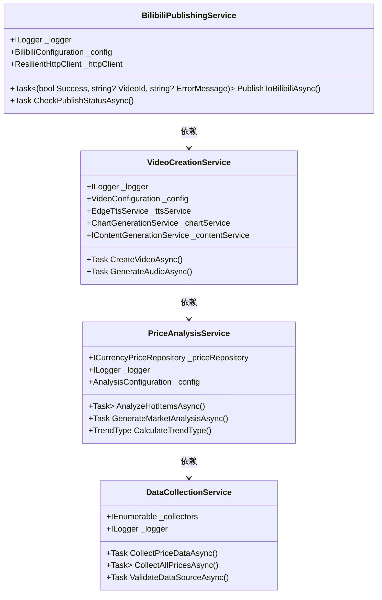
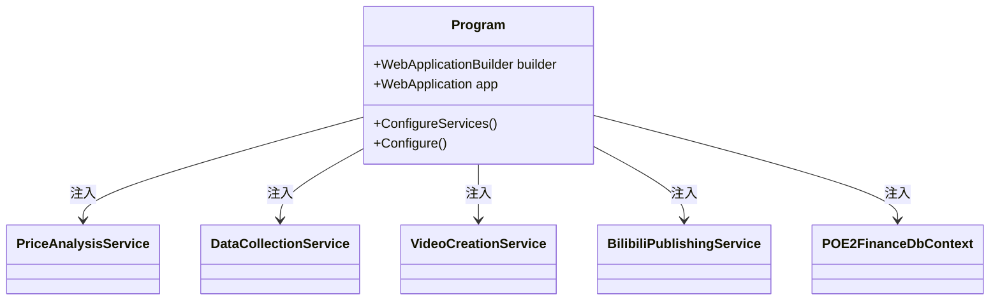
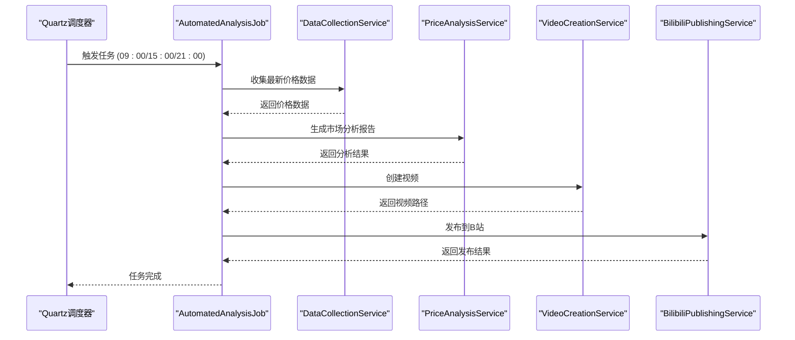

# 项目概述

<cite>
**本文档引用文件**   
- [README.md](file://README.md)
- [DEPLOYMENT.md](file://DEPLOYMENT.md)
- [Program.cs](file://src/POE2Finance.Web/Program.cs)
- [AutomatedAnalysisJob.cs](file://src/POE2Finance.Services/Jobs/AutomatedAnalysisJob.cs)
- [POE2FinanceDbContext.cs](file://src/POE2Finance.Data/DbContexts/POE2FinanceDbContext.cs)
- [ServiceCollectionExtensions.cs](file://src/POE2Finance.Data/Extensions/ServiceCollectionExtensions.cs)
- [PriceAnalysisService.cs](file://src/POE2Finance.Services/Analysis/PriceAnalysisService.cs)
- [DataCollectionService.cs](file://src/POE2Finance.Services/DataCollection/DataCollectionService.cs)
- [VideoCreationService.cs](file://src/POE2Finance.Services/Video/VideoCreationService.cs)
- [BilibiliPublishingService.cs](file://src/POE2Finance.Services/Publishing/BilibiliPublishingService.cs)
- [AnalysisReport.cs](file://src/POE2Finance.Core/Entities/AnalysisReport.cs)
- [VideoRecord.cs](file://src/POE2Finance.Core/Entities/VideoRecord.cs)
</cite>

## 目录
1. [项目简介](#项目简介)
2. [系统架构](#系统架构)
3. [工作流程](#工作流程)
4. [分层设计](#分层设计)
5. [定时任务系统](#定时任务系统)
6. [关键设计决策](#关键设计决策)
7. [使用场景](#使用场景)
8. [结论](#结论)

## 项目简介

POE2Finance 是一个专门为《流放之路2》国服玩家设计的全自动化通货价格分析系统。该系统能够实时监控国服市场价格变化，生成专业的价格分析报告，并自动制作视频内容发布到B站，为国服玩家提供及时、准确的市场信息。

系统的核心目标是为国服大学生群体、搬砖玩家、游戏商人和价格敏感玩家提供一个自动化、智能化的市场分析工具，帮助他们优化收益策略、寻找套利机会并做出更明智的投资决策。

**Section sources**
- [README.md](file://README.md#L0-L25)

## 系统架构

POE2Finance 采用分层架构设计，包含四个主要层次：核心层、数据访问层、业务逻辑层和Web API层。系统通过Quartz.NET调度器驱动整个分析流水线，实现了从数据采集到视频发布的全栈自动化。

**Diagram sources**
- [README.md](file://README.md#L27-L107)

**Section sources**
- [README.md](file://README.md#L27-L107)

## 工作流程

POE2Finance 系统的工作流程是一个完整的自动化流水线，从数据采集到视频发布共包含十个关键步骤：

1. **定时触发**：Quartz.NET调度器根据预设时间表触发自动化分析任务。
2. **数据采集**：系统从腾讯官方、DD373、千岛电玩等多个数据源采集价格数据。
3. **数据存储**：采集到的价格数据被持久化存储到SQLite数据库中。
4. **价格分析**：系统对历史价格数据进行分析，识别热点物品和市场趋势。
5. **内容生成**：基于分析结果，系统自动生成市场分析报告、视频标题和描述。
6. **图表生成**：使用ScottPlot生成动态价格图表和数据可视化。
7. **视频脚本**：为语音合成优化文本内容，生成视频脚本。
8. **语音合成**：使用Edge-TTS生成高质量中文语音。
9. **视频合成**：将图表、语音和品牌元素合成为完整的视频。
10. **自动发布**：将生成的视频自动上传到B站并填写相关信息。

**Section sources**
- [README.md](file://README.md#L108-L161)

## 分层设计

POE2Finance 采用清晰的分层架构设计，各层之间通过依赖注入实现松耦合。

### 核心层 (Core Layer)
核心层包含系统的领域模型和接口定义，是整个系统的基础。该层定义了`AnalysisReport`、`VideoRecord`等核心实体以及`IService`等接口。

**Diagram sources**
- [AnalysisReport.cs](file://src/POE2Finance.Core/Entities/AnalysisReport.cs#L1-L80)
- [VideoRecord.cs](file://src/POE2Finance.Core/Entities/VideoRecord.cs#L1-L110)

### 数据访问层 (Data Access Layer)
数据访问层负责与数据库交互，使用Entity Framework Core进行数据持久化。该层包含`POE2FinanceDbContext`和各种仓储实现。

**Diagram sources**
- [POE2FinanceDbContext.cs](file://src/POE2Finance.Data/DbContexts/POE2FinanceDbContext.cs#L9-L177)
- [IRepository.cs](file://src/POE2Finance.Data/Repositories/IRepository.cs#L9-L118)

### 业务逻辑层 (Business Logic Layer)
业务逻辑层包含系统的核心服务，如价格分析、内容生成、视频制作和B站发布等。该层通过依赖注入与数据访问层和Web API层交互。

**Diagram sources**
- [PriceAnalysisService.cs](file://src/POE2Finance.Services/Analysis/PriceAnalysisService.cs#L14-L475)
- [DataCollectionService.cs](file://src/POE2Finance.Services/DataCollection/DataCollectionService.cs#L11-L240)
- [VideoCreationService.cs](file://src/POE2Finance.Services/Video/VideoCreationService.cs#L20-L649)
- [BilibiliPublishingService.cs](file://src/POE2Finance.Services/Publishing/BilibiliPublishingService.cs#L14-L460)

### Web API层 (Web API Layer)
Web API层是系统的入口点，负责配置服务、启动应用和处理HTTP请求。该层使用ASP.NET Core框架，并通过Program.cs配置依赖注入和中间件。

**Diagram sources**
- [Program.cs](file://src/POE2Finance.Web/Program.cs#L1-L145)

**Section sources**
- [Program.cs](file://src/POE2Finance.Web/Program.cs#L1-L145)

## 定时任务系统

POE2Finance 使用Quartz.NET作为定时任务调度器，驱动整个分析流水线。系统配置了多个定时任务，包括每日三次的自动化分析任务和每小时一次的数据采集任务。

**Diagram sources**
- [AutomatedAnalysisJob.cs](file://src/POE2Finance.Services/Jobs/AutomatedAnalysisJob.cs#L15-L350)
- [Program.cs](file://src/POE2Finance.Web/Program.cs#L1-L145)

**Section sources**
- [AutomatedAnalysisJob.cs](file://src/POE2Finance.Services/Jobs/AutomatedAnalysisJob.cs#L15-L350)

## 关键设计决策

### 使用Quartz.NET进行任务调度
系统选择Quartz.NET作为任务调度框架，主要基于以下考虑：
- **可靠性**：Quartz.NET是.NET生态中最成熟、最可靠的定时任务框架。
- **灵活性**：支持Cron表达式，可以精确控制任务执行时间。
- **可扩展性**：支持集群部署，便于未来系统扩展。

### 使用EF Core进行数据持久化
系统采用Entity Framework Core作为ORM框架，主要优势包括：
- **跨平台**：支持多种数据库，便于未来迁移。
- **强类型**：提供编译时检查，减少运行时错误。
- **迁移支持**：内置数据库迁移功能，便于版本管理。

### 依赖注入实现松耦合
系统通过ASP.NET Core内置的依赖注入容器实现各层之间的松耦合：
- **可测试性**：便于单元测试和集成测试。
- **可维护性**：降低组件间的耦合度，提高代码可维护性。
- **可扩展性**：便于添加新功能或替换现有实现。

**Section sources**
- [Program.cs](file://src/POE2Finance.Web/Program.cs#L1-L145)
- [ServiceCollectionExtensions.cs](file://src/POE2Finance.Data/Extensions/ServiceCollectionExtensions.cs#L11-L73)

## 使用场景

### 游戏玩家
国服大学生和价格敏感玩家可以关注系统发布的每日市场分析视频，了解当前市场价格波动，选择最佳交易时机。

### 内容创作者
游戏商人和搬砖玩家可以利用系统生成的专业分析报告，作为自己内容创作的参考，提高内容质量和专业性。

### 投资决策
游戏商人可以基于系统的交易建议和风险提示，优化自己的投资策略，降低市场风险。

**Section sources**
- [README.md](file://README.md#L20-L25)

## 结论

POE2Finance 项目通过全栈自动化技术，为《流放之路2》国服玩家提供了一个高效、准确的市场分析工具。系统采用分层架构设计，通过Quartz.NET调度器驱动整个分析流水线，实现了从数据采集到视频发布的完整自动化。关键设计决策如使用Quartz.NET、EF Core和依赖注入，确保了系统的可靠性、可维护性和可扩展性。该系统不仅满足了游戏玩家的信息需求，也为内容创作者提供了有价值的内容素材。

**Section sources**
- [README.md](file://README.md#L0-L343)
- [DEPLOYMENT.md](file://DEPLOYMENT.md#L0-L324)