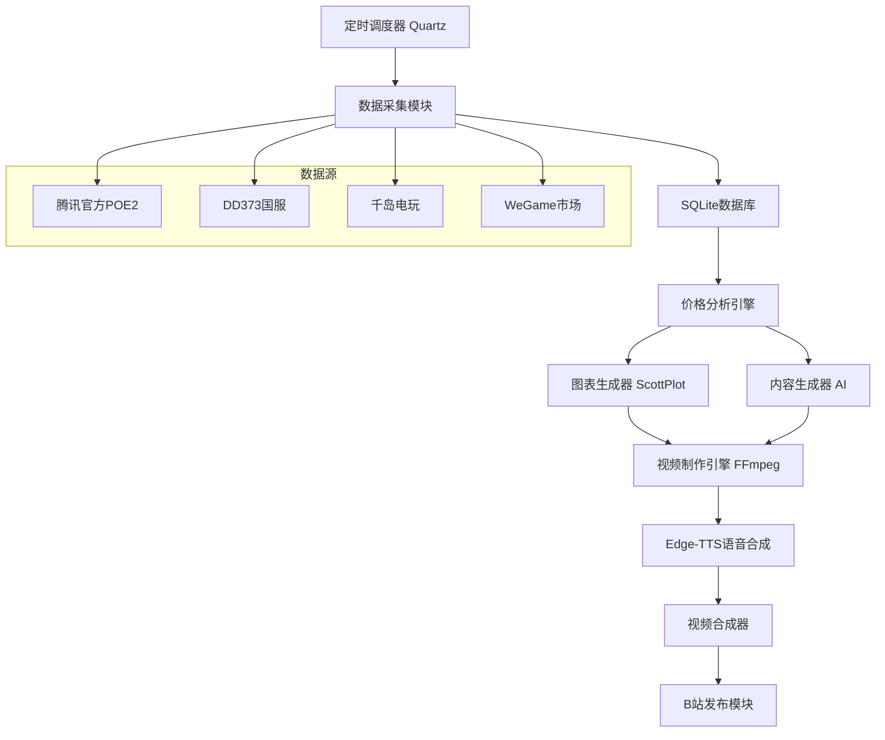

# POE2Finance - 流放之路2国服通货价格分析系统

[](https://dotnet.microsoft.com/)
[](LICENSE)
[](Dockerfile)

## 项目简介

POE2Finance 是一个专门为《流放之路2》国服玩家设计的全自动化通货价格分析系统。系统能够实时监控国服市场价格变化，生成专业的价格分析报告，并自动制作视频内容发布到B站，为国服玩家提供及时、准确的市场信息。

### 核心特性

- 🚀 **全自动化流程**: 从数据采集到视频发布的完整自动化
- 📊 **多数据源采集**: 支持腾讯官方、DD373、千岛电玩等多个数据源
- 🤖 **AI智能分析**: 基于机器学习的热点物品识别和趋势分析
- 🎥 **自动视频制作**: 集成FFmpeg和Edge-TTS的视频自动生成
- 📺 **B站自动发布**: 支持自动上传视频到B站
- ⏰ **定时任务系统**: 每日三次自动更新（09:00/15:00/21:00）
- 💾 **零成本部署**: 基于SQLite的轻量级部署方案

### 目标用户

- **国服大学生群体**: 关注价格波动，寻找套利机会
- **国服搬砖玩家**: 需要实时了解市场行情，优化收益策略
- **国服游戏商人**: 依赖价格信息进行投资决策
- **价格敏感玩家**: 希望在最佳时机进行交易

## 技术架构

### 核心技术栈

- **后端框架**: .NET 9 + ASP.NET Core
- **数据库**: SQLite + Entity Framework Core
- **定时任务**: Quartz.NET
- **HTTP客户端**: HttpClient + Polly (重试策略)
- **数据可视化**: ScottPlot
- **视频处理**: FFMpegCore
- **图像处理**: ImageSharp/SkiaSharp
- **语音合成**: Edge-TTS
- **日志记录**: Serilog
- **测试框架**: xUnit + FluentAssertions

### 系统架构图



## 快速开始

### 环境要求

- .NET 9.0 SDK
- Docker (推荐)
- FFmpeg
- Python 3.8+ (用于Edge-TTS)

### 安装步骤

1. **克隆项目**
   ```bash
   git clone https://github.com/your-username/POE2Finance.git
   cd POE2Finance
   ```

2. **使用Docker部署 (推荐)**
   ```bash
   # 构建和启动
   docker-compose up -d
   
   # 查看日志
   docker-compose logs -f poe2finance
   ```

3. **本地开发环境**
   ```bash
   # 安装依赖
   pip install edge-tts
   
   # 还原NuGet包
   dotnet restore
   
   # 运行应用
   dotnet run --project src/POE2Finance.Web
   ```

### 配置说明

编辑 `appsettings.json` 配置文件：

```json
{
  "DataCollection": {
    "CollectionIntervalHours": 1,
    "MinRequestIntervalSeconds": 3600
  },
  "Bilibili": {
    "Enabled": true,
    "SessionCookie": "your-session-cookie",
    "CsrfToken": "your-csrf-token"
  }
}
```

## 功能模块

### 1. 数据采集模块

- **多源采集**: 同时从多个平台获取价格数据
- **防Ban机制**: 智能请求频率控制和User-Agent轮换
- **容错处理**: 自动切换数据源和错误重试
- **数据验证**: 价格合理性检查和数据清洗

### 2. 价格分析引擎

- **热点识别**: 基于价格波动、交易量变化的热点物品识别
- **趋势分析**: 多时间维度的价格趋势分析
- **风险评估**: 市场风险和交易建议生成
- **预测模型**: 基于历史数据的价格预测

### 3. 内容生成系统

- **智能标题**: 根据市场数据自动生成吸引人的标题
- **分析报告**: 自动生成专业的市场分析内容
- **视频脚本**: 为语音合成优化的文本内容
- **标签推荐**: 基于内容的智能标签生成

### 4. 视频制作引擎

- **图表生成**: 动态价格图表和数据可视化
- **视频合成**: 多段落视频结构自动合成
- **语音合成**: 高质量中文语音生成
- **品牌元素**: 统一的视觉风格和水印

### 5. 自动发布系统

- **B站集成**: 全自动视频上传和信息填写
- **定时发布**: 支持预设时间自动发布
- **状态监控**: 发布状态跟踪和错误处理
- **内容审核**: 自动内容检查和合规性验证

## 监控的通货

### 第一版支持通货

| 通货名称 | 英文名 | 简称 | 计价方式 | 重要程度 |
|----------|--------|------|----------|----------|
| 崇高石 | Exalted Orb | E | 基准单位(1.00E) | 极高 |
| 神圣石 | Divine Orb | D | 相对崇高石 | 极高 |
| 混沌石 | Chaos Orb | C | 相对崇高石 | 极高 |

### 计价体系

- **基准单位**: 崇高石 (E) = 1.00E
- **显示格式**: 所有价格统一以崇高石计价
- **数据精度**: 支持8位小数精度

## 定时任务

### 发布时间表

| 时间段 | 发布时间 | 内容重点 | 目标用户 |
|--------|----------|----------|----------|
| 上午场 | 09:00 | 早间数据汇总 | 上班前关注的用户 |
| 下午场 | 15:00 | 中午活跃分析 | 下午空闲的用户 |
| 晚间场 | 21:00 | 全天总结+预测 | 晚间黄金时间用户 |

### 任务调度

- **数据采集**: 每小时一次 (08:00-23:00)
- **数据清理**: 每日02:00
- **健康检查**: 每30分钟
- **备份任务**: 每日03:00

## API文档

启动应用后访问 `http://localhost:8080/swagger` 查看完整的API文档。

### 主要API端点

- `GET /api/prices/latest` - 获取最新价格
- `GET /api/analysis/{timeSlot}` - 获取分析报告
- `GET /api/videos/status` - 查看视频状态
- `GET /health` - 健康检查

## 开发指南

### 项目结构

```
POE2Finance/
├── src/
│   ├── POE2Finance.Core/          # 核心领域模型
│   ├── POE2Finance.Data/          # 数据访问层
│   ├── POE2Finance.Services/      # 业务逻辑层
│   └── POE2Finance.Web/           # Web API层
├── tests/
│   └── POE2Finance.Tests/         # 单元测试和集成测试
├── docker-compose.yml             # Docker编排文件
├── Dockerfile                     # Docker镜像构建文件
└── DEPLOYMENT.md                  # 部署文档
```

### 开发环境设置

1. **安装依赖**
   ```bash
   # .NET SDK 9.0
   # Docker Desktop
   # Python 3.8+ (edge-tts)
   # FFmpeg
   ```

2. **IDE推荐**
   - Visual Studio 2022 17.8+
   - Visual Studio Code
   - JetBrains Rider

3. **调试配置**
   ```bash
   # 设置开发环境
   export ASPNETCORE_ENVIRONMENT=Development
   
   # 启用详细日志
   export Logging__LogLevel__Default=Debug
   ```

### 代码贡献

1. Fork 项目
2. 创建功能分支 (`git checkout -b feature/AmazingFeature`)
3. 提交更改 (`git commit -m 'Add some AmazingFeature'`)
4. 推送到分支 (`git push origin feature/AmazingFeature`)
5. 创建 Pull Request

### 测试

```bash
# 运行所有测试
dotnet test

# 运行特定测试
dotnet test --filter "PriceAnalysisServiceTests"

# 生成测试覆盖率报告
dotnet test --collect:"XPlat Code Coverage"
```

## 部署

### 腾讯云轻量级服务器

详细部署说明请参考 [DEPLOYMENT.md](DEPLOYMENT.md)

### 快速部署命令

```bash
# 1. 使用Docker Compose
docker-compose up -d

# 2. 检查状态
docker-compose ps

# 3. 查看日志
docker-compose logs -f
```

### 环境配置

| 环境变量 | 说明 | 默认值 |
|----------|------|--------|
| `ASPNETCORE_ENVIRONMENT` | 运行环境 | `Production` |
| `BILIBILI_SESSION_COOKIE` | B站认证Cookie | 空 |
| `LOG_LEVEL` | 日志级别 | `Information` |

## 性能指标

### 系统要求

- **最低配置**: 2核4GB，20GB存储
- **推荐配置**: 4核8GB，50GB SSD
- **网络带宽**: 10Mbps

### 性能基准

- **数据采集**: 3种通货 < 30秒
- **分析生成**: 完整分析 < 2分钟
- **视频制作**: 90秒视频 < 5分钟
- **内存使用**: 常驻 < 512MB

## 许可证

本项目采用 MIT 许可证 - 查看 [LICENSE](LICENSE) 文件了解详情。

## 更新日志

### v1.0.0 (2024-01-01)
- 🎉 初始版本发布
- ✅ 核心数据采集功能
- ✅ 价格分析引擎
- ✅ 自动视频生成
- ✅ B站发布集成
- ✅ 定时任务系统

## 支持

- 📧 邮件: [your-email@example.com]
- 💬 QQ群: [your-qq-group]
- 🐛 问题反馈: [GitHub Issues](https://github.com/your-username/POE2Finance/issues)

## 致谢

感谢以下开源项目的支持：
- [.NET](https://dotnet.microsoft.com/)
- [ScottPlot](https://scottplot.net/)
- [FFMpegCore](https://github.com/rosenbjerg/FFMpegCore)
- [Edge-TTS](https://github.com/rany2/edge-tts)
- [Quartz.NET](https://www.quartz-scheduler.net/)

---

⭐ 如果这个项目对你有帮助，请给个Star支持一下！